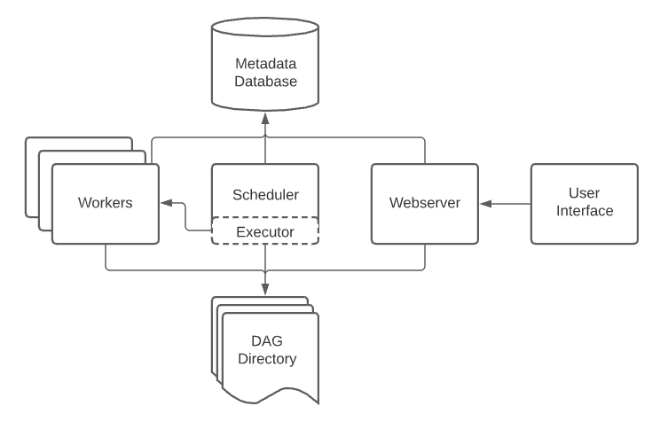

# 개요

- DAG Directory (DAGs Folder)
  - 파이썬으로 작성된 DAG 파일을 저정하는 공간입니다.
- Webserver
  - Airflow의 Web UI 입니다.
  - Meta Database로 부터 DAG 정보를 읽어와 DAG 정보 및 DAG Run의 상태를 확인하고 실행할 수 있습니다.
- Scheduler
  - Airflow의 가장 중요한 부분으로, 다양한 DAG Run과 Task들을 스케쥴링 및 오케스트레이션합니다.
  - 또한 하나의 DAG Run이 전체 시스템을 압도하지 않도록 각 DAG Run의 실행 횟수를 제한하기도 합니다.
  - Meta Database에 DAG 정보 및 DAG Run에 대해 저장합니다.
- Executor
  - Scheduler 내부의 구성 요소입니다.
  - Scheduler가 작업을 조정하는 동안 Executor는 실제로 작업을 실행합니다.
  - Sequential, Local, Celery, Kubernetes 등 Executor에는 여러 종류가 있습니다. (기본 값은 Sequential Executor 입니다.)
- Worker
  - Executor에 의해 만들어지며 Task를 실제로 실행하는 프로세스입니다.
  - Executor의 종류에 따라 Worker는 쓰레드, 프로세스, 파드가 될 수 있습니다.
- Meta Database
  - DAG, 해당 실행 및 사용자, 역할 및 연결과 같은 기타 Airflow 구성에 대한 메타데이터를 저장합니다.
