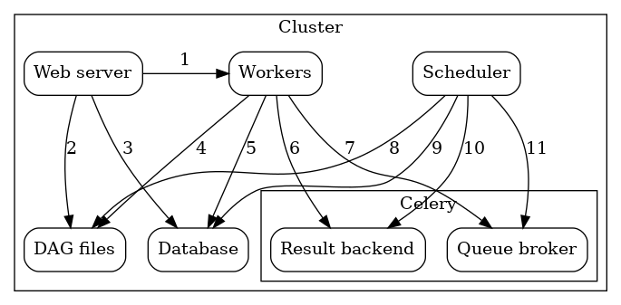

# Celery Executor

[Celery](https://docs.celeryproject.org/en/stable/getting-started/introduction.html)는 Redis나 RabbitMQ와 같은 메시지 브로커와
통신하여 필요한 Worker(프로세스)를 만든 뒤 비동기로 로직을 실행할 수 있게 하는 파이썬 라이브러리입니다.

*출처: https://kyoungmookryu.medium.com/python-celery-d347ac155720*

이렇게 여러 로직(Task)을 메시지 브로커에 보내고, 메시지 브로커에서 이를 꺼내 여러 Worker를 만드는 방식은 마치 Airflow Executor에서 하던 일과 비슷합니다.
Celery Executor는 이런 Celery를 활용한 Executor입니다.

Celery Executor를 사용하면 RabbitMQ 또는 Redis와 같은 메시지 브로커를 통해 Task Instance를 큐에 보내게 됩니다. 이후 큐에 있는 Task Instance는
미리 생성된 Celery Worker들에 의해 실행됩니다. 이 때 이 Celery Worker의 수는 `worker_concurrency` 설정 값으로 지정할 수 있습니다. 기본 값은 16개 입니다.

*출처: https://insaid.medium.com/executors-in-airflow-2357675b8284*

컴포넌트간 서로 주고받는 내용을 좀 더 알아보면 다음과 같습니다.

*출처: https://airflow.apache.org/docs/apache-airflow/stable/executor/celery.html*

- [1] Webserver -> Executor - Task 실행 로그를 가져 옵니다.
- [2] Webserver -> DAG 파일 - DAG 구조를 가져옵니다.
- [3] Webserver -> Database - Task의 상태를 가져옵니다.
- [4] Workers -> DAG 파일 - DAG 구조를 읽고 Task를 실행합니다.
- [5] Workers -> Database - Connections, Variabels 및 XCom에 대한 정보를 가져오고 저장합니다.
- [6] Workers -> Celery의 결과 Backend - Task의 상태를 저장합니다.
- [7] Workers -> Celery의 Broker - 실행을 위한 명령을 저장합니다.
- [8] Scheduler -> DAG 파일 - DAG 구조를 읽고 Task를 실행합니다.
- [9] Scheduler -> Database - DAG 실행 및 Task의 상태를 저장합니다.
- [10] Scheduler -> Celery의 결과 Backend - 완료된 Task의 상태에 대한 정보를 가져옵니다.
- [11] Scheduler -> Celery의 Broker - Task Instance 실행을 위한 명령을 보냅니다.

Celery Executor를 통해 필요한 Worker 프로세스를 미리 만들어 둘 수 있고, Scalable하게 운영할 수 있습니다.
