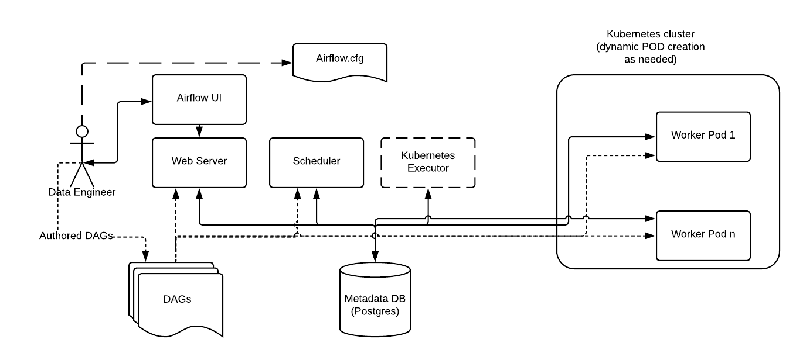

# Kubernetes Executor

Kubernetes Executor는 Kuberentes 환경에서 사용할 수 있는 Executor로, 파드를 통해 Task Instance를 실행합니다.

Kuberentes Executor는 `QUEUED` 상태인 Task Instance를 찾아 Kubernetes API Server에 해당 Task Instance를 실행할 파드 생성을 요청합니다.
즉 Task Instance 별로 파드(Worker 파드라 부릅니다)가 생기고 실행되며, 실행이 완료된 파드는 삭제됩니다.

*출처: https://insaid.medium.com/executors-in-airflow-2357675b8284*

Kubernetes Executor를 사용하면 Task Instance를 독립적인 컨테이너 환경에서 실행할 수 있고, 리소스(CPU, Memory) 역시 다르게 줄 수 있어,
Airflow를 매우 유연하게 사용할 수 있습니다. 또한 필요한 Worker 파드를 동적으로 생성하고 삭제하기 떄문에 전체 리소스 사용량도 매우 효율적이게 됩니다.

일반적으로 Kubernetes는 어느 정도 규모가 있는 Airflow 운영과 궁합이 잘 맞다고 알려져 있으며,
Kubernetes 환경에서 Airflow 사용 시 Kubernetes Executor가 일반적으로 권장되고 있습니다.
(다만 Kubernetes 환경은 분산 노드 환경이므로, DAG Direcotory를 별도로 Sync 해야하고,
로그 설정 역시 Remote Logging으로 해야하는 등 추가 설정해야할 것들이 조금 더 있습니다.)

*출처: https://airflow.apache.org/docs/apache-airflow/stable/executor/kubernetes.html*
