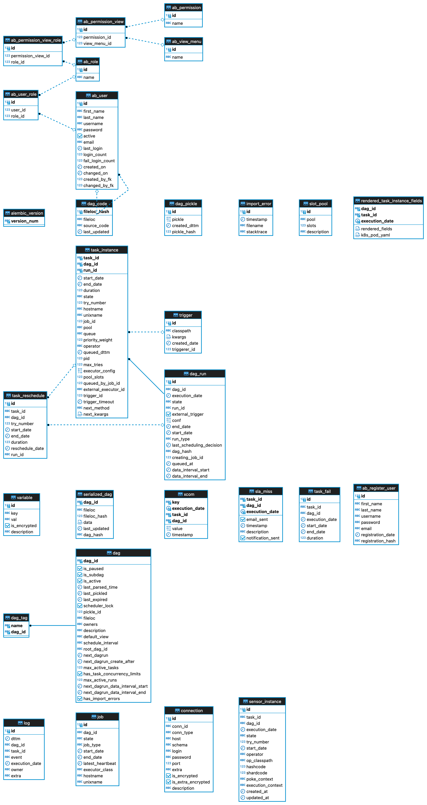

# Meta Database

## 개념

Meta Database는 Airflow의 DAG, DAG Run, Task Instance, Variables, Connections 등 여러 컴포넌트에서 사용해야하는 데이터를 저장합니다.
Webserver, Scheduler, Worker 모두 Meta Database와 통신하기 때문에 Meta Database는 Scheduler와 더불어 매우 중요한 컴포넌트입니다.

:::tip
Meta Database는 `airflow db init` 명령어로 초기화되며, 다른 컴포넌트가 실행되기 전에 이 커맨드가 먼저 선행되어야 합니다.
:::

Meta Database가 실제로 어떤 테이블들을 가지고 있는지 살짝 살펴보겠습니다.

```bash
$ \dt
                    List of relations
 Schema |             Name              | Type  |  Owner
--------+-------------------------------+-------+---------
 public | ab_permission                 | table | airflow
 public | ab_permission_view            | table | airflow
 public | ab_permission_view_role       | table | airflow
 public | ab_register_user              | table | airflow
 public | ab_role                       | table | airflow
 public | ab_user                       | table | airflow
 public | ab_user_role                  | table | airflow
 public | ab_view_menu                  | table | airflow
 public | alembic_version               | table | airflow
 public | connection                    | table | airflow
 public | dag                           | table | airflow
 public | dag_code                      | table | airflow
 public | dag_pickle                    | table | airflow
 public | dag_run                       | table | airflow
 public | dag_tag                       | table | airflow
 public | import_error                  | table | airflow
 public | job                           | table | airflow
 public | log                           | table | airflow
 public | rendered_task_instance_fields | table | airflow
 public | sensor_instance               | table | airflow
 public | serialized_dag                | table | airflow
 public | sla_miss                      | table | airflow
 public | slot_pool                     | table | airflow
 public | task_fail                     | table | airflow
 public | task_instance                 | table | airflow
 public | task_reschedule               | table | airflow
 public | trigger                       | table | airflow
 public | variable                      | table | airflow
 public | xcom                          | table | airflow
```

ERD는 다음과 같습니다.



## 설정

Meta Database와 관련하여 다음과 같은 설정 값들이 있습니다.

### `sql_alchemy_pool_size`

Database Connection Pool의 최대 크기입니다. Connection Pool에 최대 이 개수만큼의 Connection이 생길 수 있습니다. 기본 값은 5개입니다.

이 값이 너무 작으면, Airflow 전체적으로 Meta Database와의 I/O에 병목이 생길 수 있습니다.
