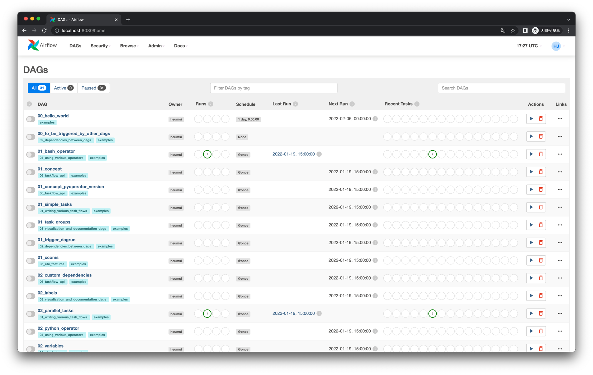

# Webserver

## 개념

Webserver는 Meta Database와 통신하며 DAG, DAG Runs, Task Instance, Variables, Connections 등의 데이터를 가져와
웹에서 보여주고 유저와 상호작용 할 수 있게 합니다.

사실 Webserver가 없어도 Airflow의 DAG이 실행 또는 스케줄링은 여전히 되기 때문에, 다른 컴포넌트들 보다는 장애에 있어서 덜 민감한 컴포넌트이기는 합니다.

## 설정

Meta Database와 관련하여 다음과 같은 설정 값들이 있습니다.

### `default_dag_run_display_number`

UI(DAG 상세 화면)에서 보여줄 DAG Runs의 수입니다. 기본 값은 25개 입니다.

### `default_ui_timezone`

UI에서 보여줄 기본 타임존입니다. `"Asia/Seoul"` 과 같은 IANA 타임존 형태로 값을 지정하면 됩니다. 기본 값은 UTC 입니다.

이 값을 빈 문자열(`""`)로 두면, `default_timezone` 설정 값을 따라갑니다.

### `page_size`

UI(대시보드)에서 보여줄 DAG 리스트의 페이지 사이즈입니다. 기본 값은 100개 입니다.

### `worker_class`

Webserver Worker(gunicorn)이 사용할 Worker 클래스입니다. `sync`, `eventlet`, `gevent` 중 하나를 지정하면 됩니다.
기본 값은 `sync` 입니다.

이 값은 Webserver Worker 클래스를 바꿔 UI 속도를 올리고 싶을 때 유용할 수 있습니다.

:::tip
여기서 소개된 것들보다 훨씬 더 많은 설정 값들이 있습니다. 이에 대한 내용은 [공식 문서](https://airflow.apache.org/docs/apache-airflow/stable/configurations-ref.html#webserver)에서 확인하세요.
:::
