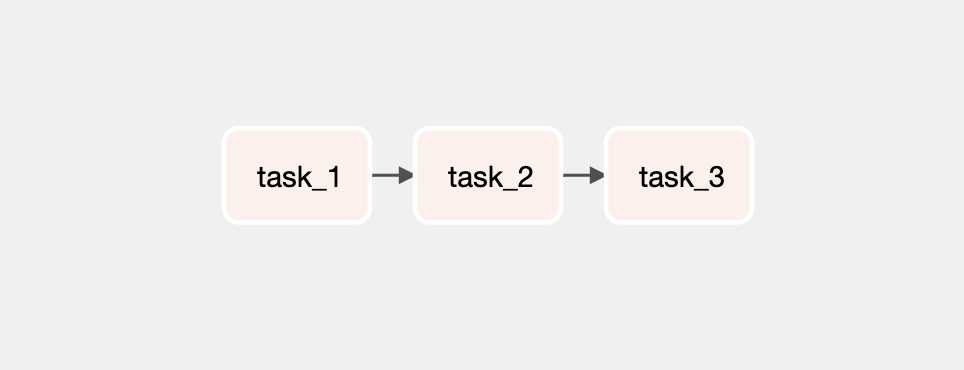

# 직전 DAG Run의 상태에 따라 Task 실행 여부를 결정하기

## Graph View

## Tree View

## Code

<<< @/../my-airflow-project/dags/01_writing_various_task_flows/06_conditional_tasks_with_wait_for_downstream.py

## Web UI

