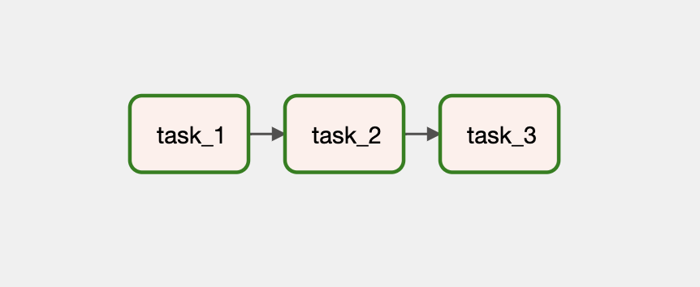

# 간단한 Task 의존성 작성하기

## Graph View

다음과 같은 간단한 Task 의존성을 가지는 DAG을 작성해봅시다.

## Code

<<< @/../my-airflow-project/dags/01_writing_various_task_flows/01_simple_tasks.py{28}

- `>>` 연결로 순차적인 Task 의존성을 만듭니다. 아주 간단합니다.

## Web UI

