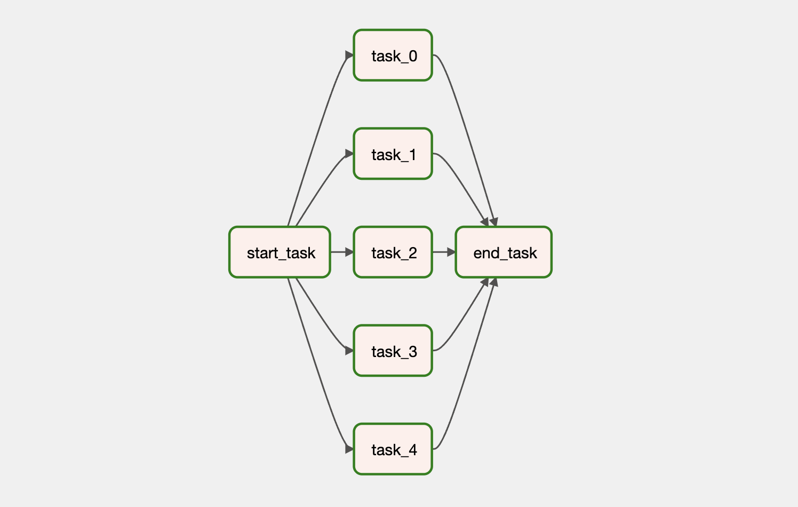
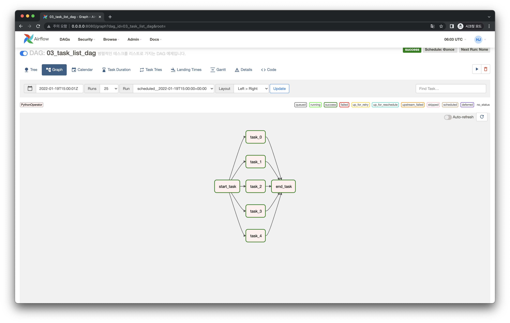

# 병렬 Task 리스트 의존성 작성하기

## Graph View

다음과 같은 Task 의존성을 가지는 DAG을 작성해봅시다.

## Code

<<< @/../my-airflow-project/dags/01_writing_various_task_flows/03_parallel_task_list.py{26-29,33}

- `List`에 Task Instance를 담아 Task 의존성 정의하는 부분에 사용할 수 있습니다.
- 의존성 앞 뒤에 있는 Task Instance에 `List` 내 모든 Task Instance가 연결됩니다.

## Web UI

