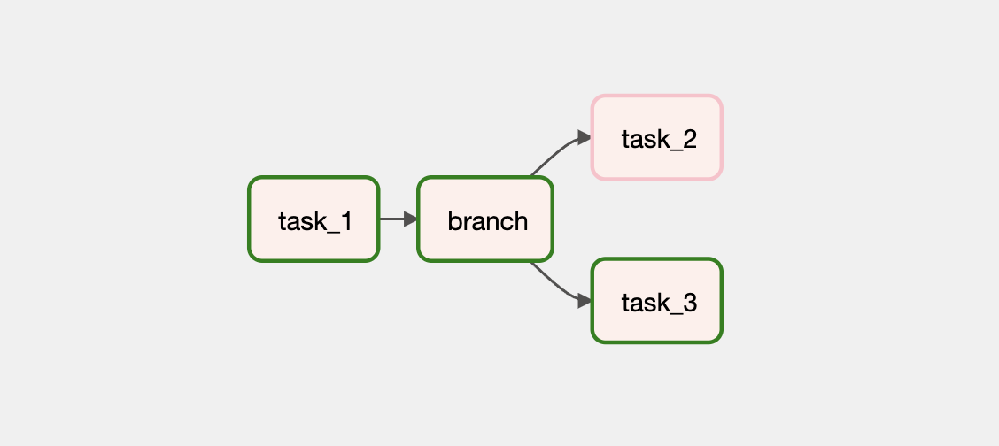
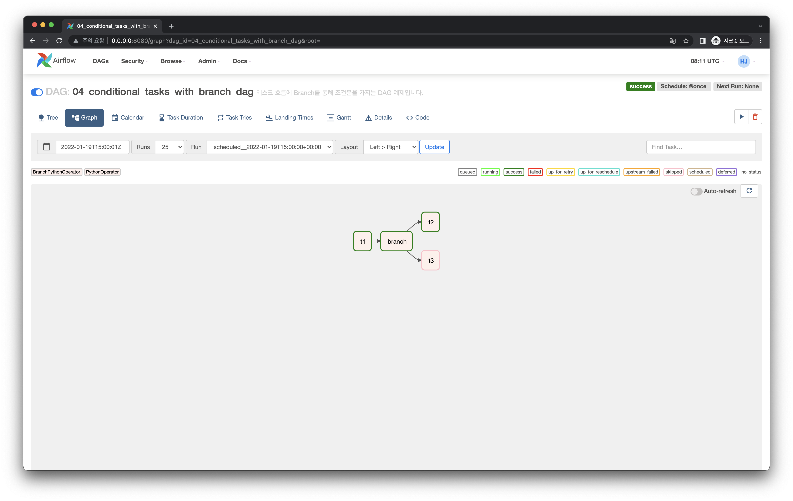

# 조건에 따라 다른 Task 의존성 작성하기

## Graph View

다음처럼 특정 조건(Branch)에 따라 분기 처리되어 실행되는 Task Instance가 달라지는 의존성을 가지는 DAG을 작성해봅시다.

## Code

<<< @/../my-airflow-project/dags/01_writing_various_task_flows/04_conditional_tasks_with_branch.py{7,26-27,32-38,40}

- `32-38` 라인에 `BranchPythonOperator` 로 Task Instance를 정의합니다.
  - `select_random` 함수를 `task_ids` 의 파라미터 값인 `[t2.task_id, t3.task_id]` 를 함께 넘기며 호출합니다.
- `26-27` 라인의 `select_random` 함수는 `task_ids` 리스트 값중 하나를 랜덤으로 선택해 반환합니다.
  - 즉 `t2.task_id`, `t3.task_id` 중 하나가 선택됩니다.
  - 선택된 `task`가 실행됩니다.
- `40` 라인에 `BranchPythonOperator` 로 정의한 Task Instance 뒤에 분기에 따라 실행할 Task Instance를 담은 리스트가 있습니다.

조건에 따라 다른 Task 의존성을 갖는 방법을 정리해보면 다음과 같습니다.

- **조건에 따라 분기 처리해야 할 Task Instance들을 `List`에 담아 `BranchPythonOperator` Task Instance에 의존하도록 설정합니다.,**
- **`BranchPythonOperator` Task Instance는 이 `List` 에 담긴 Task Instance 중 하나의 Task Instance의 `task_id`를 반환합니다.**

## Web UI

