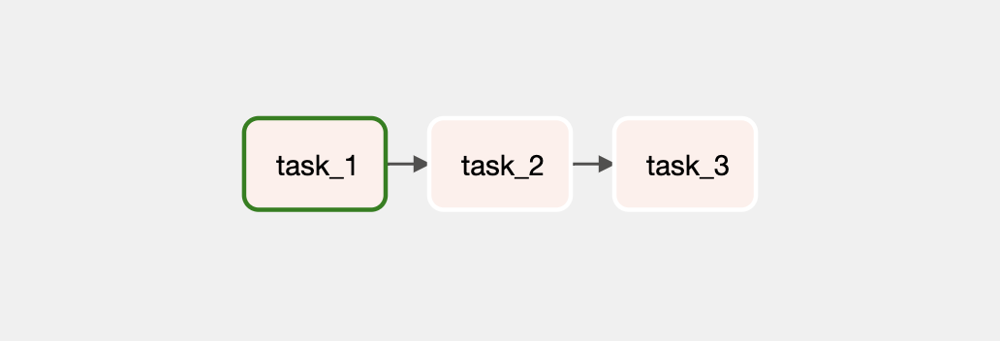
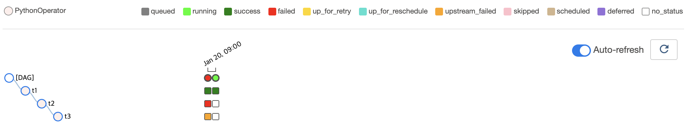
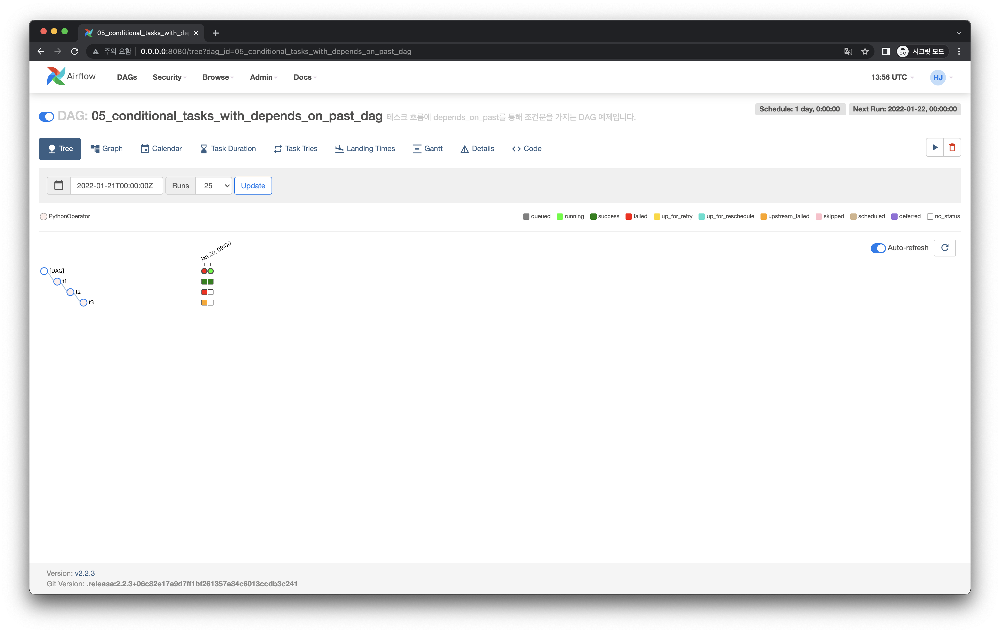

# 직전 DAG Run의 Task 상태에 따라 Task 실행 여부를 결정하기

## Graph View

다음처럼 간단한 Task 의존성을 가지는 DAG을 작성해볼 것입니다.



간단해 보이지만 하나 다른 점은 **이전 DAG Run의 Task Instance의 상태가 성공인 경우에만 현재 DAG Run의 Task Instance을 실행**한다는 것입니다.
Grahp View에서는 이러한 내용이 잘 보이지 않으니 Tree View를 살펴보겠습니다.

## Tree View

작성할 DAG을 실행하면 다음과 같은 Tree View를 얻게 됩니다.



자세히 살펴보면, 첫 번째 DAG Run의 두 번째 Task Instnace가 실패한 상태이기 때문에 두 번째 DAG Run의 두 번째 Task Instance가 실행되지 않은 상태임을 알 수 있습니다.
(세 번째 Task Instance 역시 두 번째 Task Instance에 의존이 있기 때문에 실행되지 않았습니다.)

## Code

<<< @/../my-airflow-project/dags/01_writing_various_task_flows/05_conditional_tasks_with_depends_on_past.py{28-30}


- `PythonOperator`의 `depends_on_past` 파라미터 값을 `True`로 넘겨줍니다.
  - `depends_on_past` 의 기본 값은 `False` 입니다.
  - `PythonOperator` 뿐 아니라 제공되는 모든 `Operator`에 `depends_on_past`가 존재합니다.

:::tip
`depends_on_past=True` 를 다음처럼  `default_args` 에 넣어주면, 모든 Task에 대해 직전 DAG Run의 Task 각각의 상태에 따라 실행할 수 있게 됩니다.

```python
with DAG(
    ...
    default_args={
        ...
        "depends_on_past": True
    },
    ...
) as dag:
    ...
```
:::

## Web UI


