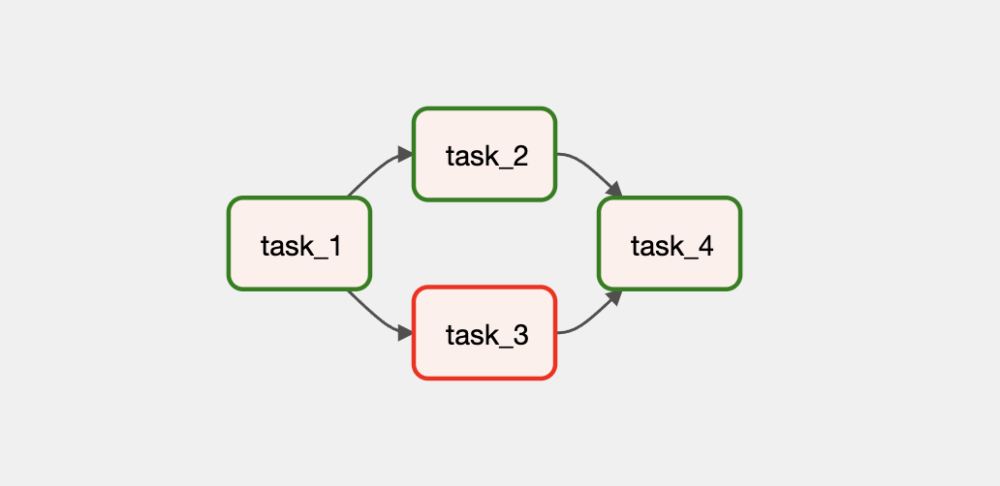

# Trigger Rule에 따라 Task 실행 여부를 결정하기

## Graph View

다음처럼 간단한 Task 의존성을 가지는 DAG을 작성해볼 것입니다.

간단해 보이지만 조금 특이한 점은 `task_3`가 실패한 상태임에도 `task_4`가 실행되어 성공한 상태로 남아있다는 것입니다.
Task Instance의 실행 조건을 **Trigger Rule**이라고 부르는데, 기본적으로 의존하는 모든 Task Instance가 성공 상태여야 해당 Task Instance가 실행됩니다.

여기서는 Trigger Rule의 기본 값이 아닌 다른 옵션으로 수정해보겠습니다.

## Code

<<< @/../my-airflow-project/dags/01_writing_various_task_flows/07_conditional_tasks_with_trigger_rule.py{30-32}

- `PythonOperator`의 `trigger_rule` 파라미터 값으로 `"one_success"`을 넘겨주었습니다.
  - 이는 의존하는 Task Instance의 상태가 단 하나라도 성공 상태이면 해당 Task Instance를 실행한다는 의미입니다.
  - `trigger_rule`의 기본 값은 `"all_success"` 입니다.

:::tip
더 다양한 Trigger Rule 옵션을 보고 싶으면 [공식 문서](https://airflow.apache.org/docs/apache-airflow/stable/concepts/dags.html?highlight=trigger%20rule#trigger-rules)를 확인해보세요.
:::

## Web UI

