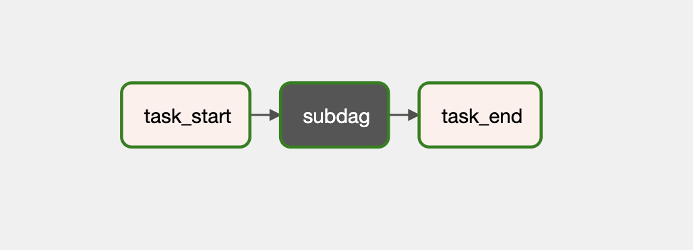
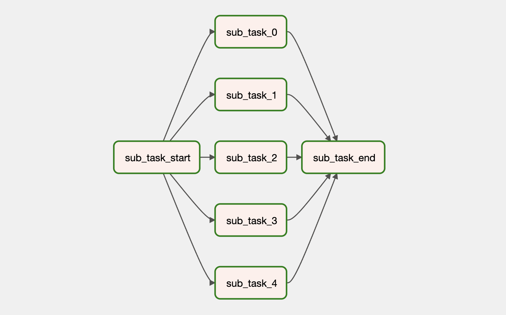
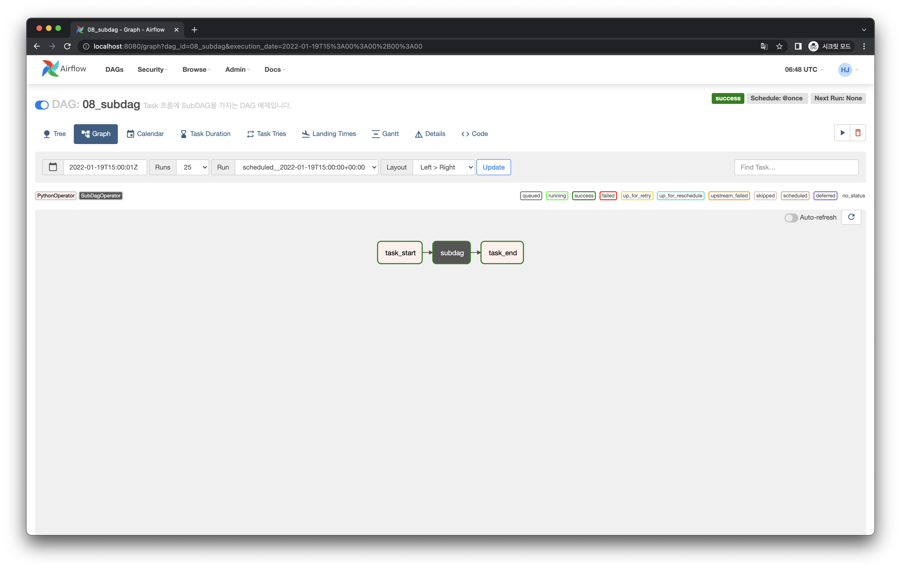
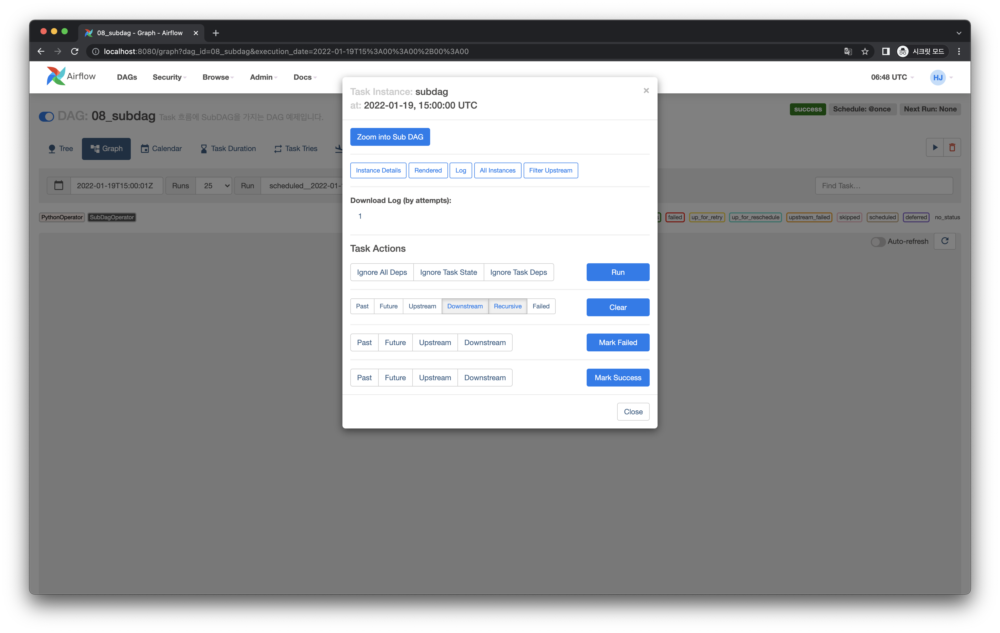
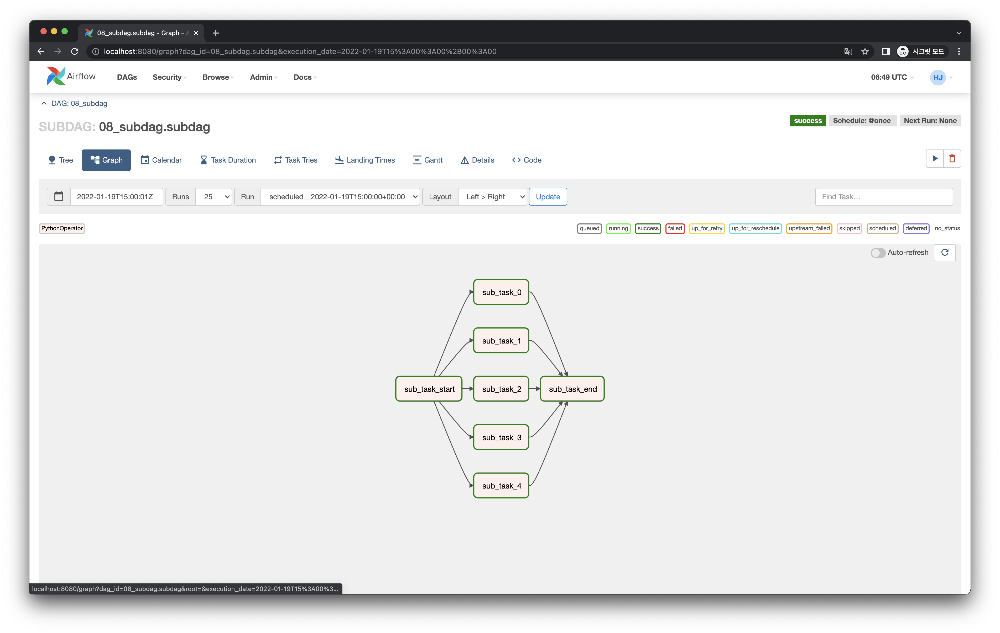

# SubDAG 만들기

:::warning
SubDAG은 현재(Airflow 2.2.3 기준) 일반적으로 사용이 권장되지는 않습니다. (현재는 Task Group 사용을 권장합니다.)
다만 기존에 작성된 DAG 파일을 보게되는 경우 간혹 등장하기 때문에, 한번 둘러본다는 차원으로 보시면 좋습니다.
:::

## Graph View

다음과 같은 Task 의존성을 가지는 DAG을 작성해볼 것입니다.

조금 특이한 점은 가운데에 `subdag` Task의 색이 다른 Task들과 다르다는 것입니다.
이 Task는 SubDAG 이라 부르는 Task로, 이름 그대로 DAG 안에 존재하는 또 다른 DAG 입니다.

이 `subdag` Task는 다음과 같이 또 다른 DAG으로 구성되어 있습니다.

이처럼 SubDAG은 DAG 내 존재하는 하위 DAG입니다.
이제 이를 어떻게 작성하는지 살펴봅시다.

## Code

<<< @/../my-airflow-project/dags/01_writing_various_task_flows/08_subdag.py{6,14-37,56-58}

- `56-58` 라인에서 `SubDagOperator` 를 통해 SubDAG을 정의합니다.
  - 이 때 `subdag` 파라미터를 통해 `get_subdag` 함수를 호출합니다.
  - `subdag` 파라미터에 넘길 함수는 `DAG` 객체를 반환하는 함수여야 합니다.
- `14-37` 라인에 `get_subdag` 함수가 정의되어 있습니다.
  - 일반적인 `DAG` 작성과 동일합니다. 이 DAG은 SubDAG이 됩니다.
  - 하나 주의해야할 점은 SubDAG의 `dag_id`는 `{parent_dag_id}.` 를 prefix로 가져야 합니다. 만약 prefix 갖지 않으면 Scheduler에서 DAG 파일을 파싱할 때 에러를 뱉습니다.
  - 이 함수는 `DAG` 인스턴스를 반환합니다.

:::warning
SubDAG을 사용할 때는 좀 더 주의해야할 사항들이 있습니다. 자세한 내용은 [공식 문서](https://airflow.apache.org/docs/apache-airflow/stable/concepts/dags.html?highlight=subdag#subdags)에서 확인해주세요.
:::

## Web UI

