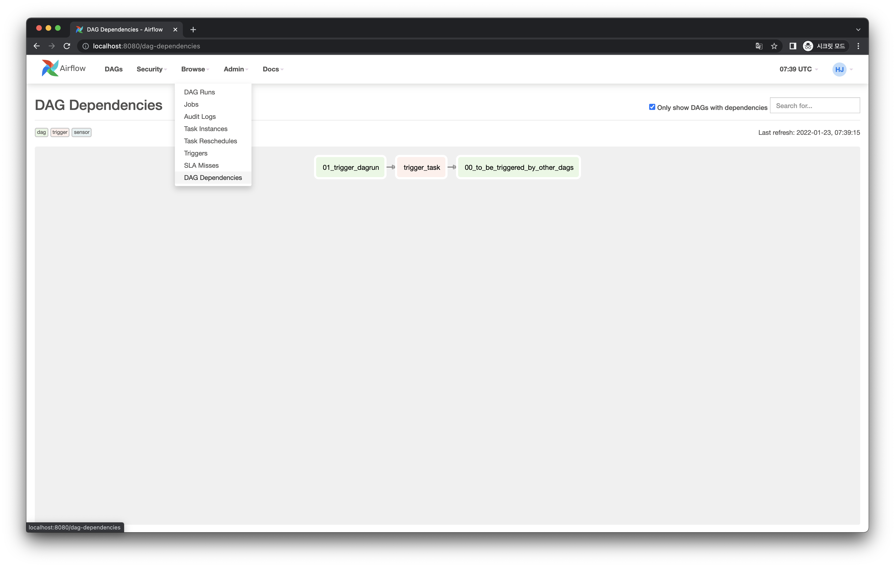

# DAG에서 다른 DAG Run을 트리거하기

## 사전 준비

다른 DAG에 의해 트리거될 DAG을 먼저 다음처럼 작성합니다. 트리거될 DAG은 아래 Graph View 이미지처럼 아주 간단한 Task 의존성을 가지고 있습니다.

코드는 다음과 같습니다.

<<< @/../my-airflow-project/dags/02_dependencies_between_dags/00_to_be_triggered_by_other_dags.py

작성 후 Web UI에서 이 DAG을 ON 상태로 둡니다.

## Graph View

다음과 같은 간단한 Task 의존성을 가지는 DAG을 작성해봅시다.

이 때 `trigger_task` 는 앞서 "사전 준비"에서 작성한 DAG Run을 Trigger하게 됩니다.

## Code

<<< @/../my-airflow-project/dags/02_dependencies_between_dags/01_trigger_dagrun.py{6,26-37}

- `TriggerDagRunOperator` 를 통해 다른 DAG Run을 Trigger하는 Task Instance를 작성합니다.
  - `trigger_dag_id` 파라미터에 Trigger할 DAG의 `dag_id`를 넘깁니다.
  - `trigger_run_id` 파라미터를 통해 Trigger된 DAG Run의 `run_id` 를 지정할 수 있습니다. `None` 으로 넘기는 경우, 자동으로 지정됩니다.
  - 나머지는 모두 기본 값 그대로 적었습니다. 자세한 내용은 [공식 문서](https://airflow.apache.org/docs/apache-airflow/stable/_api/airflow/operators/trigger_dagrun/index.html#airflow.operators.trigger_dagrun.TriggerDagRunOperator)를 확인해주세요.

## Web UI

작성한 DAG Run이 실행되어 모든 Task Instance가 성공했습니다.

이 때 `TriggerDagRunOperator` 로 작성한 Task가 Trigger한 DAG Run 역시 다음처럼 실행되어 성공한 것을 볼 수 있습니다.

Run Id를 살펴보면 다음처럼 자동으로 지정된 것을 볼 수 있습니다.

현재 배포한 Airflow 내 DAG 간 의존성 현황은 Web UI 상단 메뉴의 Browse - DAG Dependencies 탭에서 다음처럼 볼 수 있습니다.

