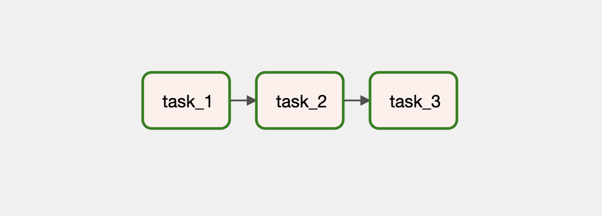
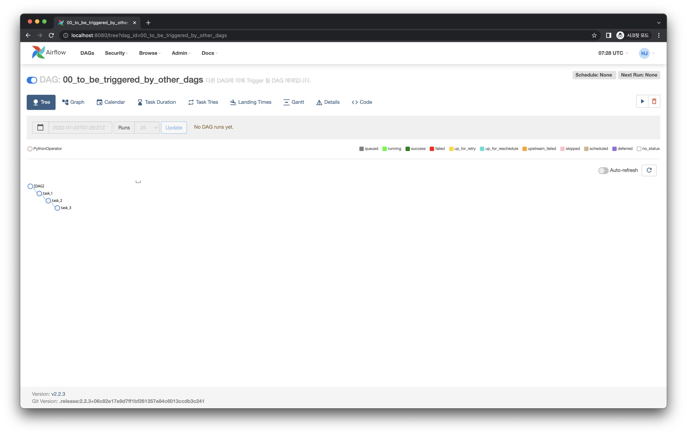
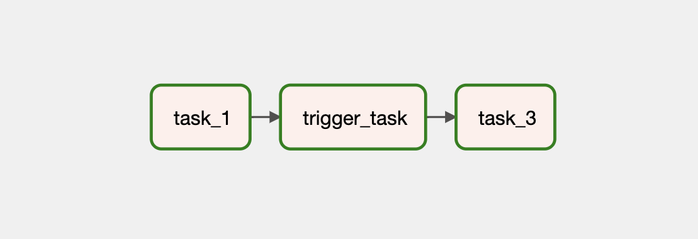
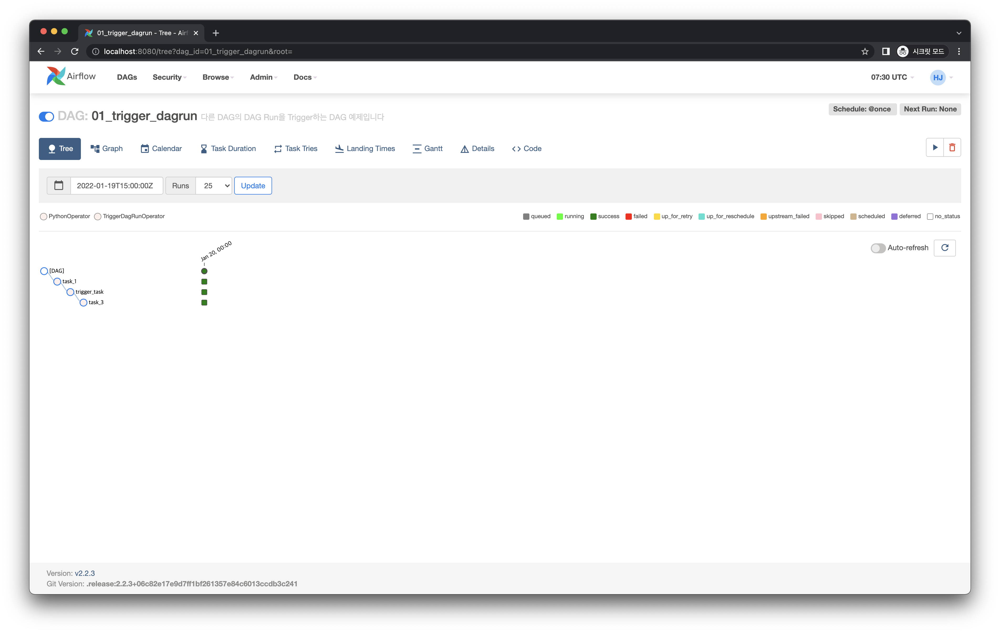
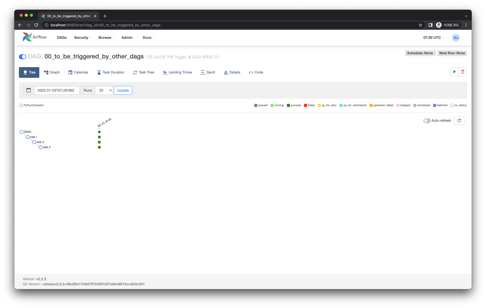
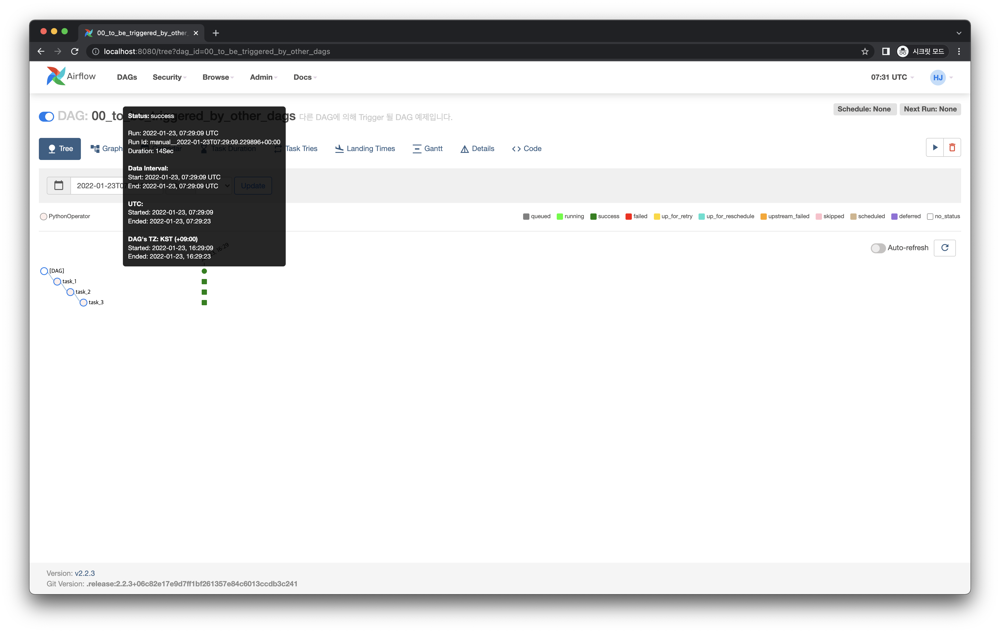

# DAG에서 다른 DAG Run을 트리거하기

## 사전 준비

다른 DAG에 의해 트리거될 DAG을 먼저 다음처럼 작성합니다. 트리거될 DAG은 아래 Graph View 이미지처럼 아주 간단한 Task 흐름을 가지고 있습니다.

<<< @/../examples/dags/02_dependencies_between_dags/00_to_be_triggered_by_other_dags.py

작성 후 웹 UI에서 이 DAG을 ON 상태로 둡니다.

## Graph View

## Code

<<< @/../examples/dags/02_dependencies_between_dags/01_trigger_dagrun.py

## Web UI

