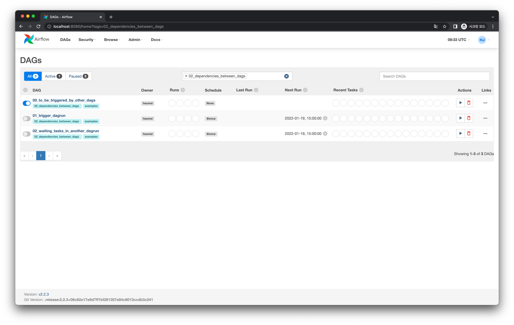
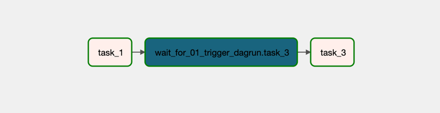
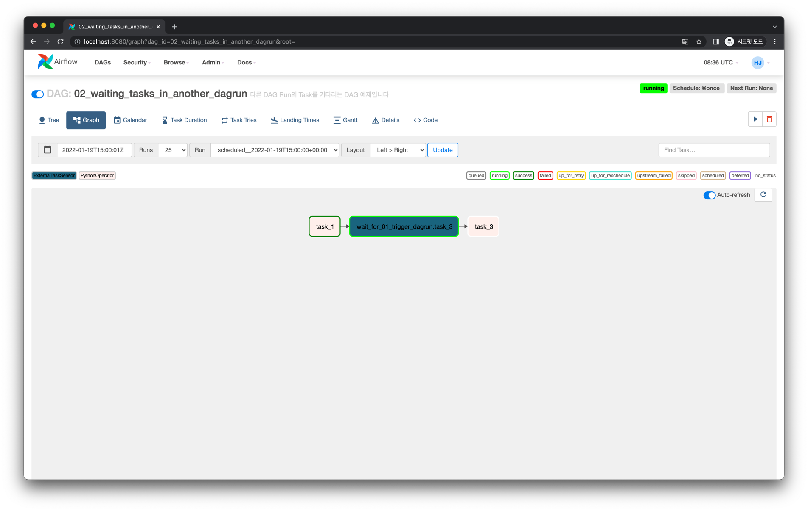
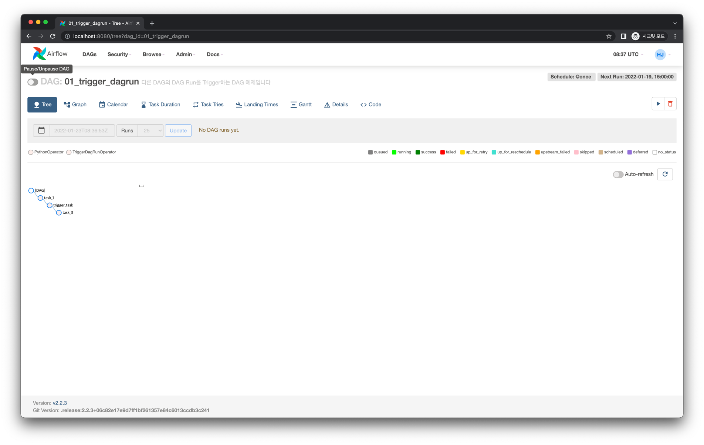
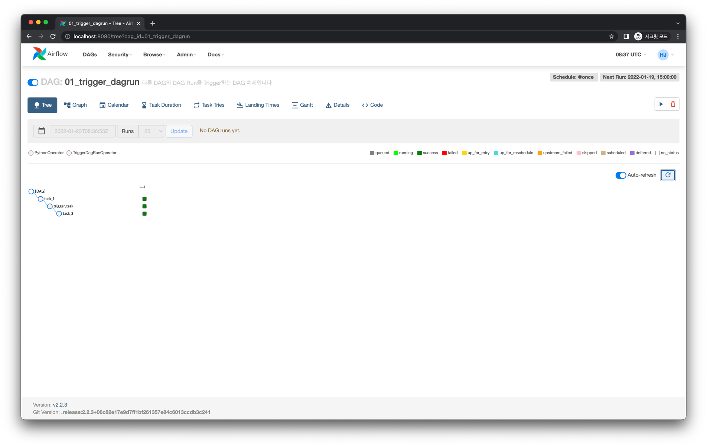
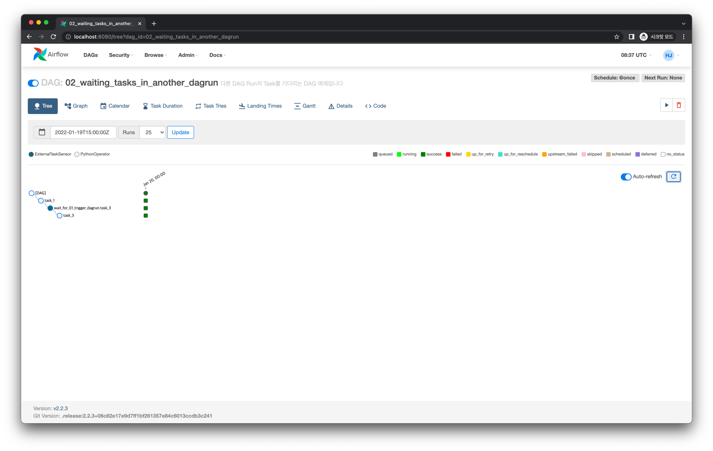

# DAG에서 다른 DAG Run의 Task를 기다리기

## 사전 준비

직전 파트에서 만든 `01_trigger_dagrun` DAG이 있어야 합니다. 이에 대한 내용은 직전 파트에서 확인해주세요.

`01_trigger_dagrun`이 이미 있고, DAG Run이 이미 만들어진 상황이라면 Web UI에서 `01_trigger_dagrun`을 삭제해주세요.
시간이 조금 지나면 `01_trigger_dagrun` 은 OFF된 상태로 다시 Web UI에 등장할거에요.

위 준비를 모두 마치면 Web UI는 다음과 같이 `01_trigger_dagrun` 는 OFF 상태고, 에 대한 DAG Run 기록이 없는 상태여야 합니다.
그리고 `00_to_be_triggered_by_other_dags` 는 ON 상태여야 합니다.

## Graph View

## Code

<<< @/../examples/dags/02_dependencies_between_dags/02_waiting_tasks_in_another_dagrun.py

## Web UI

:::tip
`ExternalTaskMarker` 가 필요한 상황과 사용 방법
:::
