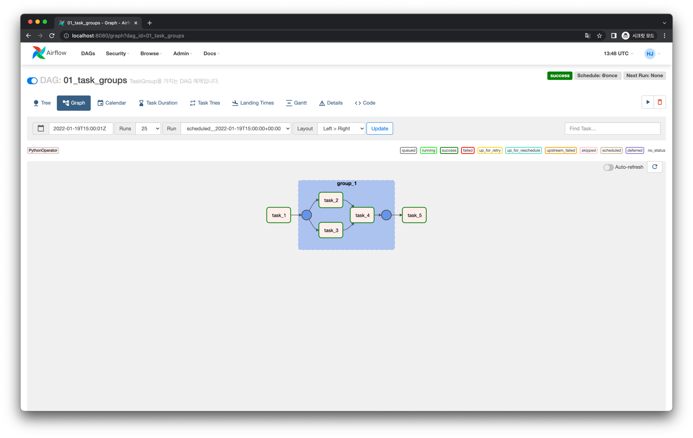

# UI에 Task들을 Group으로 표현하기

## Web UI

Task들을 Group화 하여 보여줄 수 있는 **Task Group** 이라는 개념이 있습니다.
Task Group을 사용하면 그룹화된 Task들이 Graph View에서 다음과 같이 `group_1` Task 처럼 보이게 됩니다.

`group_1` Task를 클릭하면 다음처럼 그룹화된 Task들을 볼 수 있습니다.

## Code

<<< @/../my-airflow-project/dags/03_visualization_and_documentation_dags/01_task_groups.py{6,27-33}

- `with` 구문과 같이 `TaskGroup` 인스턴스로 Task Group을 정의합니다.
  - `with` 구문 내에 정의된 Task Instance들과 의존성은 모두 하나의 Task Group으로 그룹화 됩니다.

:::tip
Task Group은 단순히 Web UI에서 그룹화되어서 보이는 것일 뿐, 동작에는 영향을 주거나 별다른 의미는 없습니다.
:::
