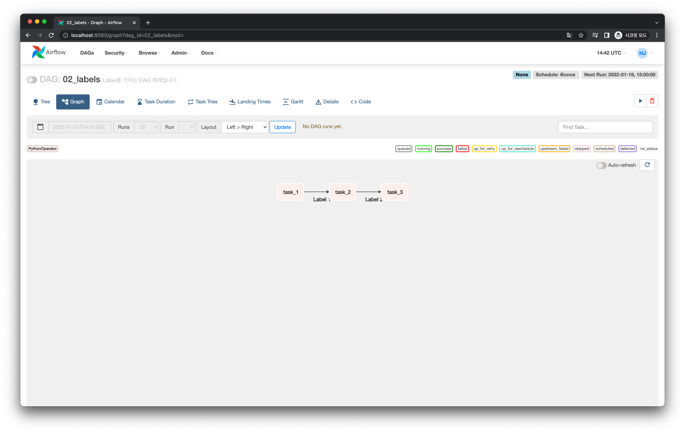

# UI에 Task 간 Edge에 Label 추가하기

## Web UI

Graph View에서 다음처럼 Task 간 Edge에 Label을 부여할 수 있습니다.

## Code

<<< @/../my-airflow-project/dags/03_visualization_and_documentation_dags/02_labels.py{6,26,28,31}
