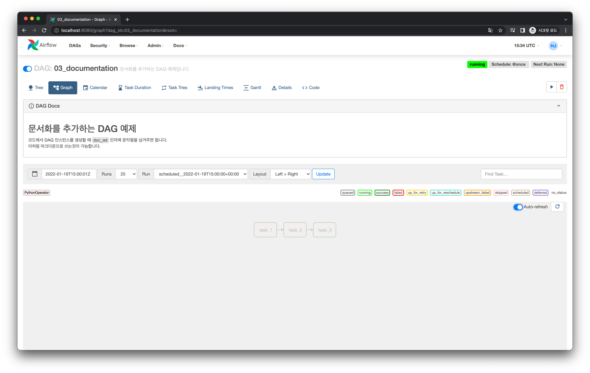
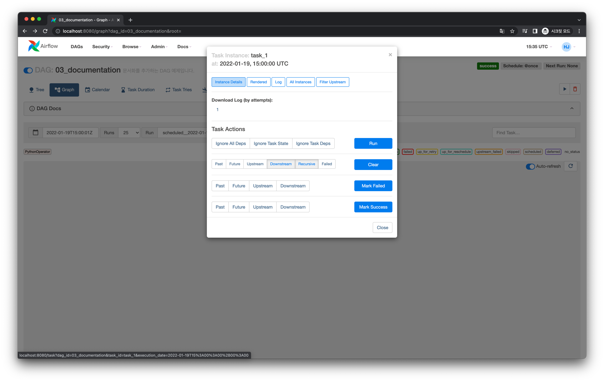
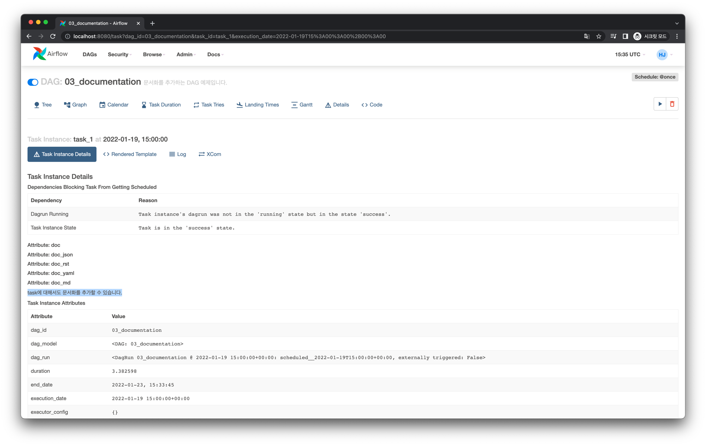

# UI에 DAG 문서화 추가하기

## Web UI

다음과 같이 DAG에 대한 문서화를 작성할 수 있습니다.

또한 다음처럼 Task에 대한 문서화도 작성할 수 있습니다.

## Code

<<< @/../my-airflow-project/dags/03_visualization_and_documentation_dags/03_documentation.py{19-24,31}

:::tip
마크다운(md) 뿐 아니라 json이나 rst형식도 가능합니다. 자세한 내용은 [공식 문서](https://airflow.apache.org/docs/apache-airflow/stable/concepts/dags.html#dag-task-documentation)를 확인해보세요.
:::
