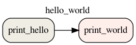

# DAG을 이미지로 저장하기

## CLI

다음과 같은 명령어로 DAG을 이미지로 저장할 수 있습니다.

```bash
$ airflow dags show {dag_id} --save {image_name.png}`
```

예를 들면 `dag_id`가 `hello_world` 인 DAG을 `output.png` 이미지로 저장하는 명령어는 다음과 같습니다.

```bash
$ airflow dags show hello_world --save output.png
```

생성된 `output.png` 는 다음과 같습니다.


