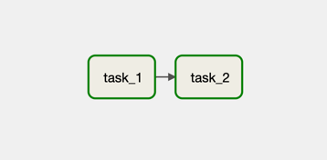

# BashOperator

`BashOperator`는 `bash` 커맨드를 실행하는 Operator입니다.

## Graph View

다음처럼 간단한 Task 의존성을 가지는 DAG을 작성해봅시다.

## Code

<<< @/../my-airflow-project/dags/04_using_various_operators/01_bash_operator.py{4,20-23}

- `BashOperator`로 `bash` 커맨드를 실행하는 Task Instance를 생성합니다.
  - `bash_command` 파라미터에 실행할 셸 커맨드를 넘기면 됩니다.
  - `env` 파라미터에 `Dict` 형태로 환경변수를 주입할 수 있습니다.

## Web UI

실행 결과를 확인하면 다음과 같습니다.

Task Instance 로그를 통해 의도한대로 bash 커맨드가 잘 동작한 것을 확인할 수 있습니다.

