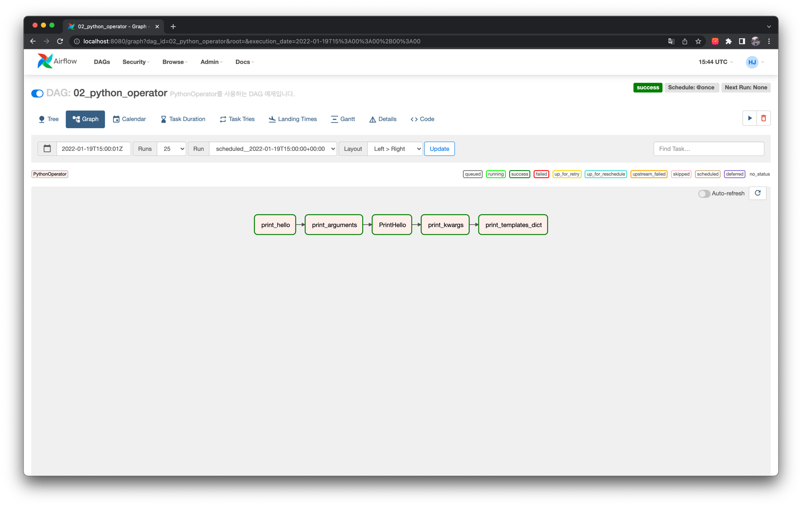
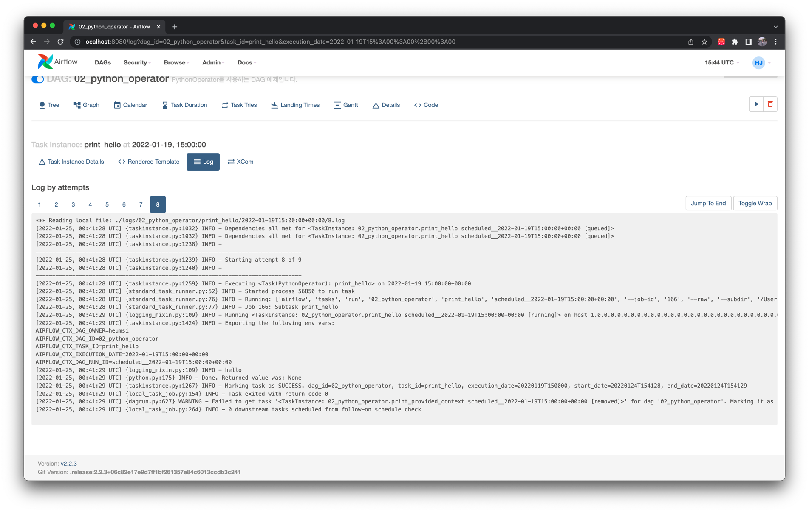
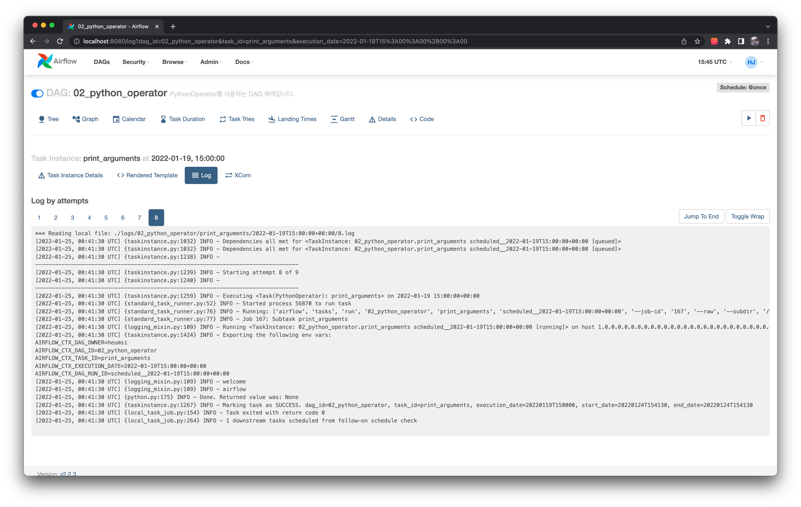
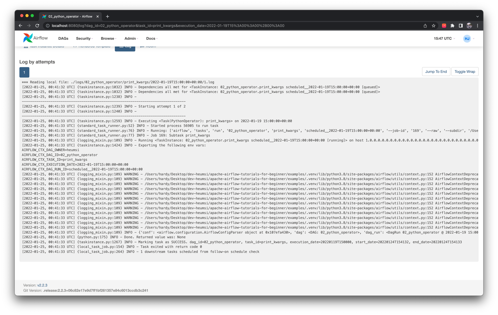
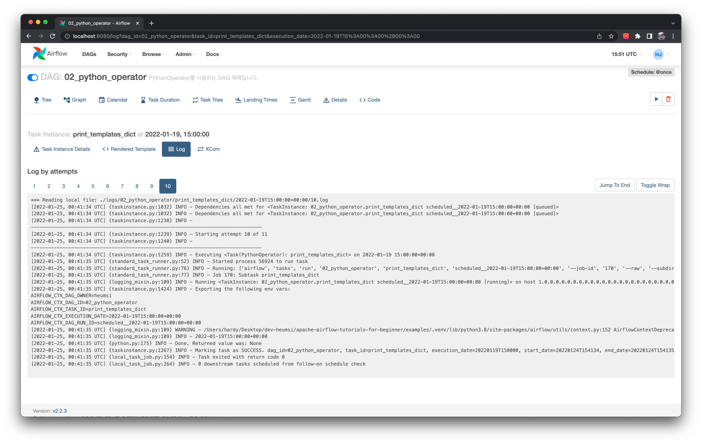

# PythonOperator

## Graph View



## Code

<<< @/../examples/dags/04_using_various_operators/02_python_operator.py

## Web UI








```python
{
    'conf': <airflow.configuration.AirflowConfigParser object at 0x107efa430>,
    'dag': <DAG: 02_python_operator>,
    'dag_run': <DagRun 02_python_operator @ 2022-01-19 15:00:00+00:00: scheduled__2022-01-19T15:00:00+00:00,
    externally triggered: False>,
    'data_interval_end': DateTime(2022, 1, 19, 15, 0, 0, tzinfo=Timezone('UTC')),
    'data_interval_start': DateTime(2022, 1, 19, 15, 0, 0, tzinfo=Timezone('UTC')),
    'ds': '2022-01-19',
    'ds_nodash': '20220119',
    'execution_date': DateTime(2022, 1, 19, 15, 0, 0, tzinfo=Timezone('UTC')),
    'inlets': [],
    'logical_date': DateTime(2022, 1, 19, 15, 0, 0, tzinfo=Timezone('UTC')),
    'macros': <module 'airflow.macros' from '/Users/hardy/Desktop/dev-heumsi/apache-airflow-tutorials-for-beginner/examples/.venv/lib/python3.8/site-packages/airflow/macros/__init__.py'>,
    'next_ds': None,
    'next_ds_nodash': None,
    'next_execution_date': None,
    'outlets': [],
    'params': {},
    'prev_data_interval_start_success': None,
    'prev_data_interval_end_success': None,
    'prev_ds': None,
    'prev_ds_nodash': None,
    'prev_execution_date': None,
    'prev_execution_date_success': None,
    'prev_start_date_success': None,
    'run_id': 'scheduled__2022-01-19T15:00:00+00:00',
    'task': <Task(PythonOperator): print_kwargs>,
    'task_instance': <TaskInstance: 02_python_operator.print_kwargs scheduled__2022-01-19T15:00:00+00:00 [running]>,
    'task_instance_key_str': '02_python_operator__print_kwargs__20220119',
    'test_mode': False,
    'ti': <TaskInstance: 02_python_operator.print_kwargs scheduled__2022-01-19T15:00:00+00:00 [running]>,
    'tomorrow_ds': '2022-01-20',
    'tomorrow_ds_nodash': '20220120',
    'ts': '2022-01-19T15:00:00+00:00',
    'ts_nodash': '20220119T150000',
    'ts_nodash_with_tz': '20220119T150000+0000',
    'var': {'json': None, 'value': None},
    'conn': None,
    'yesterday_ds': '2022-01-18',
    'yesterday_ds_nodash': '20220118',
    'templates_dict': None
}
```

:::tip
https://airflow.apache.org/docs/apache-airflow/stable/templates-ref.html
:::


