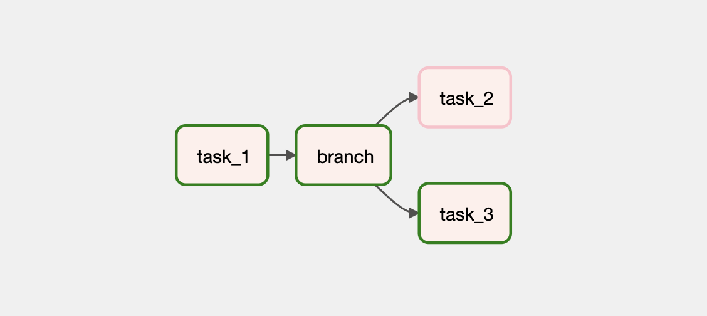

# BranchPythonOperator

`BranchPythonOperator` 는 특정 조건에 따라 의존성 흐름에 분기를 줄 수 있는 Operator입니다.
이전 글 [조건에 따라 다른 Task 의존성 작성하기](/dags/01-writing-various-tasks-dependencies/04-conditional-task-flow-with-branch/)에서 이미 한 번 살펴봤으므로
여기에서 자세한 내용은 생략하겠습니다.

## Graph View

## Code

<<< @/../my-airflow-project/dags/01_writing_various_task_flows/04_conditional_tasks_with_branch.py{7,26-27,32-38,40}

## Web UI

