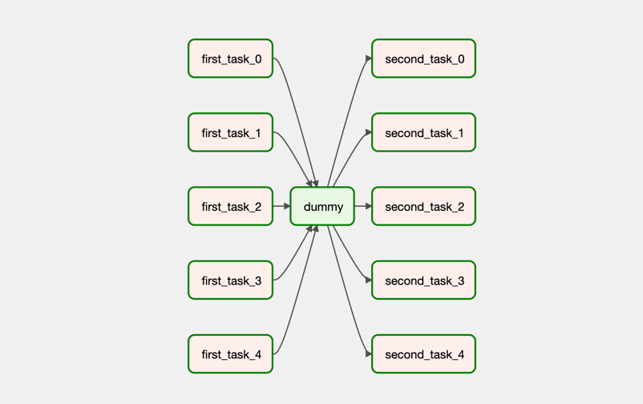
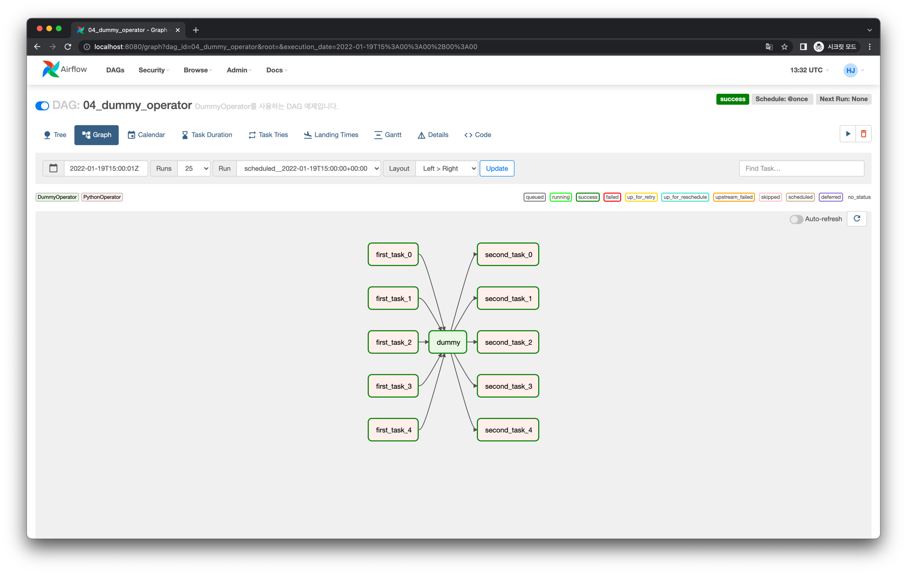
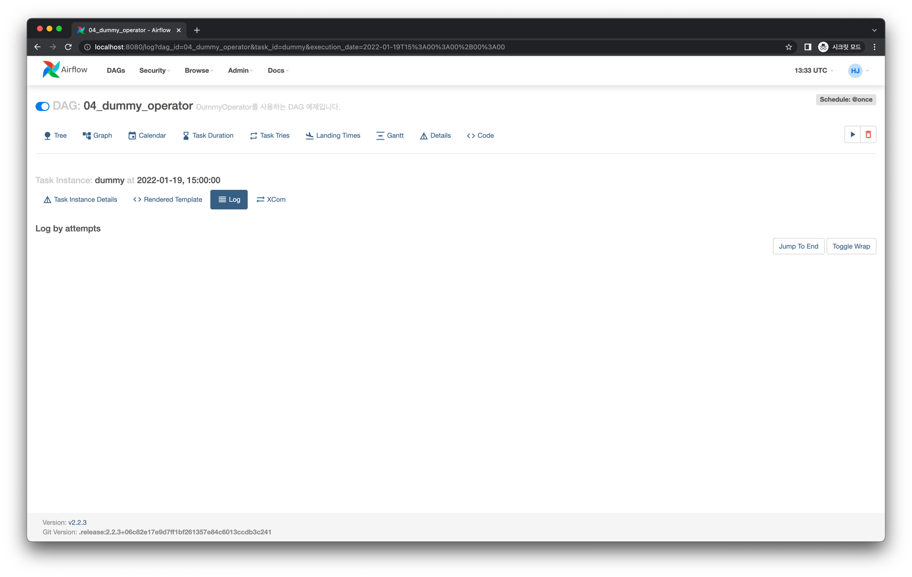

# DummyOperator

`DummyOperator` 는 아무 실행도 하지 않는 Operator입니다. 간혹 Task 간 의존성 흐름 내 필요한 경우에 사용됩니다.

## Graph View

다음과 같은 Task 의존성을 가지는 DAG을 작성해봅시다.

- `first_task_0` ~ `first_task_4` Task Instance는 병렬로 실행됩니다.
- 이 중 하나가 먼저 성공했다고 하더라도 가운데 `dummy` Task Instance가 이전의 모든 Task Instance가 성공되기를 기다리기 때문에,
`first_task_0` ~ `first_task_4` 가 모두 성공해야 그 다음 `second_task_0` ~ `second_task_4` Task Instance를 한 번에 병렬로 실행하게 됩니다.

## Code

<<< @/../my-airflow-project/dags/04_using_various_operators/04_dummy_operator.py{5,29}

## Web UI

다음처럼 잘 실행된 것을 로그를 통해 확인할 수 있습니다.

`DummyOperator` Task Instance는 어떤 로그도 출력하지 않았습니다.

