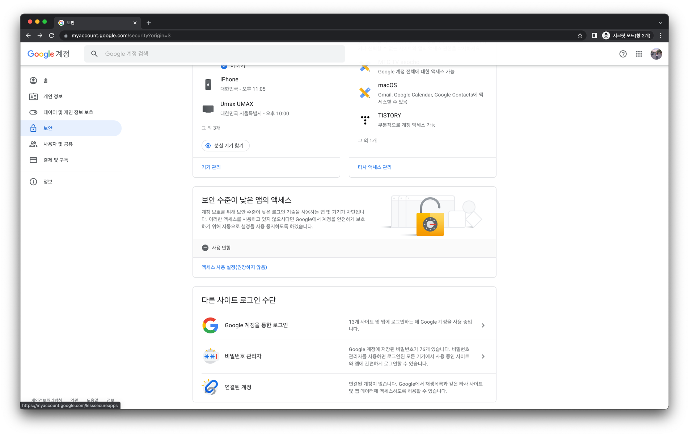
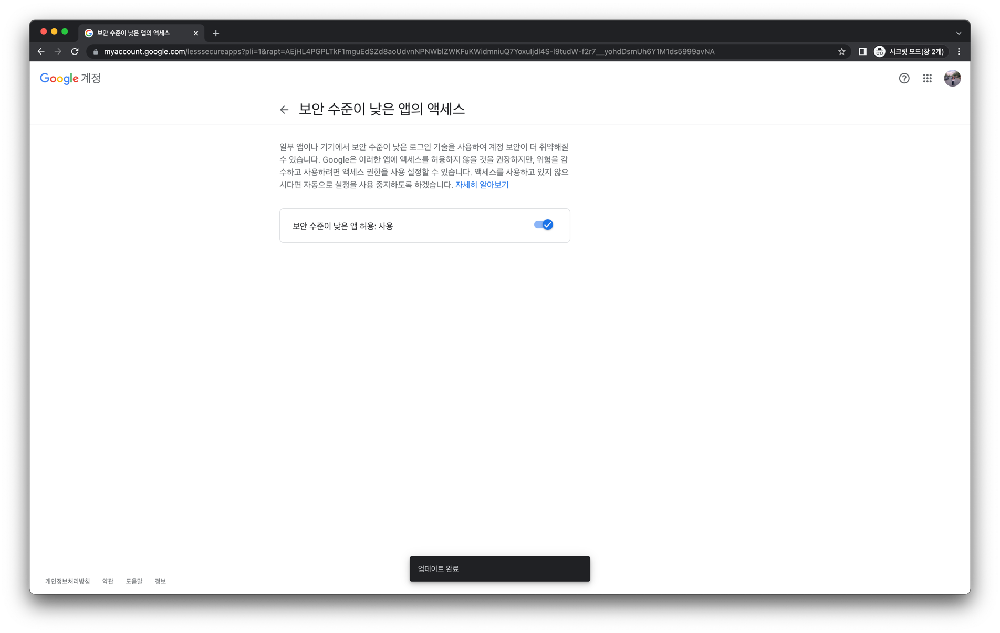
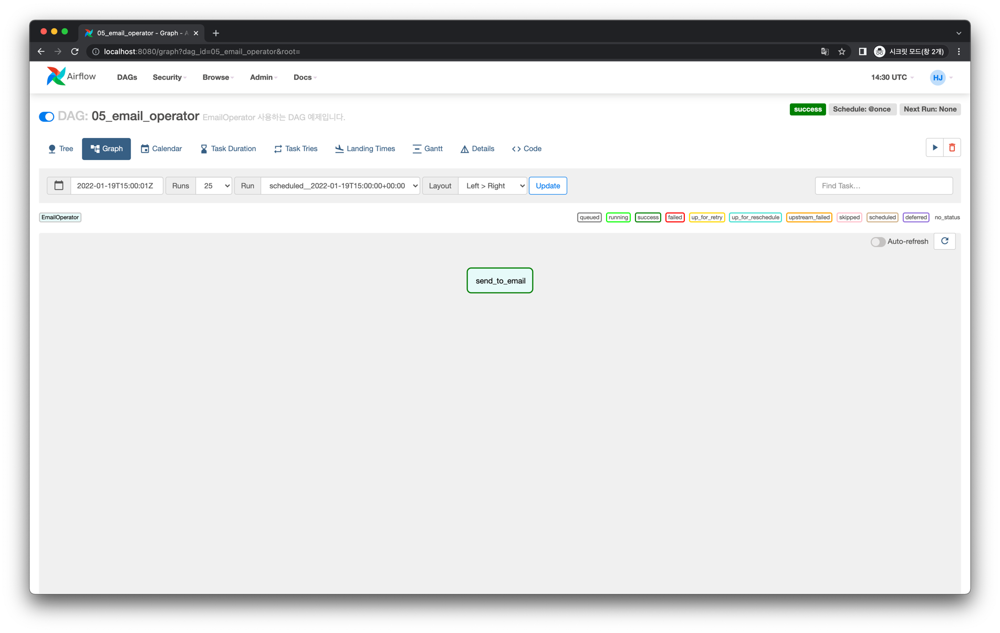
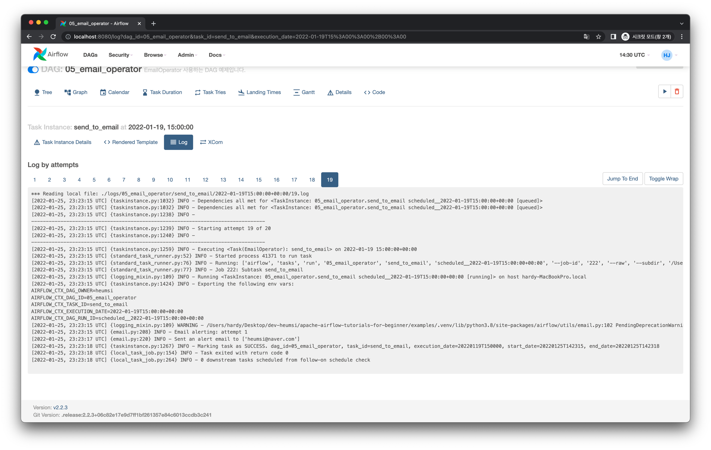
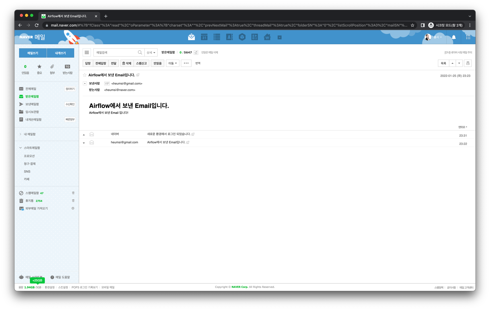

# EmailOperator

## 사전 준비

`EmailOperator`를 쓰기 위해서 먼저 Airflow의 SMTP 관련 설정을 해줘야합니다.
여기서는 간단하게 Airflow에서 사용할 메일 서버로 gmail을 사용해보겠습니다.

### Google 내 계정 페이지에서 보안 수준 낮은 앱 액세스 설정

브라우저에서 [Google 내 계정 페이지](https://myaccount.google.com/security)에 접속하여 왼쪽에서 "보안" 탭 누릅니다.
보이는 항목 중 "보안 수준이 낮은 앱의 액세스" 부분이 아래처럼 "사용 안함"으로 되어있을겁니다..



이를 클릭하여 다음처럼 "사용"으로 바꿔주세요.



### `airflow.cfg` 에서 SMTP 설정

`$AIRLFOW_HOME` 에서 `airflow.cfg` 파일을 찾습니다.
파일 내부에서 `[smtp]` 를 검색해보면 다음과 같이 되어있을 겁니다.

```ini
[smtp]

smtp_host = localhost
smtp_starttls = True
smtp_ssl = False
# smtp_user =
# smtp_password =
smtp_port = 25
smtp_mail_from = airflow@example.com
smtp_timeout = 30
smtp_retry_limit = 5
```

이제 이 항목을 다음처럼 변경합니다.

```ini{3,6,8,10,11}
[smtp]

smtp_host = smtp.gmail.com
smtp_starttls = True
smtp_ssl = False
smtp_user = "gmail 서버 유저"
# smtp_user = heumsi
smtp_password = "본인의 비밀번호"
# smtp_password = 1234
smtp_port = 587
smtp_mail_from = "gmail 서버 유저 이메일"
# smtp_mail_from = heumsi@gmail.com
smtp_timeout = 30
smtp_retry_limit = 5
```

이 때 `smtp_user`와 `smtp_password` 에는 Google 계정 정보에 대해 써주시면 됩니다.
그리고 `smtp_mail_from` 는 예시(주석)처럼 Google 계정 이메일을 써주시면 됩니다.

### Scheduler 재기동

`airflow.cfg` 파일을 이처럼 변경한 후 적용을 위해 Scheduler를 종료한 뒤 `$AIRFLOW_HOME`에서 Scheduler를 재기동합니다.

```bash
$ airflow scheduler
```

## Graph View


## Code

<<< @/../my-airflow-project/dags/04_using_various_operators/05_email_operator.py

## Web UI






