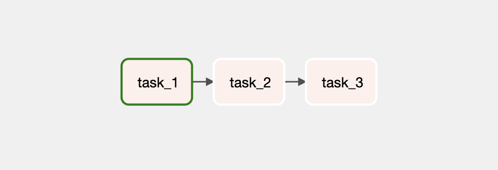
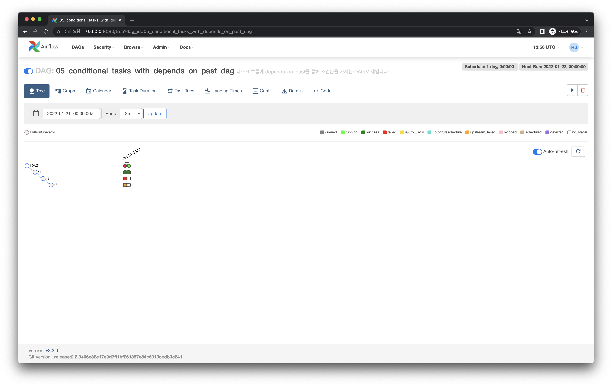

# 직전 DAG Run의 Task 상태에 따라 Task 실행 여부를 결정하는 DAG 작성하기

## Graph View




## Tree View


## Code

<<< @/../examples/dags/05_conditional_tasks_with_depends_on_past.py

:::tip
`depends_on_past` 는 기본적으로 모든 `Operator` 에  `False` 로 설정되어 있습니다. 따라서 이 설정 값을 적용하려면 위 코드처럼 명시적으로 `depends_on_past=True` 로 설정해주어야 합니다.
:::

:::tip
`depends_on_past=True` 를 다음처럼  `default_args` 에 넣어주면, 모든 Task에 대해 직전 DAG Run의 Task 각각의 상태에 따라 실행할 수 있게 됩니다.

```python
with DAG(
    ...
    default_args={
        ...
        "depends_on_past": True
    },
    ...
) as dag:
    ...
```

:::

## Web UI


