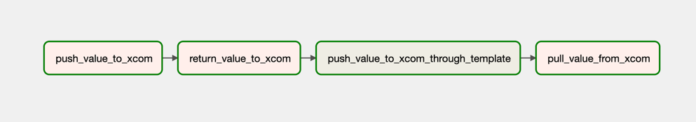
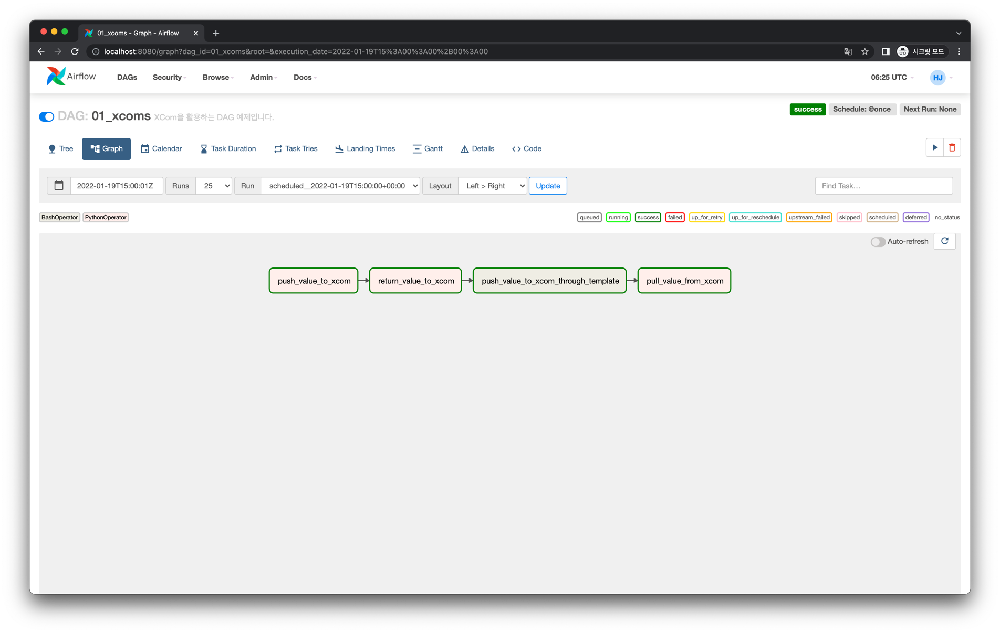
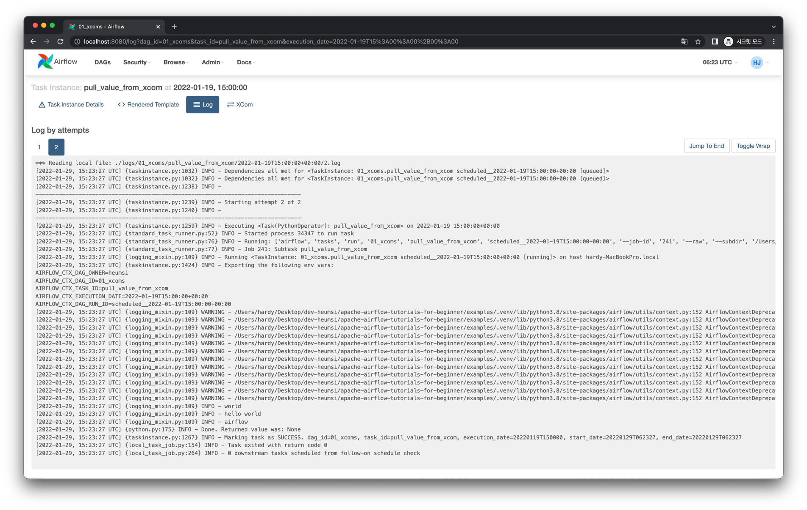
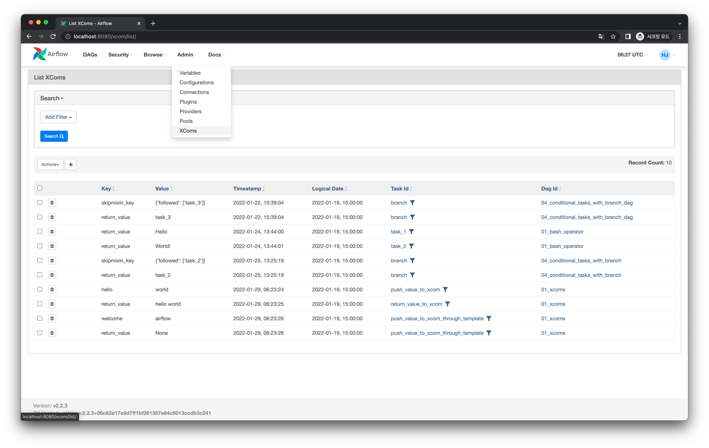
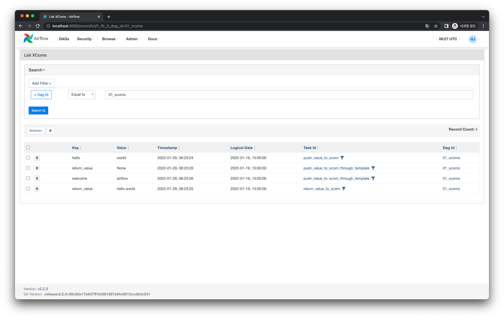

# XComs - Task 간 데이터 주고받기

Airflow의 DAG 내에서 각각 Task Instance들의 실행은 격리되어 있습니다.
따라서 기본적으로 Task Instance 간 메모리를 공유하고 있지 않으며, 데이터를 주고 받으려면 별도의 동작이 필요합니다.

XComs는 Cross Communications의 줄임말로 Task Instance 간 데이터를 주고 받고싶을 때 사용하는 Airflow 기능입니다.

:::warning
XComs의 저장 범위는 DAG Run 내에서만 유효합니다.
서로 다른 DAG Run에서는 XComs를 통한 데이터 주고 받기가 불가능합니다.
:::

## Grpah View

다음과 같이 XCom 을 활용한 Task 의존성을 가지는 DAG을 작성해볼 것 입니다.

## Code

전체 코드는 다음과 같습니다.

<<< @/../my-airflow-project/dags/05_etc_features/01_xcoms.py

XComs를 활용하여 Task간 넘기는 방법은 다음처럼 이루어집니다.

- Task A Instance에서 XCom에 데이터를 저장한다. (push)
- Task B Instance에서 XCom에 저장된 데이터를 가져온다. (pull)

### XCom에 데이터 저장하기

위 코드에서 XCom에 데이터를 저장하는 부분은 다음과 같습니다.

<<< @/../my-airflow-project/dags/05_etc_features/01_xcoms.py{21-26,40-51}

- XCom에 데이터를 저장하는 첫 번째 방법은 `kwargs` 에서 `task_instance` 를 가져와 `xcom_push` 메서드를 사용하는 것입니다.
  - `21-23` 라인이 이 방법을 사용합니다.
  - Xcom에 데이터를 저장할 때는 Key-Value 형태로 합니다.
- XCom에 데이터를 저장하는 두 번째 방법은 Callable 객체의 리턴 값을 활용하는 것입니다.
  - `25-26` 라인이 이 방법을 사용합니다.
  - 리턴 값은 Key-Value 형태에서 '값'이 되며, '키' 값은 자동적으로 `return_value` 라는 값이 됩니다.
- XCom에 데이터를 저장하는 세 번째 방법은 템플릿 문법을 활용하는 것입니다.
  - `48-51` 라인이 이 방법을 사용합니다.
  - `task_instance` 는 템플릿 변수로 제공 되므로 `{{ }}` 안에서 사용할 수 있습니다.

:::tip
`PythtonOperator`의 경우 반환 값이 XCom로 푸시됩니다.
`BashOperator`의 경우 stdout의 가장 마지막 줄만 XCom으로 푸시됩니다.
(이 기능을 끄고 싶다면 `BashOperator`의 생성자 파라미터 중 `do_xcom_push=False`로 지정하면 됩니다.)

두 경우 모두 XCom의 Key는 `return_value` 로 자동 지정됩니다.
:::

### XCom에 저장된 데이터 불러오기

위 코드에서 XCom에 저장된 데이터를 불러오는 부분은 다음과 같습니다.

<<< @/../my-airflow-project/dags/05_etc_features/01_xcoms.py{28-38,53-55}

- XCom에 데이터를 불러오는 방법은 `kwargs` 에서 `task_instance` 를 가져와 `xcom_pull` 메서드를 사용하는 것입니다.
  - `key` 파라미터에 불러올 데이터의 Key를 넘겨주면 Value를 받을 수 있습니다.
  - XCom에 데이터를 `return` 으로 저장했을 시, `xcom_pull` 메서드에서 `task_ids` 파라미터에 데이터를 저장한 `task_id` 를 넘겨주어 `return` 으로 저장한 데이터를 받아올 수 있습니다. (`34` 번 라인)

## Web UI

실행 결과를 확인해보면 다음과 같습니다.

*`pull_value_from_xcom` Task Instance의 실행 로그*

XCom에 저장된 데이터는 웹 UI에서 상단 메뉴의 Admin - XComs에서 다음처럼 확인할 수 있습니다.

:::warning
XCom는 Task 간의 간단한 데이터를 주고 받기 위한 용도이며, 대용량 파일이나 데이터를 주고받기에는 적절치 않습니다.
XCom은 Database에 저장되는데, XCom으로 주고받을 수 있는 데이터 사이즈 한계는 Database에 따라 다음과 같습니다.

- SQLite: 2 Go
- Postgres: 1 Go
- MySQL: 64 KB
:::

## 더 읽어보면 좋을 글

- [What is an Airflow XCom?](https://marclamberti.com/blog/airflow-xcom/)
