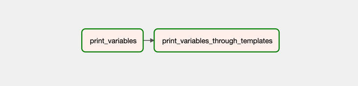
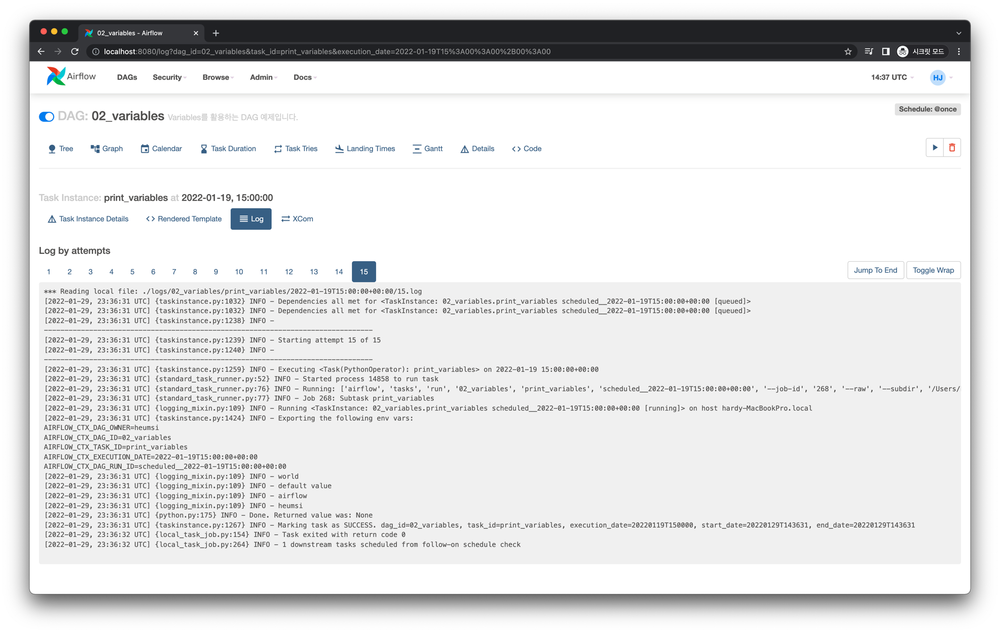

# Variables - 전역 변수 사용하기

Variables는 어느 DAG에서든 불러올 수 있는 Airflow에서 제공하는 일종의 전역 변수입니다.

## Web UI

먼저 Variables로 데이터를 저장해봅시다.

웹 UI에서 상단 메뉴의 Admin - Variables 페이지로 진입합니다.

진입한 페이지에서 + 버튼을 클릭합니다.

Key와 Val, 그리고 Description 폼에 다음과 같이 입력합니다.

Save 버튼을 클릭하면 다음처럼 Variable이 생성됩니다.

다시 + 버튼을 눌러 하나 더 만들어봅시다. 이번엔 다음처럼 Val 값으로 JSON 데이터를 입력합니다.

Save 버튼으로 Variable을 생성합니다.

총 2개의 Variable을 생성했습니다.

:::tip
Variable은 위처럼 웹 UI에서 만들 수도 있지만, CLI나 환경 변수로도 만들 수 있습니다.
이에 대한 자세한 내용은 아래 공식 문서를 확인해주세요.

- [Variables를 환경 변수로 정의하는 법](https://airflow.apache.org/docs/apache-airflow/stable/howto/variable.html#storing-variables-in-environment-variables)
- [Variables를 CLI로 정의하는 법](https://airflow.apache.org/docs/apache-airflow/stable/cli-and-env-variables-ref.html#import_repeat3)
:::

## Graph View

다음과 같이 Variable 을 활용한 Task 의존성을 가지는 DAG을 작성해볼 것 입니다.

## Code

전체 코드는 다음과 같습니다.

<<< @/../my-airflow-project/dags/05_etc_features/02_variables.py

코드에서 Variable을 불러오는 방법은 2가지 방법이 있는데 각 부분을 하나씩 알아봅시다.

### `Variable.get()` 으로 불러오기

<<< @/../my-airflow-project/dags/05_etc_features/02_variables.py{4,20-31,42}

- `Variable.get()` 메서드로 Variable을 불러옵니다.
  - `key` 파라미터로 불러올 Variable의 Key를 넘겨줘야 합니다.
  - `default_var` 파라미터로 `key`에 해당하는 Variable이 없는 경우의 기본 값을 지정할 수 있습니다.
  - `deserialize_json` 파라미터를 `True`로 주면 Val이 JSON 데이터인 경우, 이를 파싱하여 파이썬 `Dict` 자료구조 형태로 받아옵니다.

### 템플릿 문법으로 불러오기

<<< @/../my-airflow-project/dags/05_etc_features/02_variables.py{33-40,43-51}

- `47-49` 라인처럼 템플릿 문법으로 불러올 수 있습니다.

## Log

`print_variables` Task Instance의 실행 로그는 다음과 같습니다.

`print_variables_through_templates` Task Instance의 실행 로그는 다음과 같습니다.

