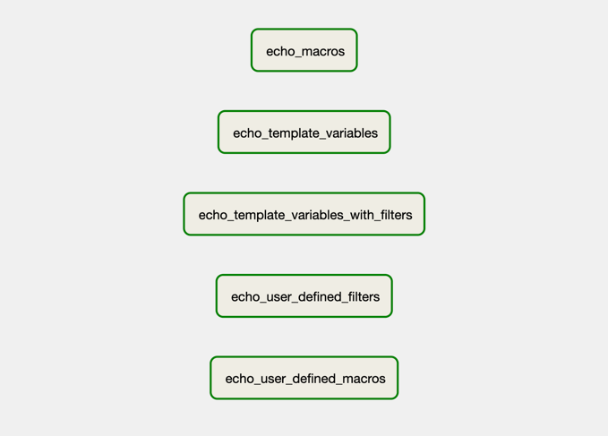
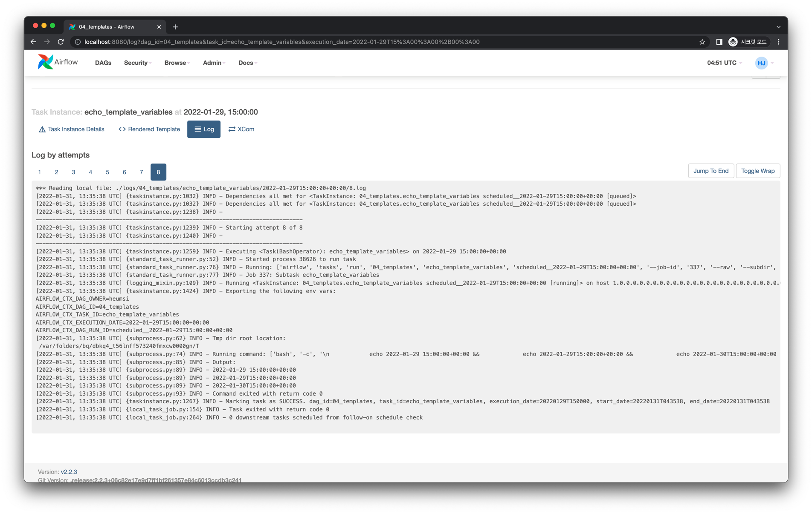
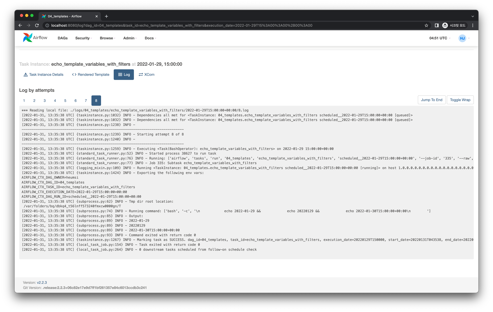
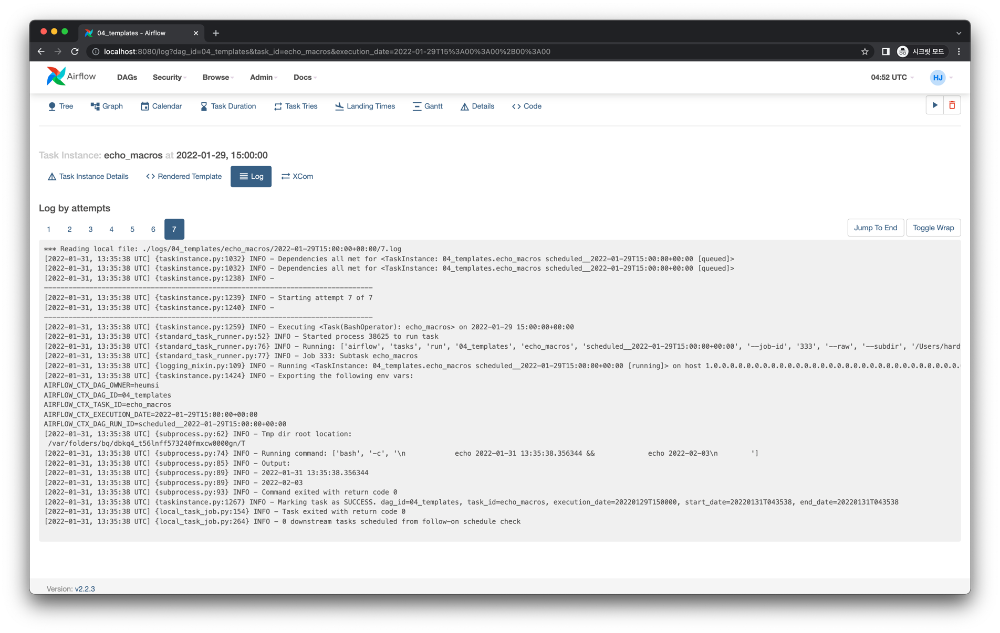
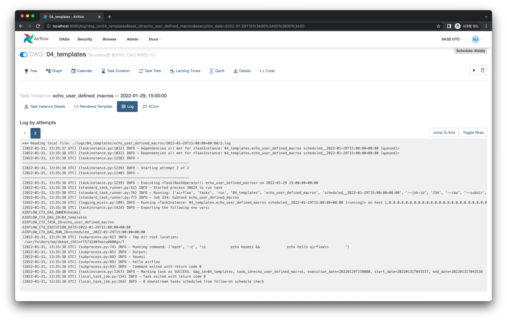
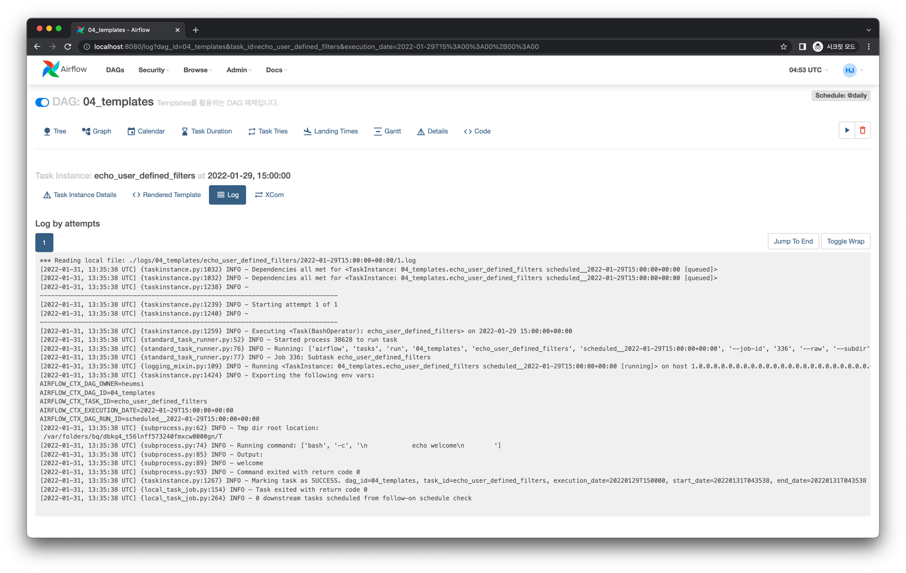

# Templates - 동적으로 변수를 넘기는 또다른 방법

## Overview

### Grpah View



### Code

<<< @/../my-airflow-project/dags/05_etc_features/04_templates.py

## Pre Defined Variables

### Code

<<< @/../my-airflow-project/dags/05_etc_features/04_templates.py

### Log



```
[2022-01-31, 13:35:38 UTC] {subprocess.py:89} INFO - 2022-01-29 15:00:00+00:00
[2022-01-31, 13:35:38 UTC] {subprocess.py:89} INFO - 2022-01-29T15:00:00+00:00
[2022-01-31, 13:35:38 UTC] {subprocess.py:89} INFO - 2022-01-30T15:00:00+00:00
```

:::tip
Airflow에 미리 정의된 모든 변수는 [공식 문서](https://airflow.apache.org/docs/apache-airflow/stable/templates-ref.html#variables)에서 확인하실 수 있습니다.
:::

## Pre Defined Filters

### Code

<<< @/../my-airflow-project/dags/05_etc_features/04_templates.py

### Log



```
[2022-01-31, 13:35:38 UTC] {subprocess.py:89} INFO - 2022-01-29
[2022-01-31, 13:35:38 UTC] {subprocess.py:89} INFO - 20220129
[2022-01-31, 13:35:38 UTC] {subprocess.py:89} INFO - 2022-01-30T15:00:00+00:00
```

:::tip
Airflow에 미리 정의된 모든 변수는 [공식 문서](https://airflow.apache.org/docs/apache-airflow/stable/templates-ref.html#filters)에서 확인하실 수 있습니다.
:::

## Macros

### Code

<<< @/../my-airflow-project/dags/05_etc_features/04_templates.py

### Log



```
[2022-01-31, 13:35:38 UTC] {subprocess.py:89} INFO - 2022-01-31 13:35:38.356344
[2022-01-31, 13:35:38 UTC] {subprocess.py:89} INFO - 2022-02-03
```

:::tip
Airflow에 미리 정의된 모든 변수는 [공식 문서](https://airflow.apache.org/docs/apache-airflow/stable/templates-ref.html#macros)에서 확인하실 수 있습니다.
:::

## User Defined Macros

### Code

<<< @/../my-airflow-project/dags/05_etc_features/04_templates.py

### Log



```
[2022-01-31, 13:35:38 UTC] {subprocess.py:89} INFO - heumsi
[2022-01-31, 13:35:38 UTC] {subprocess.py:89} INFO - hello airflow
```

## User Defined Filters

### Code

<<< @/../my-airflow-project/dags/05_etc_features/04_templates.py

### Log



```
[2022-01-31, 13:35:38 UTC] {subprocess.py:89} INFO - welcome
```

## 더 읽어보면 좋을 글

- [불곰님 블로그 - [Airflow] Templates](https://brownbears.tistory.com/588)

## Keywords

- Templates
- Macro

:::tip
일반적으로 Operator에 Template 변수를 넘기는 방법은 [Custom Operator](/dags/04-using-various-operators/07-custom-operator/#code) 페이지를 참고하세요.
:::
