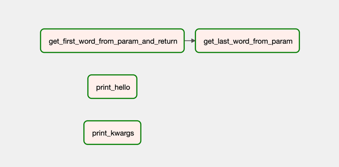
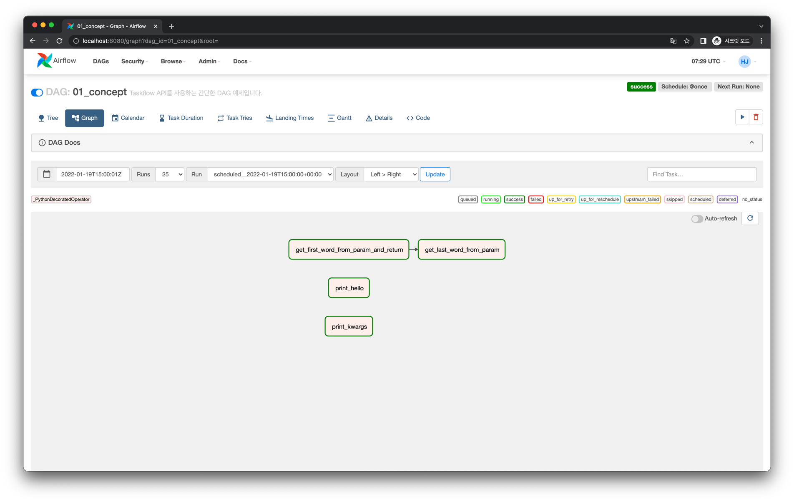
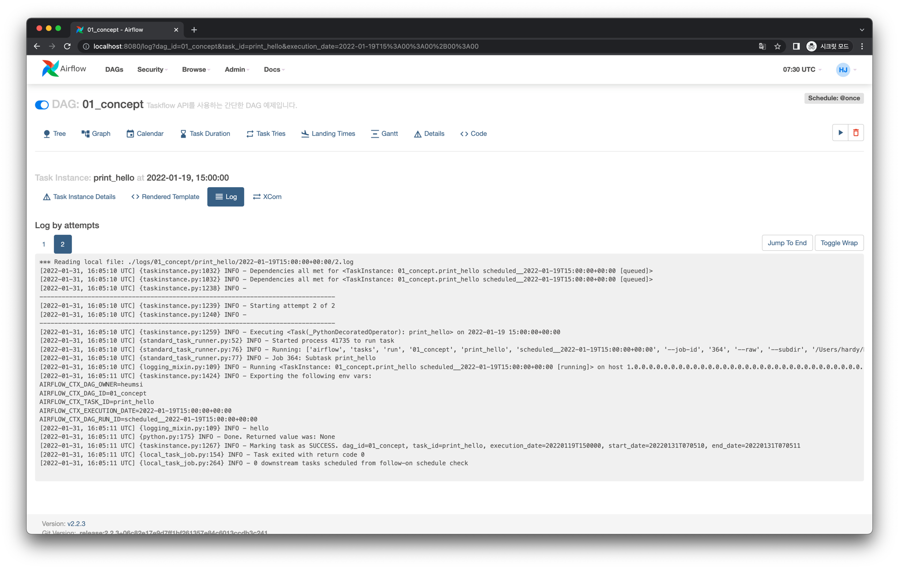
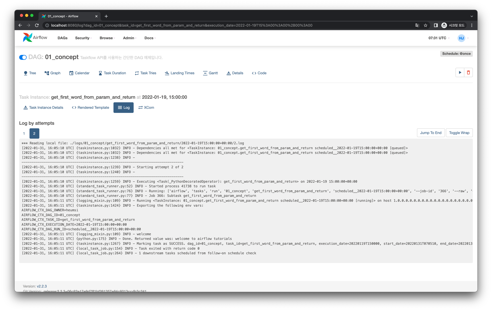
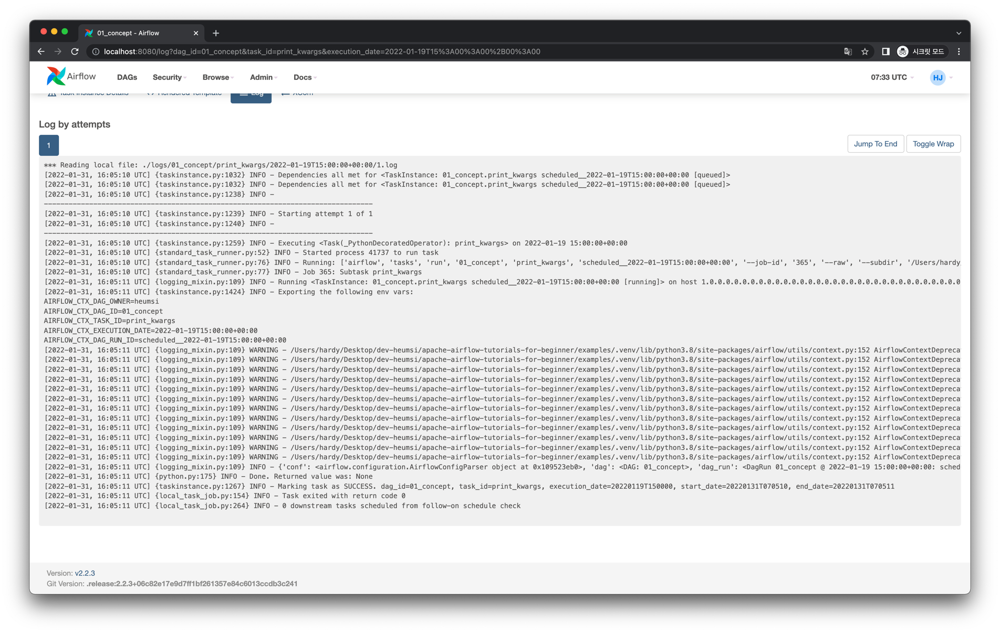

# 개념

Airflow를 통해 DAG을 작성하다보면, 일반적으로 `PythonOperator` 를 많이 사용하게 됩니다.
Taskflow API는 이런 `PythonOperator` 을 좀 더 쉽게 사용하기 위해 2.x 버전부터 등장한 개념입니다.

Taskflow API를 사용하면 DAG을 작성하는 방식이 기존과 조금 달라지게 됩니다.

## Graph View

다음과 같은 Task 의존성을 가지는 DAG을 Taskflow API로 작성해보겠습니다.



## Code

전체 코드는 다음과 같습니다.

<<< @/../my-airflow-project/dags/06_taskflow_api/01_concept.py

주요한 부분을 하나씩 살펴보겠습니다.

<<< @/../my-airflow-project/dags/06_taskflow_api/01_concept.py{3,7-17}

- `@dag` 데코레이터를 메인이 되는 함수 위에 두어 `DAG` 인스턴스를 정의합니다.
  - `@dag` 데코레이터 내 파라미터는 일반적인 `DAG` 생성 파라미터와 동일합니다.


<<< @/../my-airflow-project/dags/06_taskflow_api/01_concept.py{3,25-48}

- `@task` 데코레이터를 함수 위에 두어 Task 인스턴스를 정의합니다.
  - 기존과 달리 `PythonOperator`로 정의하지 않고 함수를 정의한 뒤 데코레이터를 붙이는 방식입니다.

<<< @/../my-airflow-project/dags/06_taskflow_api/01_concept.py{50-53}

- `@task` 데코레이터를 붙인 함수(Task Instance)들을 호출합니다.
- 함수 간 의존 관계가 있다면 Scheduler가 파싱할 때 자동으로 의존 관계가 설정됩니다.
  - 즉 `>>` 와 같이 명시적으로 Task Instance간 의존성 정의를 하지 않아도 됩니다.

Taskflow API 형태가 아닌 Operator 형태로 작성했다면 다음과 같습니다.

<<< @/../my-airflow-project/dags/06_taskflow_api/01_concept_pyoperator_version.py

- Taskflow API에 비해 코드량이 조금 더 늘어납니다.
- 또한 XCom을 직접 사용해야해서 조금 복잡할 수 있습니다.

## Web UI & Logs

DAG을 실행하면 다음과 같은 화면을 얻습니다.



각 Task Instance의 로그를 살펴보면 다음과 같습니다.

### `print_hello`



```
[2022-01-31, 16:05:11 UTC] {logging_mixin.py:109} INFO - hello
```

### `get_first_word_from_param_and_return`



```
[2022-01-31, 16:05:11 UTC] {logging_mixin.py:109} INFO - welcome
```

### `get_last_word_from_param`


```
[2022-01-31, 16:05:13 UTC] {logging_mixin.py:109} INFO - tutorials
```

### `print_kwargs`



```
[2022-01-31, 16:05:11 UTC] {logging_mixin.py:109} INFO - {
    'conf': <airflow.configuration.AirflowConfigParser object at 0x109523eb0>,
    'dag': <DAG: 01_concept>,
    'dag_run': <DagRun 01_concept @ 2022-01-19 15:00:00+00:00: scheduled__2022-01-19T15:00:00+00:00, externally triggered: False>,
    'data_interval_end': DateTime(2022, 1, 19, 15, 0, 0, tzinfo=Timezone('UTC')),
    'data_interval_start': DateTime(2022, 1, 19, 15, 0, 0, tzinfo=Timezone('UTC')),
    'ds': '2022-01-19',
    'ds_nodash': '20220119',
    'execution_date': DateTime(2022, 1, 19, 15, 0, 0, tzinfo=Timezone('UTC')),
    'inlets': [],
    'logical_date': DateTime(2022, 1, 19, 15, 0, 0, tzinfo=Timezone('UTC')),
    'macros': <module 'airflow.macros' from '/Users/hardy/Desktop/dev-heumsi/apache-airflow-tutorials-for-beginner/examples/.venv/lib/python3.8/site-packages/airflow/macros/__init__.py'>,
    'next_ds': None,
    'next_ds_nodash': None,
    'next_execution_date': None,
    'outlets': [],
    'params': {},
    'prev_data_interval_start_success': None,
    'prev_data_interval_end_success': None,
    'prev_ds': None,
    'prev_ds_nodash': None,
    'prev_execution_date': None,
    'prev_execution_date_success': None,
    'prev_start_date_success': None,
    'run_id': 'scheduled__2022-01-19T15:00:00+00:00',
    'task': <Task(_PythonDecoratedOperator): print_kwargs>,
    'task_instance': <TaskInstance: 01_concept.print_kwargs scheduled__2022-01-19T15:00:00+00:00 [running]>,
    'task_instance_key_str': '01_concept__print_kwargs__20220119',
    'test_mode': False,
    'ti': <TaskInstance: 01_concept.print_kwargs scheduled__2022-01-19T15:00:00+00:00 [running]>,
    'tomorrow_ds': '2022-01-20',
    'tomorrow_ds_nodash': '20220120',
    'ts': '2022-01-19T15:00:00+00:00',
    'ts_nodash': '20220119T150000',
    'ts_nodash_with_tz': '20220119T150000+0000',
    'var': {'json': None, 'value': None},
    'conn': None,
    'yesterday_ds': '2022-01-18',
    'yesterday_ds_nodash': '20220118',
    'templates_dict': None
}
```
