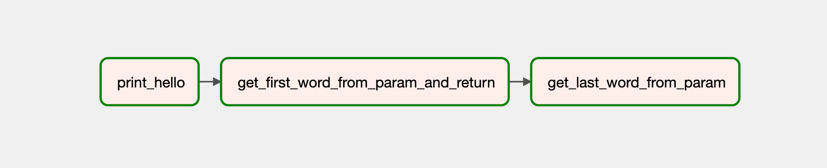
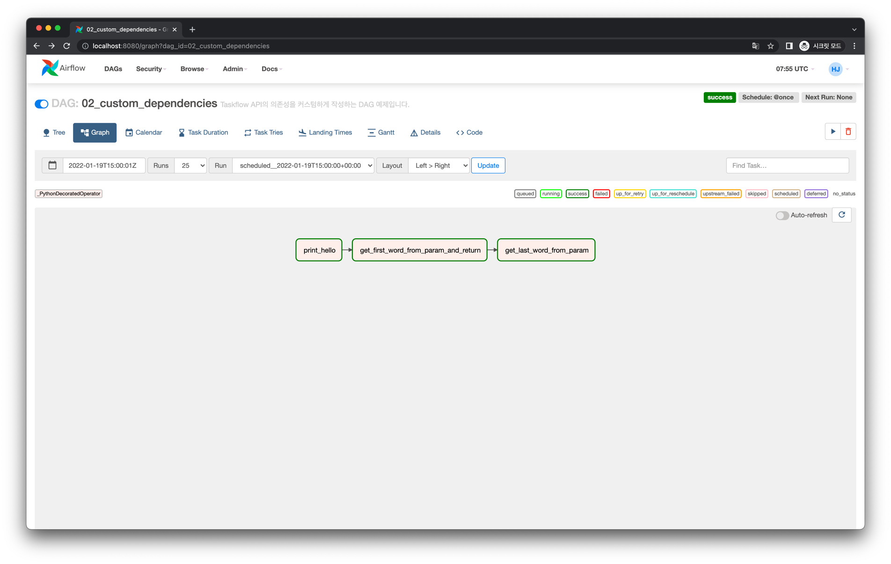
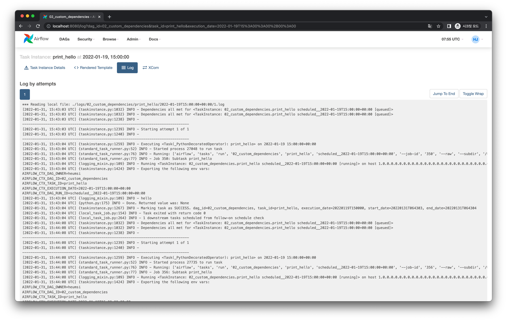
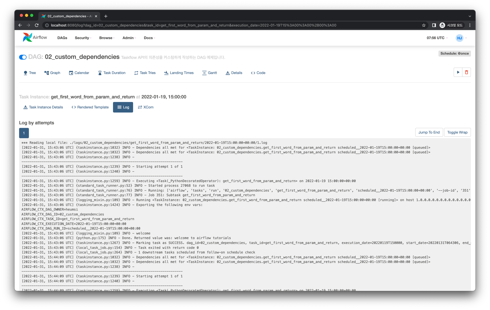
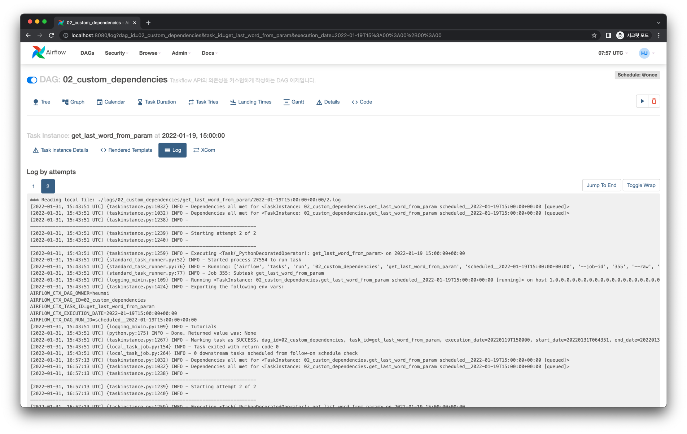

# 커스텀하게 Task간 의존성 작성하기

## Graph View



## Code

<<< @/../my-airflow-project/dags/06_taskflow_api/02_custom_dependencies.py

## Web UI & Logs



### `print_hello`



```
[2022-01-31, 15:43:04 UTC] {logging_mixin.py:109} INFO - hello
```

### `get_first_word_from_param_and_return`



```
[2022-01-31, 15:43:06 UTC] {logging_mixin.py:109} INFO - welcome
```

### `get_last_word_from_param`



```
[2022-01-31, 15:43:51 UTC] {logging_mixin.py:109} INFO - tutorials
```

## Keywords

- Taskflow API
- Task Dependencies
