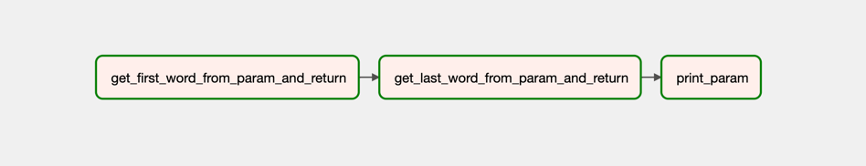
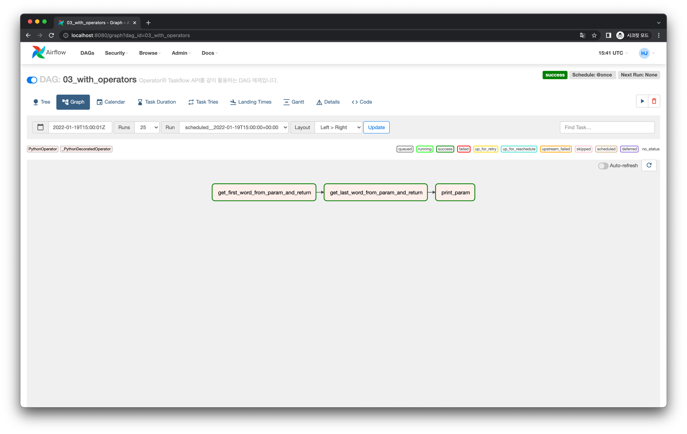
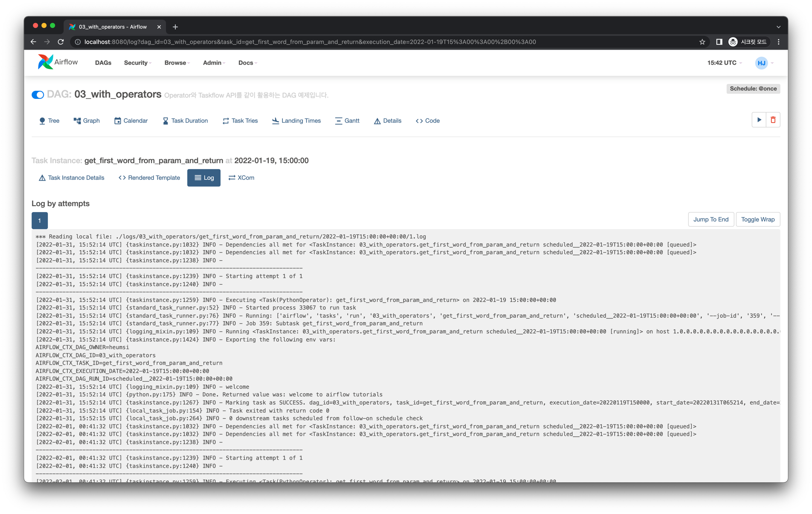
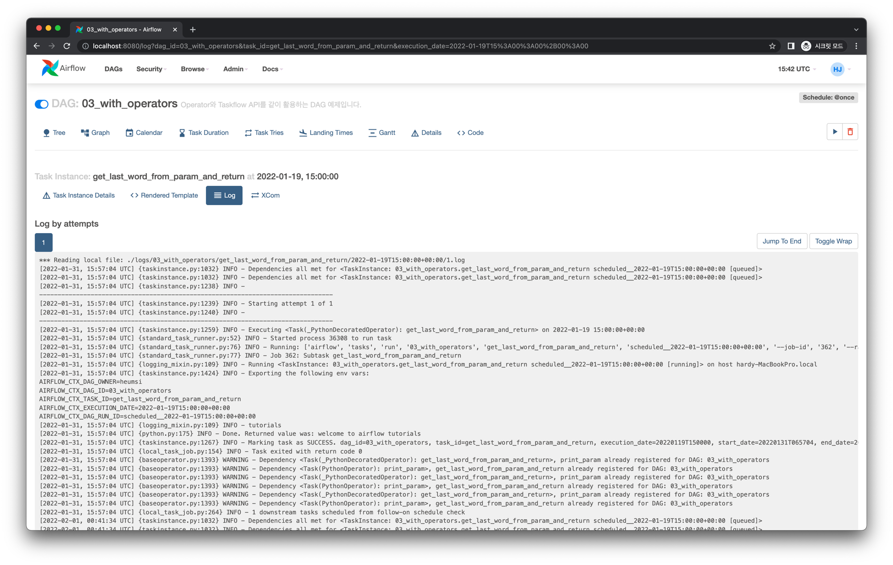
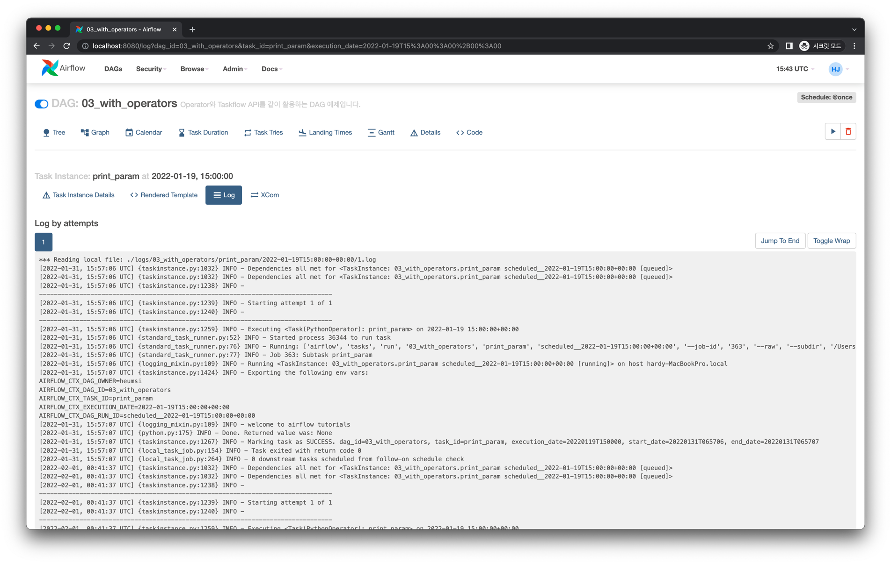

# Operator와 함께 사용하기

Taskflow API와 기존의 방식인 Operator를 같이 사용하는 방법을 알아봅시다.

## Graph View

다음과 같은 Task 의존성을 갖는 DAG을 작성할 것입니다.



## Code

<<< @/../my-airflow-project/dags/06_taskflow_api/03_with_operators.py{3-4,20-37,39-49,51}

- 전체적으로 Operator를 사용하는 방식과 큰 차이가 없습니다.
- `27-33` 번 라인에 `@task` 데코레이터로 Task를 정의한 부분이 있습니다.
- `46` 번 라인에 이 Task를 Task Instance로 정의합니다.
  - 이 때 `task_1.output` 으로 `task_1` 의 `return` 값을 가져올 수 있습니다.
- `51` 번 라인에는 Task 간 의존 관계를 정의합니다. 크게 다른 부분은 없습니다.

## Web UI & Logs

DAG을 실행하면 다음과 같은 화면을 얻습니다.



각 Task Instance의 로그를 살펴보면 다음과 같습니다.

### `get_first_word_from_param_and_return`



```
[2022-01-31, 15:52:14 UTC] {logging_mixin.py:109} INFO - welcome
```

### `get_last_word_from_param_and_return`



```
[2022-01-31, 15:57:04 UTC] {logging_mixin.py:109} INFO - tutorials
```

### `print_param`



```
[2022-01-31, 15:57:07 UTC] {logging_mixin.py:109} INFO - welcome to airflow tutorials
```
