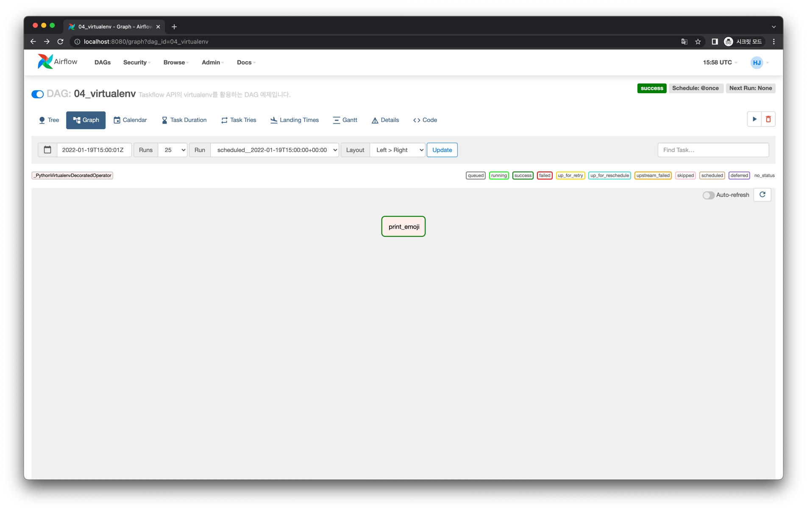
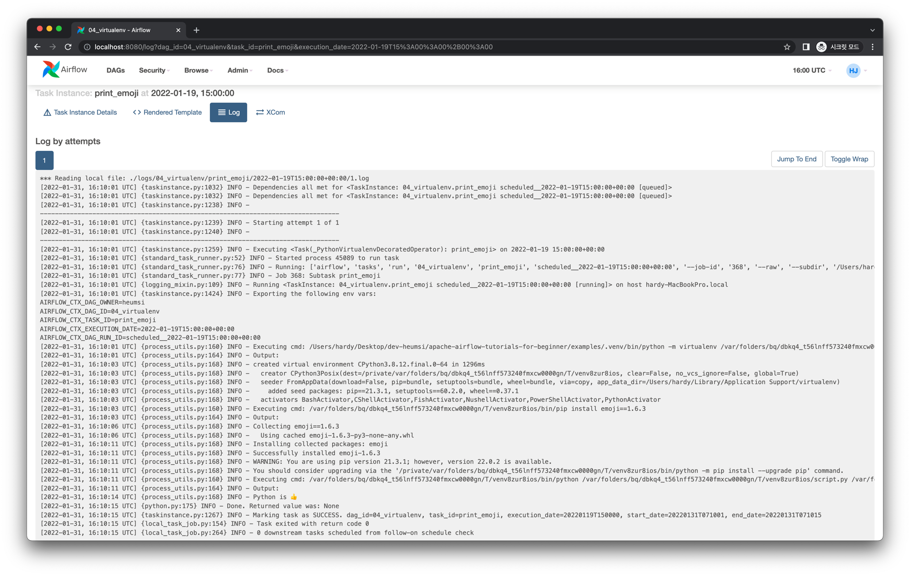

# Virtualenv 사용하기

가상환경 생성과 패키지 설치를 Taskflow API에서도 사용할 수 있습니다.
결과적으로는 `PythonVirtualenvOperator` 를 사용하는 것과 동일합니다.

## Graph View

다음과 같이 간단한 Task를 하나 실행하는 DAG을 작성할 것입니다.


## Code

<<< @/../my-airflow-project/dags/06_taskflow_api/04_virtualenv.py{3,19-28}

- `@task.virtualenv` 로 가상 환경과 패키지에 대한 설정을 추가할 수 있습니다.
  - `requirements` 파라미터로 설치할 패키지 목록을 `List[str]` 형태로 넘깁니다.

## Web UI & Logs

DAG을 실행하면 다음과 같은 화면을 얻습니다.



Task Instance의 로그를 살펴보면 다음과 같습니다.

### `print_emoji`



```
[2022-01-31, 16:10:01 UTC] {process_utils.py:164} INFO - Output:
[2022-01-31, 16:10:03 UTC] {process_utils.py:168} INFO - created virtual environment CPython3.8.12.final.0-64 in 1296ms
[2022-01-31, 16:10:03 UTC] {process_utils.py:168} INFO -   creator CPython3Posix(dest=/private/var/folders/bq/dbkq4_t56lnff573240fmxcw0000gn/T/venv8zur8ios, clear=False, no_vcs_ignore=False, global=True)
[2022-01-31, 16:10:03 UTC] {process_utils.py:168} INFO -   seeder FromAppData(download=False, pip=bundle, setuptools=bundle, wheel=bundle, via=copy, app_data_dir=/Users/hardy/Library/Application Support/virtualenv)
[2022-01-31, 16:10:03 UTC] {process_utils.py:168} INFO -     added seed packages: pip==21.3.1, setuptools==60.2.0, wheel==0.37.1
[2022-01-31, 16:10:03 UTC] {process_utils.py:168} INFO -   activators BashActivator,CShellActivator,FishActivator,NushellActivator,PowerShellActivator,PythonActivator
[2022-01-31, 16:10:03 UTC] {process_utils.py:160} INFO - Executing cmd: /var/folders/bq/dbkq4_t56lnff573240fmxcw0000gn/T/venv8zur8ios/bin/pip install emoji==1.6.3
[2022-01-31, 16:10:03 UTC] {process_utils.py:164} INFO - Output:
[2022-01-31, 16:10:06 UTC] {process_utils.py:168} INFO - Collecting emoji==1.6.3
[2022-01-31, 16:10:06 UTC] {process_utils.py:168} INFO -   Using cached emoji-1.6.3-py3-none-any.whl
[2022-01-31, 16:10:11 UTC] {process_utils.py:168} INFO - Installing collected packages: emoji
[2022-01-31, 16:10:11 UTC] {process_utils.py:168} INFO - Successfully installed emoji-1.6.3
[2022-01-31, 16:10:11 UTC] {process_utils.py:168} INFO - WARNING: You are using pip version 21.3.1; however, version 22.0.2 is available.
[2022-01-31, 16:10:11 UTC] {process_utils.py:168} INFO - You should consider upgrading via the '/private/var/folders/bq/dbkq4_t56lnff573240fmxcw0000gn/T/venv8zur8ios/bin/python -m pip install --upgrade pip' command.
[2022-01-31, 16:10:11 UTC] {process_utils.py:160} INFO - Executing cmd: /var/folders/bq/dbkq4_t56lnff573240fmxcw0000gn/T/venv8zur8ios/bin/python /var/folders/bq/dbkq4_t56lnff573240fmxcw0000gn/T/venv8zur8ios/script.py /var/folders/bq/dbkq4_t56lnff573240fmxcw0000gn/T/venv8zur8ios/script.in /var/folders/bq/dbkq4_t56lnff573240fmxcw0000gn/T/venv8zur8ios/script.out /var/folders/bq/dbkq4_t56lnff573240fmxcw0000gn/T/venv8zur8ios/string_args.txt
[2022-01-31, 16:10:11 UTC] {process_utils.py:164} INFO - Output:
[2022-01-31, 16:10:14 UTC] {process_utils.py:168} INFO - Python is 👍
```
