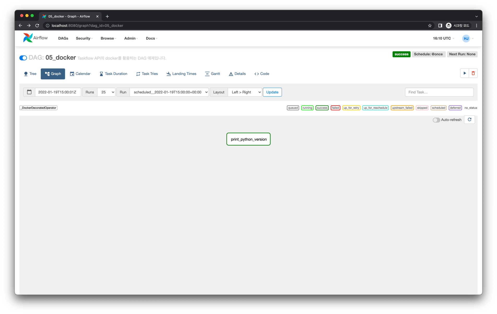
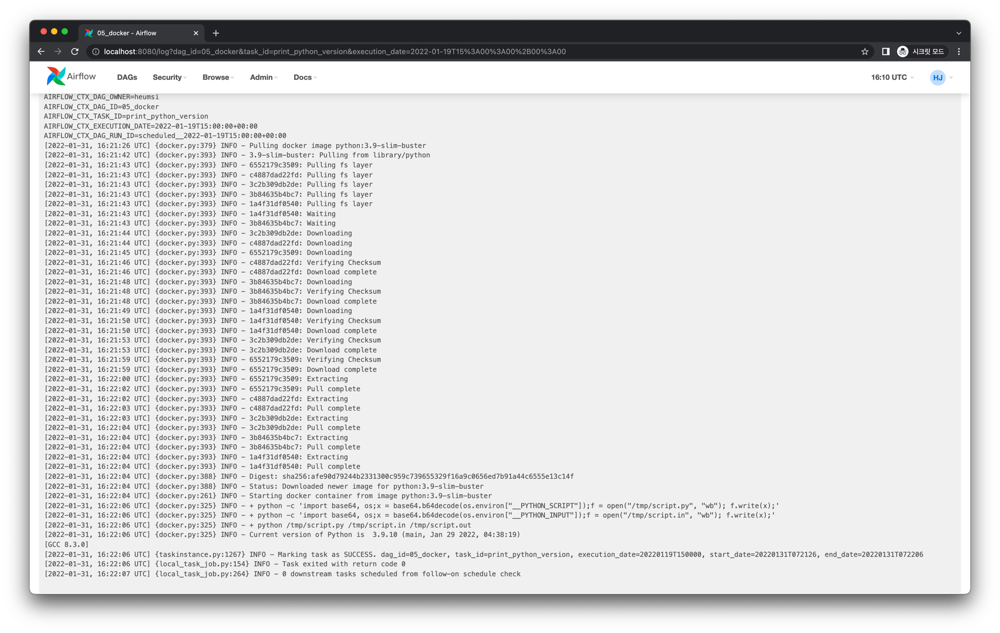

# Docker 사용하기

Taskflow API에서 Task Instance를 Docker Container로 실행할 수 있습니다.
이는 가상 환경보다 더 높은 격리 수준으로, 환경적으로 더 높은 자유도를 가질 수 있습니다.

## 사전 준비

### Airflow Docker Provider 설치

Taskflow API에서 docker를 사용하려면 다음처럼 docker provider를 설치해야합니다.

```bash
$ pip install apache-airflow-providers-docker
```

### Docker 실행

또한 docker engine(desktop)이 실행되어 있어야 합니다.

```bash
$ docker --version
Docker version 20.10.5, build 55c4c88
```

## Graph View

다음과 같이 간단한 Task를 하나 실행하는 DAG을 작성할 것입니다.


## Code

<<< @/../my-airflow-project/dags/06_taskflow_api/05_docker.py{3,19-23}

- `@task.docker` 로 해당 Task Instance를 docker container로 실행합니다.
  - `image` 파라미터에 실행 기반이 되는 image를 넘깁니다.

## Web UI & Logs

DAG을 실행하면 다음과 같은 화면을 얻습니다.



Task Instance의 로그를 살펴보면 다음과 같습니다.

### `print_python_version`



```
[2022-01-31, 16:21:26 UTC] {docker.py:379} INFO - Pulling docker image python:3.9-slim-buster
[2022-01-31, 16:21:42 UTC] {docker.py:393} INFO - 3.9-slim-buster: Pulling from library/python
[2022-01-31, 16:21:43 UTC] {docker.py:393} INFO - 6552179c3509: Pulling fs layer
[2022-01-31, 16:21:43 UTC] {docker.py:393} INFO - c4887dad22fd: Pulling fs layer
[2022-01-31, 16:21:43 UTC] {docker.py:393} INFO - 3c2b309db2de: Pulling fs layer
[2022-01-31, 16:21:43 UTC] {docker.py:393} INFO - 3b84635b4bc7: Pulling fs layer
[2022-01-31, 16:21:43 UTC] {docker.py:393} INFO - 1a4f31df0540: Pulling fs layer
[2022-01-31, 16:21:43 UTC] {docker.py:393} INFO - 1a4f31df0540: Waiting
[2022-01-31, 16:21:43 UTC] {docker.py:393} INFO - 3b84635b4bc7: Waiting
[2022-01-31, 16:21:44 UTC] {docker.py:393} INFO - 3c2b309db2de: Downloading
[2022-01-31, 16:21:44 UTC] {docker.py:393} INFO - c4887dad22fd: Downloading
[2022-01-31, 16:21:45 UTC] {docker.py:393} INFO - 6552179c3509: Downloading
[2022-01-31, 16:21:46 UTC] {docker.py:393} INFO - c4887dad22fd: Verifying Checksum
[2022-01-31, 16:21:46 UTC] {docker.py:393} INFO - c4887dad22fd: Download complete
[2022-01-31, 16:21:48 UTC] {docker.py:393} INFO - 3b84635b4bc7: Downloading
[2022-01-31, 16:21:48 UTC] {docker.py:393} INFO - 3b84635b4bc7: Verifying Checksum
[2022-01-31, 16:21:48 UTC] {docker.py:393} INFO - 3b84635b4bc7: Download complete
[2022-01-31, 16:21:49 UTC] {docker.py:393} INFO - 1a4f31df0540: Downloading
[2022-01-31, 16:21:50 UTC] {docker.py:393} INFO - 1a4f31df0540: Verifying Checksum
[2022-01-31, 16:21:50 UTC] {docker.py:393} INFO - 1a4f31df0540: Download complete
[2022-01-31, 16:21:53 UTC] {docker.py:393} INFO - 3c2b309db2de: Verifying Checksum
[2022-01-31, 16:21:53 UTC] {docker.py:393} INFO - 3c2b309db2de: Download complete
[2022-01-31, 16:21:59 UTC] {docker.py:393} INFO - 6552179c3509: Verifying Checksum
[2022-01-31, 16:21:59 UTC] {docker.py:393} INFO - 6552179c3509: Download complete
[2022-01-31, 16:22:00 UTC] {docker.py:393} INFO - 6552179c3509: Extracting
[2022-01-31, 16:22:02 UTC] {docker.py:393} INFO - 6552179c3509: Pull complete
[2022-01-31, 16:22:02 UTC] {docker.py:393} INFO - c4887dad22fd: Extracting
[2022-01-31, 16:22:03 UTC] {docker.py:393} INFO - c4887dad22fd: Pull complete
[2022-01-31, 16:22:03 UTC] {docker.py:393} INFO - 3c2b309db2de: Extracting
[2022-01-31, 16:22:04 UTC] {docker.py:393} INFO - 3c2b309db2de: Pull complete
[2022-01-31, 16:22:04 UTC] {docker.py:393} INFO - 3b84635b4bc7: Extracting
[2022-01-31, 16:22:04 UTC] {docker.py:393} INFO - 3b84635b4bc7: Pull complete
[2022-01-31, 16:22:04 UTC] {docker.py:393} INFO - 1a4f31df0540: Extracting
[2022-01-31, 16:22:04 UTC] {docker.py:393} INFO - 1a4f31df0540: Pull complete
[2022-01-31, 16:22:04 UTC] {docker.py:388} INFO - Digest: sha256:afe90d79244b2331300c959c739655329f16a9c0656ed7b91a44c6555e13c14f
[2022-01-31, 16:22:04 UTC] {docker.py:388} INFO - Status: Downloaded newer image for python:3.9-slim-buster
[2022-01-31, 16:22:04 UTC] {docker.py:261} INFO - Starting docker container from image python:3.9-slim-buster
[2022-01-31, 16:22:06 UTC] {docker.py:325} INFO - + python -c 'import base64, os;x = base64.b64decode(os.environ["__PYTHON_SCRIPT"]);f = open("/tmp/script.py", "wb"); f.write(x);'
[2022-01-31, 16:22:06 UTC] {docker.py:325} INFO - + python -c 'import base64, os;x = base64.b64decode(os.environ["__PYTHON_INPUT"]);f = open("/tmp/script.in", "wb"); f.write(x);'
[2022-01-31, 16:22:06 UTC] {docker.py:325} INFO - + python /tmp/script.py /tmp/script.in /tmp/script.out
[2022-01-31, 16:22:06 UTC] {docker.py:325} INFO - Current version of Python is  3.9.10 (main, Jan 29 2022, 04:38:19)
[GCC 8.3.0]
```
