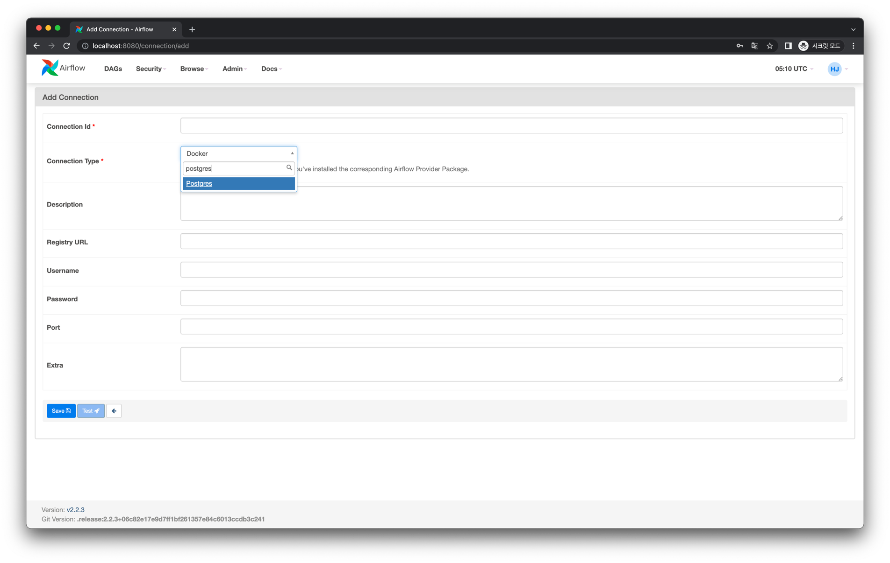

# Providers 사용법 알아보기

Provider는 Slack, MySQL, GCP, AWS와 같은 외부 시스템을 Airflow DAG에서 사용할 수 있는 방법입니다.
예를 들어 Postgres Provider를 설치하면 Postgres 관련 Operator나 Hook을 사용할 수 있습니다.
이처럼 패키지는 각 외부 시스템 별로 나뉘어 구성되어 있고 Airflow를 설치한 이후 필요에 따라 별도로 설치해야합니다.

## Provider Package 목록

[공식 문서](https://airflow.apache.org/docs/#providers-packages-docs-apache-airflow-providers-index-html)에서 다음처럼 Provider Package 목록을 확인할 수 있습니다.


각 패키지별로 버전도 다르고, 지원하는 Airflow 버전도 다르므로 이를 확인하고 사용해야합니다.

## 설치하는 방법

공식 문서에 대부분 설명되어 있지만, Provider를 어떻게 설치하고 둘러볼지에 대해 간단히 알아보겠습니다.

먼저 설치입니다. 예를 들어 Postgres와 관련한 작업을 하고 싶어 Postgres Provider Package를 설치해야한다고 해봅시다. 먼저 위 공식문서에서 postgres를 찾습니다.


해당 패키지가 존재하는 것을 확인후 클릭해보면 다음처럼 어떻게 설치해야하는지, 어떤 Airflow 버전을 지원하는지 적혀있습니다.


문서에 나온대로 Airflow가 배포된 환경에 다음처럼 Postgres Provider Package를 설치합니다.

```bash
$ pip install 'apache-airflow-providers-postgres'
```

설치가 완료되고 Airflow Scheduler를 재시작하면 다음처럼 Airflow Web UI의 Providers 페이지에서 Postgres Provider Package가 설치되었음을 확인할 수 있습니다.


## 제공해주는 목록 확인하기

문서의 Content 부분을 보면 이 Provider Package에서 다음처럼 어떤 것들을 제공해주는지 볼 수 있습니다.


Connection types를 확인해보면 다음처럼 Postgres Connection Type을 확인할 수 있습니다.


이 Connection Type은 Airflow Web UI에서 다음처럼 Connection을 생성할 때 등장합니다.



또한 PostgresOperator types를 확인해보면 다음처럼 `PostgresOperator` 를 어떻게 사용하는지에 대한 가이드가 소개되어 있습니다.


파이썬 코드에서 실제로 제공해주능 패키지 목록은 다음처럼 Python API 페이지에서 볼 수 있습니다.


## 나가며

Airflow Providers Package는 외부 시스템과 Airflow를 통합(Integration)하는 아주 강력한 방법입니다.
Airflow가 인기있는 이유 중 하나는 바로 외부 시스템과 잘 통합되도록 다양한 Providers를 제공한다는 점 때문입니다.

Airflow 1.x 버전에서는 Provider Packages가 모두 Airflow에 내장되어 있었지만,
Airflow 2.x 버전부터는 Providers가 내장되어 있지 않고, 필요에 따라 사용자가 직접 플러그인처럼 설치해야합니다.
공식문서를 잘 찾아 필요한 Provider를 적재적소에 잘 활용해봅시다.

:::tip
Postgres Package Provider를 활용하는 예제는 이전 예제인 [Connections와 Hooks - 외부 시스템과 연결 및 작업하기](/dags/05-etc-features/03-connections-and-hooks/)를 참고하세요.
:::
