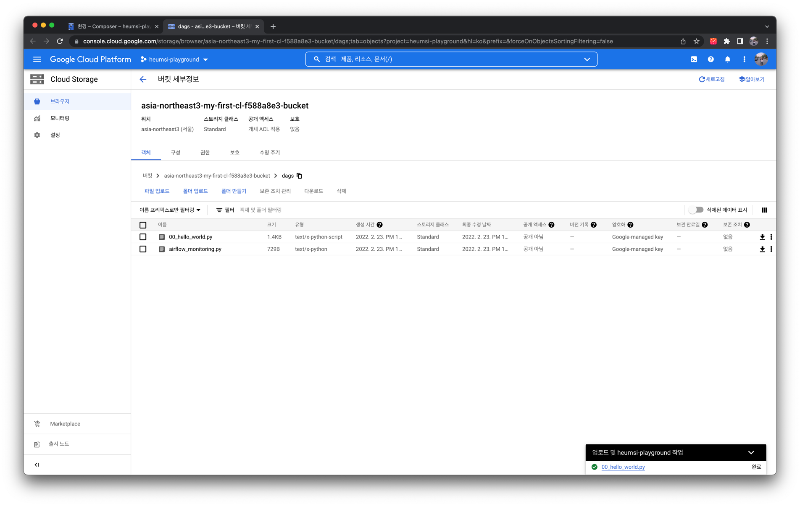

# GCP - Cloud Composer

## 개요

GCP Cloud Composer는 GCP에서 제공하는 Managed Airflow 서비스 입니다. 여기서는 어떻게 사용할 수 있는지 간략하게 살펴보겠습니다.

## Cloud Composer 인스턴스 만들기

먼저 GCP 웹 콘솔에 접속하여 메뉴에서 "빅 데이터" 탭에 있는 "Composer"를 찾습니다.

다음과 같이 "Cloud Composer API" 화면에서 "사용" 버튼을 누릅니다.

다음과 같은 첫 화면에서 "CREATE ENVIRONMENT" 버튼을 누르고, "Composer 2"를 선택합니다.

각 폼에 다음과 같은 값을 입력합니다.

:::tip
실제 운영 환경에서 배포할 때는 "네트워크 구성" 항목에서 "네트워크(VPC)"와 "서브 네트워크(Subnet)"를 명확히 잡아주는 것이 좋습니다.
(default를 사용하는 것은 지양해야 하고, 아직 default 밖에 없다면, VPC와 Subnet 구성부터 하시기를 권장드립니다.)

여기에서는 간단히 Cloud Composer를 둘러보는 것이 목표이기에, 세부적인 사항은 설정하지 않았습니다.

:::

"만들기" 버튼을 누르면 아래 사진처럼 Cloud Composer 인스턴스 생성이 시작됩니다. 생성 완료까지 시간이 조금 걸리므로, 커피 한잔 하고 오시면 좋을거 같습니다. ☕️

생성이 완료되면 다음과 같은 화면이 등장합니다.

:::tip
Cloud Composer 인스턴스 생성은 GCP의 Managed Kubernetes 서비스인 GKE(Google Kubernetes Engine) 인스턴스를 생성하고, 이 클러스터 위에
Airflow Helm Chart를 배포하는 과정을 거칩니다. 따라서 결과적으로 Kubernetes 환경에서 Airflow를 배포하는 모양입니다.

실제로 GCP 웹 콘솔에서 Kubernetes Engine 페이지에 접속하면 다음과 같이 GKE 인스턴스가 만들어진 것을 볼 수 있습니다.

:::

## Cloud Composer 대시보드 둘러보기

인스턴스 이름을 클릭하면 다음과 같이 "모니터링" 탭 화면에 진입하게 됩니다.

"로그" 탭 화면에서는 다음처럼 Airflow의 각 컴포넌트들(정확히는 GKE 클러스터에 배포된 Pod들)의 로그를 확인할 수 있습니다.

"DAG" 탭 화면에서는 다음처럼 DAG에 대한 간략한 정보를 볼 수 있습니다.

"Environment Configuration" 탭 화면에서는 다음처럼 환경 구성 값에 대한 정보를 볼 수 있습니다.

"Airflow 구성 재정의" 탭 화면에서는 Airflow 설정 값들을 입력할 수 있습니다.

"환경 변수" 탭 화면에서는 Airflow 각 컴포넌트에 들어갈 환경 변수를 입력할 수 있습니다.

"Pypi Packages" 탭 화면에서는 Airflow 컴포넌트에 설치할 파이썬 패키지를 입력할 수 있습니다.

위 쪽의 "Airflow UI 열기" 버튼을 클릭하면 다음처럼 웹 UI 페이지에 접속할 수 있습니다.

## DAG 업로드 하기

다음과 같이 Cloud Composer 메인 화면에서 "DAG" 버튼을 눌러봅시다.

그러면 다음과 같이 GCS(Google Cloud Storage)의 특정 버킷으로 접속되는데, 이처럼 Cloud Composer에서 DAG Directory로 GCS 버킷을 사용합니다.

따라서 DAG 작성 후 GCS 버킷에 업로드 해야합니다. 업로드 하는 간단한 과정을 살펴봅시다.

먼저 로컬에서 다음과 같은 DAG 파일을 작성한 뒤 `hello_world.py` 로 저장합니다.

<<< @/../my-airflow-project/dags/hello_world.py

그 뒤 다음처럼 GCS 버킷에서 "파일 업로드" 버튼을 눌러 `hello_world.py`를 업로드 합니다.

웹 UI에 접속해보면 다음처럼 DAG이 잘 생성된 것을 확인할 수 있습니다.

:::tip
버킷에 업로드 후 웹 UI에 등장까지 시간이 조금 걸릴 수 있습니다. 등장하지 않는다면 조금만 기다려 주세요.
:::
