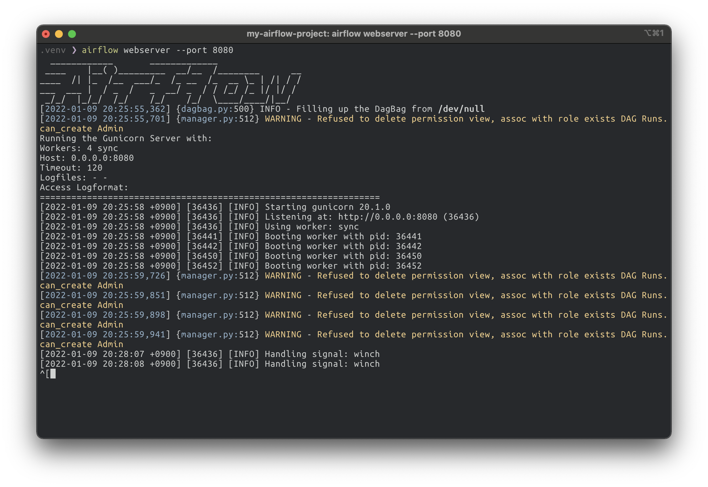
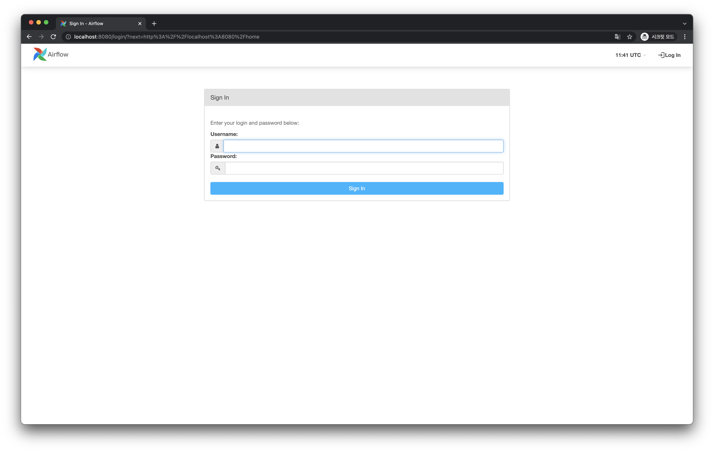
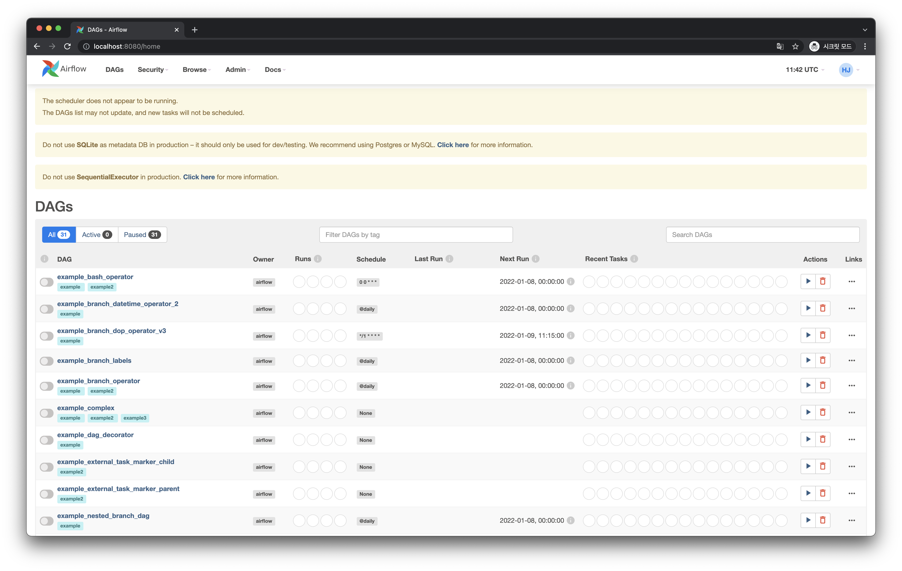
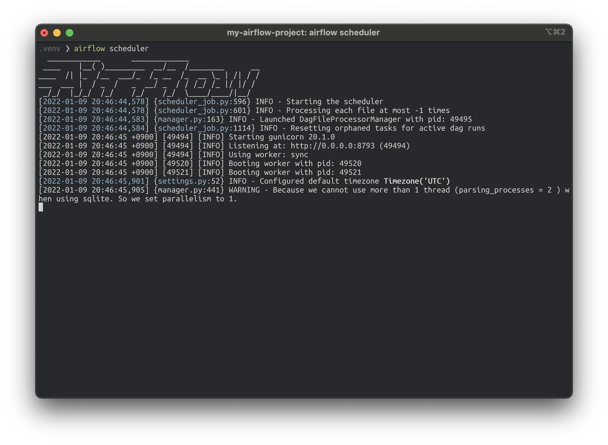
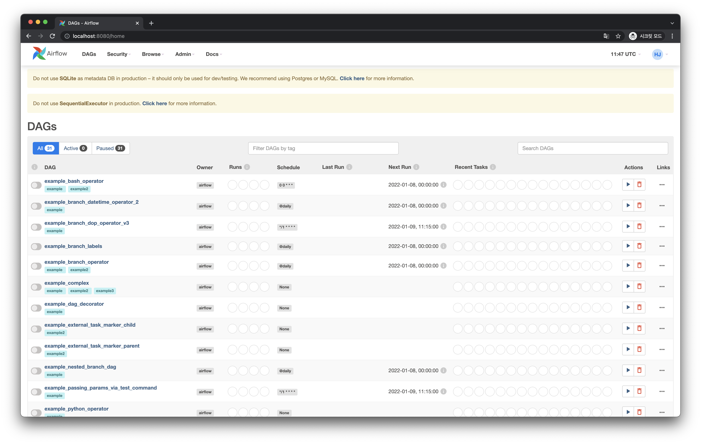

# 실행하기

Airflow를 설치했으니 이제 실행해봅시다.

Airflow를 실행하기 위해서는 다음의 작업들을 해야합니다.

1. 프로젝트 루트 경로 설정
2. 설정 및 데이터베이스 초기화
3. 관리자 계정 생성
4. Webserver 실행
5. Scheduler 실행

<br>

## 프로젝트 루트 경로 설정

Airflow 관련 설정 및 파일들이 어디 경로에 담을지 설정합니다.
`AIRFLOW_HOME` 이라는 환경변수에 경로를 값으로 주면 됩니다.

셸에서 다음 명령어를 입력합니다.

```bash
# 현재 경로를 Airflow 프로젝트의 루트 경로로 설정합니다.
$ export AIRFLOW_HOME=.
```

<br>

## 설정 및 데이터베이스 초기화

다음으로 Airflow에서 사용하는 데이터베이스를 초기화 해줍니다.
데이터베이스는 기본적으로 SQLite를 사용하며, `$AIRFLOW_HOME/airflow.db` 에 기록됩니다.

셸에서 다음 명령어를 입력합니다.

```bash
$ airflow db init
```

위 명령의 결과로, 설정 파일 및 Airflow와 관련된 파일들은 `$AIRFLOW_HOME` 경로에 다음처럼 생성됩니다.

```bash
$ ls -al
total 1384
drwxr-xr-x  7 heumsi  staff     224  1  9 20:16 .
drwxr-xr-x  5 heumsi  staff     160  1  9 20:11 ..
drwxr-xr-x  6 heumsi  staff     192  1  9 20:00 .venv
-rw-r--r--  1 heumsi  staff   43865  1  9 20:16 airflow.cfg
-rw-r--r--  1 heumsi  staff  638976  1  9 20:16 airflow.db
drwxr-xr-x  3 heumsi  staff      96  1  9 20:16 logs
-rw-r--r--  1 heumsi  staff    4695  1  9 20:16 webserver_config.py
```

<br>

## 관리자 계정 생성

Airflow에는 계정이라는 개념이 있습니다.
Airflow를 실행하고 Webserver에 접속하게 되면 로그인 화면이 나올텐데, 이 때 초기에 사용할 관리자 계정을 만들어봅시다.

셸에서 다음 명령어를 입력합니다.
`role` 을 제외한 나머지 값들은 다른 값으로 바꾸셔도 됩니다.

```bash
$ airflow users create \
	--username admin \
	--password 1234 \
    --firstname heumsi \
    --lastname jeon \
    --role Admin \
    --email heumsi@naver.com
```

<br>

## Webserver 실행

Airflow Webserver는 Web UI를 제공합니다.
Webserver를 실행하기 위해서 셸에서 다음 명령어를 입력합니다.

```bash
$ airflow webserver --port 8080
```



이제 `http://0.0.0.0:8080` 에 접속해보면 다음처럼 Airflow Web UI를 볼 수 있습니다.



아까 만들어준 관리자 계정으로 로그인합니다.
이 글을 그대로 따라하셨다면 `Admin` / `1234` 로 로그인 하시면 됩니다.

로그인 이후 다음과 같은 메인 화면을 볼 수 있습니다.



무엇이 있나 찬찬히 살펴보셔도 좋습니다.

일단 페이지 상단 노란색 박스에 다음과 같은 메시지가 보입니다.

```
The scheduler does not appear to be running.
The DAGs list may not update, and new tasks will not be scheduled.
```

Scheduler를 실행시키지 않았기 때문에 나는 에러 메시지입니다.
이제 Scheduler를 실행시켜봅시다.

<br>

## Scheduler 실행

Webserver가 사용자에게 UI를 제공한다면, Scheduler는 실행해야할 일들의 스케쥴링 작업을 담당합니다. 즉 실제 대부분의 중요한 일들은 Scheduler가 담당한다고 볼 수 있습니다.

이전에 Webserver를 실행시켰던 셸은 그대로 두고, 새로운 셸에 실행합니다.
Airflow 프로젝트 디렉토리에 진입 후 다음 명령어를 입력합니다.

```bash
# 가상 환경 진입
$ source .venv/bin/activate

# Airflow 프로젝트 루트 경로 지정
$ export AIRFLOW_HOME=.

# Scheduler 실행
$ airflow scheduler
```



Scheduler를 정상적으로 실행시켰습니다.
이제 다시 Web UI로 돌아가서 새로 고침을 해보면 상단에 Scheduler와 관련된 에러 메시지가 없어진 것을 볼 수 있습니다.


