# DAG 실행하기

이제 작성한 DAG을 실행해봅시다.

<br>

## 웹서버 접속하기

웹서버, 스케쥴러를 실행한 이후에 브라우저에서 `localhost:8080` 에 접속하여 로그인합니다.

:::tip

만약 웹서버와 스케줄러가 내려간 상태라면, 다음처럼 Airflow 스케쥴러와 웹서버를 실행시켜주세요.

```bash
# 셸에서 다음 명령어로 웹서버를 실행합니다.
$ export AIRFLOW_HOME=.
$ airflow webserver --port 8080

# 또 다른 셸에서 다음 명령어로 스케줄러를 실행합니다.
$ export AIRFLOW_HOME=.
$ airflow scheduler
```

:::

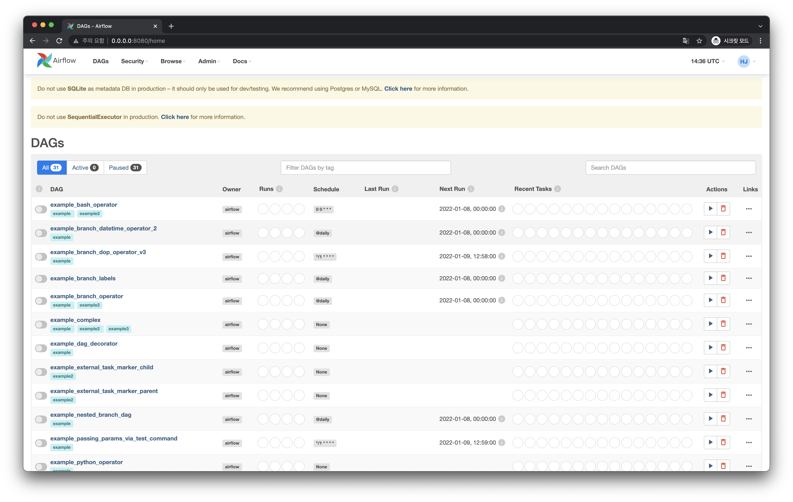

`$AIRFLOW_HOME/dags` 디레토리 내에 `hello_world.py` 를 잘 작성했다면, Airflow 웹 UI에서 다음처럼 `hello_world` DAG을 금방 찾을 수 있습니다.

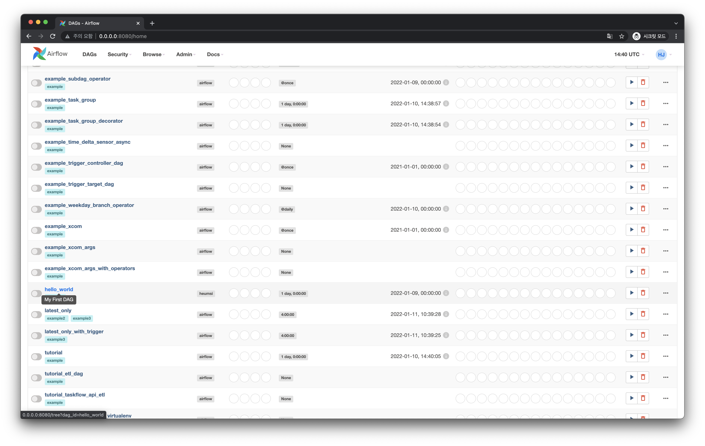

:::tip

Airflow의 Scheduler는 주기적으로 `DAGS_FOLDER` 내 `.py` 파일을 파싱하여 `DAG` 정보를 Database에 저장합니다. 즉 `DAG_FOLDER` 내에 DAG 파일을 작성하기만 하고 기다리면 Airflow Webserver에서 해당 DAG이 자동적으로 등장합니다. (파싱 주기는 기본적으로 5분입니다.)

:::

<br>

## DAG 실행하기

`hello_world` 를 클릭하고 들어가 DAG의 `ON/OFF 스위치`를 `ON` 상태로 만들고, 우측에 `Auto-refresh` 버튼도 `ON` 상태로 둔 뒤 기다려 봅시다. 조금 기다리면 다음과 같은 화면을 볼 수 있습니다.

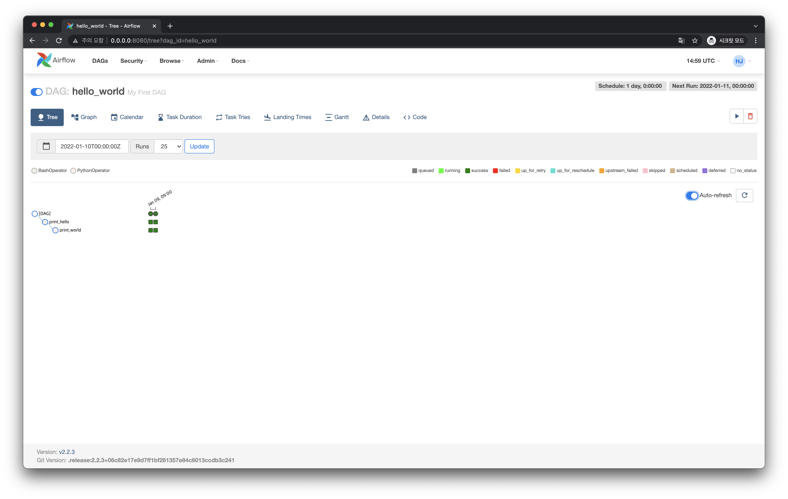

위 화면을 하나씩 살펴보겠습니다.

먼저 가장 위에 2개의 동그라미가 보입니다. 이는 실행된 DAG을 표현합니다. 이처럼 DAG의 실제 인스턴스 개념을 **Dag Run** 이라고 부릅니다.

총 2개의 DAG Run이 있습니다. 2개가 있는 이유는 우리가 DAG을 정의할 때 다음처럼 값을 주었기 때문입니다.

```python{6-7}
# hello_world.py

with DAG(
    dag_id="hello_world",  # DAG의 식별자용 아이디입니다.
    description="My First DAG",  # DAG에 대해 설명합니다.
    start_date=days_ago(2),  # DAG 정의 기준 2일 전부터 시작합니다.
    schedule_interval=timedelta(days=1),  # 1일을 주기로 실행합니다.
    tags=["my_dags"],
) as dag:
```

`start_date` 에서 2일 전부터 이 DAG이 스케줄링이 되도록 했고, `schedule_interval` 로 스케줄링 간격을 1일로 주었습니다. 따라서 이틀 전, 오늘 이렇게 두 번 DAG이 실행되게 된 것입니다. 이런 실행 정보는 다음처럼 DAG Run 동그라미 위에 마우스를 올리면 볼 수 있습니다.

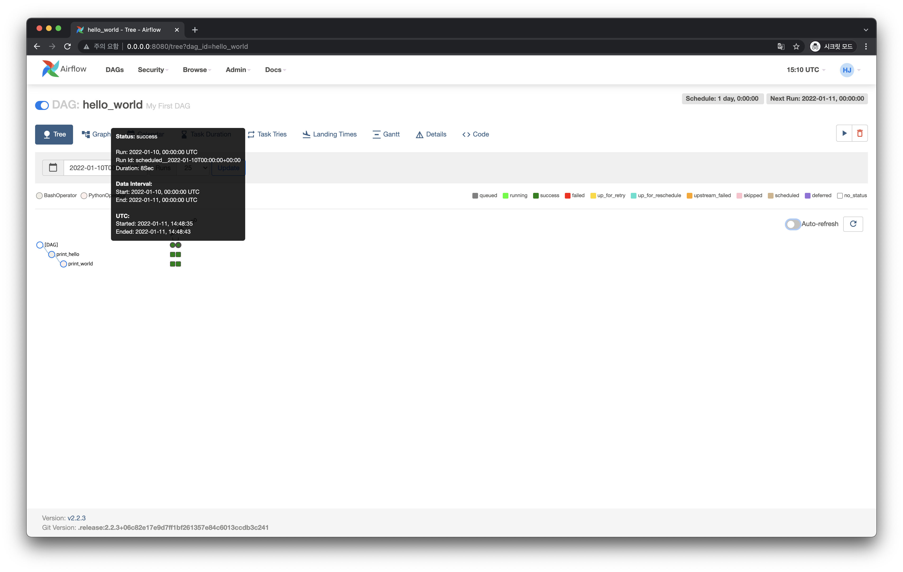

::: tip

`start_date` 를 `days_ago()` 로 주면 기본적으로 해당 일의 00시를 기준으로 합니다.
실제로 사용할 때는 `days_ago()` 를 사용하지 않고 시간을 좀 더 명확하게 줄 수 있는 `datetime.datetime()` 을 사용합니다. `schedule_interval` 역시 [Cron Expressions](https://docs.oracle.com/cd/E12058_01/doc/doc.1014/e12030/cron_expressions.htm)을 쓰는게 일반적입니다. 이에 대해서는 뒤에서 다시 다룹니다.

:::

DAG Run 동그라미 아래로 각각 2개의 네모가 보입니다. 이는 Task를 표현합니다. 여기서 첫 번째 네모는 `print_hello` Task고, 두 번째 네모는 `print_world` Task 입니다.

각 네모는 현재 초록색 입니다. 이는 각 Task가 성공적으로 잘 실행되었음을 의미합니다. DAG Run의 동그라미와 마찬가지로 Task의 상태 표시는 이렇게 색상으로 표현됩니다.

마찬가지로 마우스를 올리면 다음처럼 Task에 대한 실행정보를 볼 수 있습니다.

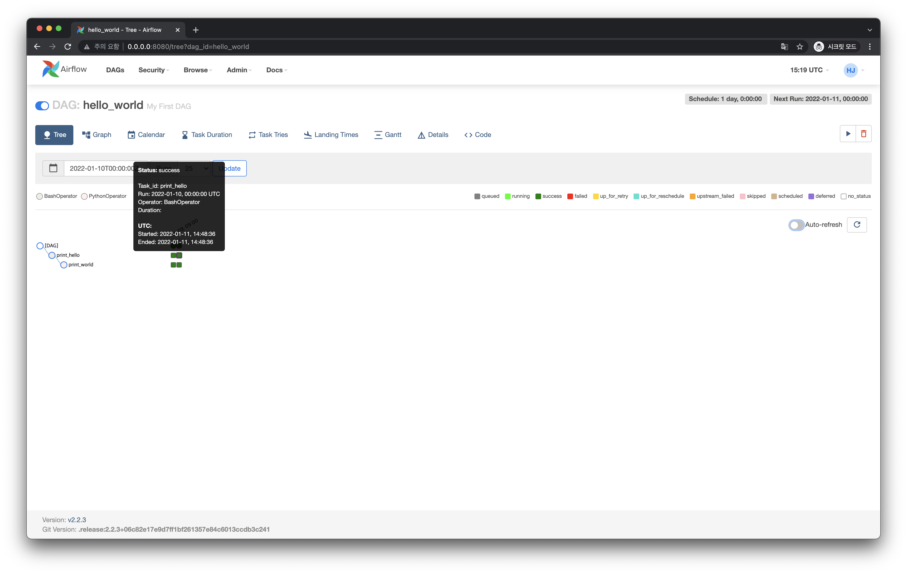

<br>

## Task 실행 Log 보기

Task 네모를 클릭하면 다음과 같은 메뉴가 등장합니다.

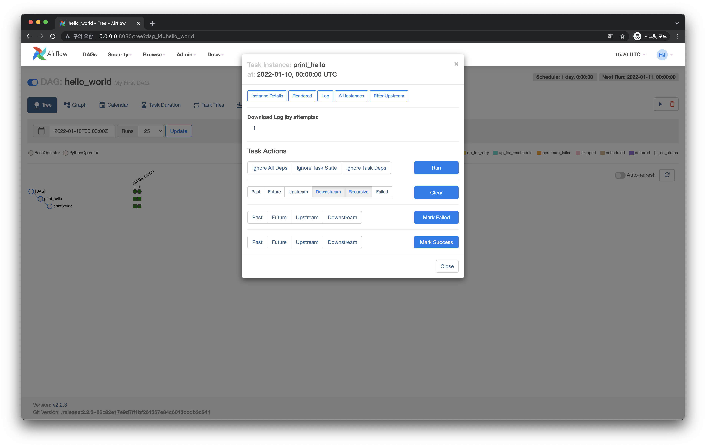

여기서 위쪽의 `Log` 버튼을 클릭하면 다음처럼 Task를 진행하며 기록된 로그를 볼 수 있습니다.

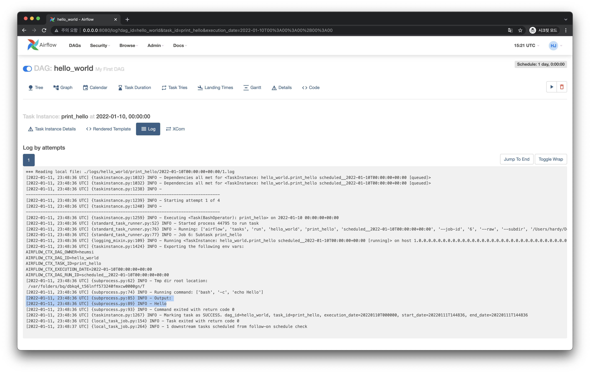

`BashOperator`로 `echo Hello` 를 실행한 결과도 이 로그 화면에 보입니다. Task가 실패하는 경우 이 로그를 잘 보는 것이 트러블 슈팅에 매우 중요한 단서가 될 것입니다.


## DAG / Task Clear 하기

이미 실행된(진행 중이거나, 성공 혹은 실패한 상태의) DAG을 다시 실행되게 만드려면 DAG을 클리어하면 됩니다.

DAG Run의 동그라미를 클릭하면 다음과 같은 화면이 등장합니다.

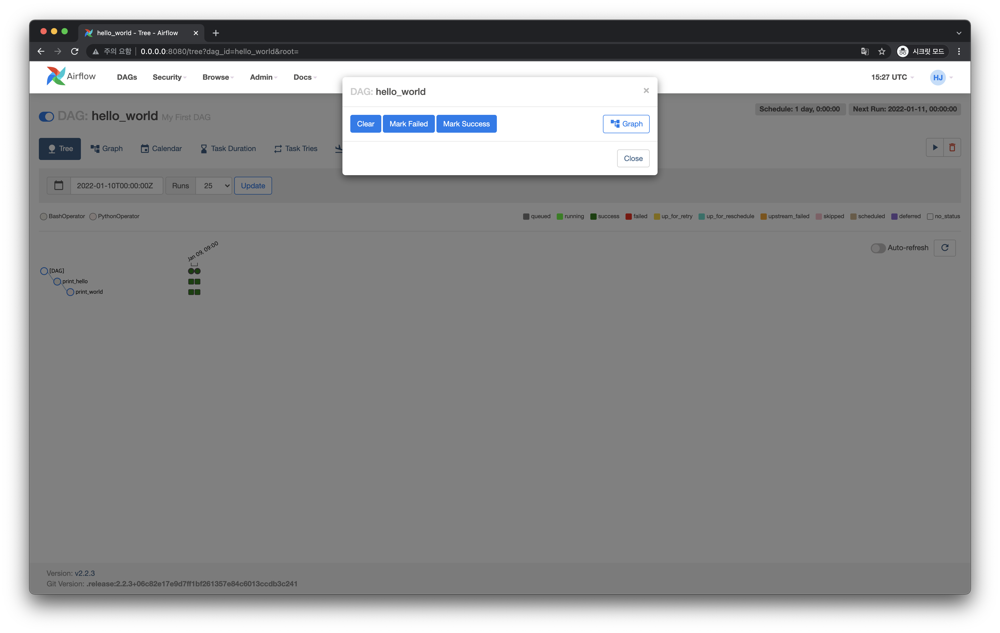

여기서 DAG Run의 상태를 바꿀 수 있습니다. 이 때 `Clear` 버튼을 클릭하면 해당 DAG Run의 Task 상태 역시 모두 초기화 되며 DAG Run은 다시 실행됩니다.


Task만 따로 Clear할 수 있습니다. 다음처럼 Clear할 Task 네모를 클릭하면 `Clear` 버튼이 보입니다.

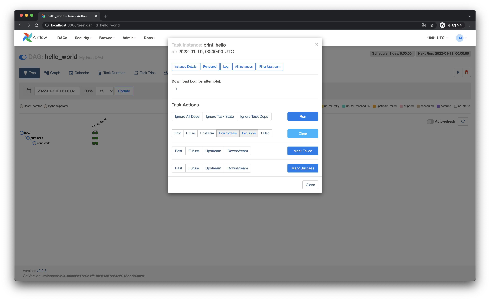

이 버튼을 클릭하면 해당 Task를 다시 실행하게 됩니다. (기본적으로 Downstream 옵션이 포함되어 있어서 Clear한 Task 뒤에 있는 모든 Task들도 Clear 됩니다.)

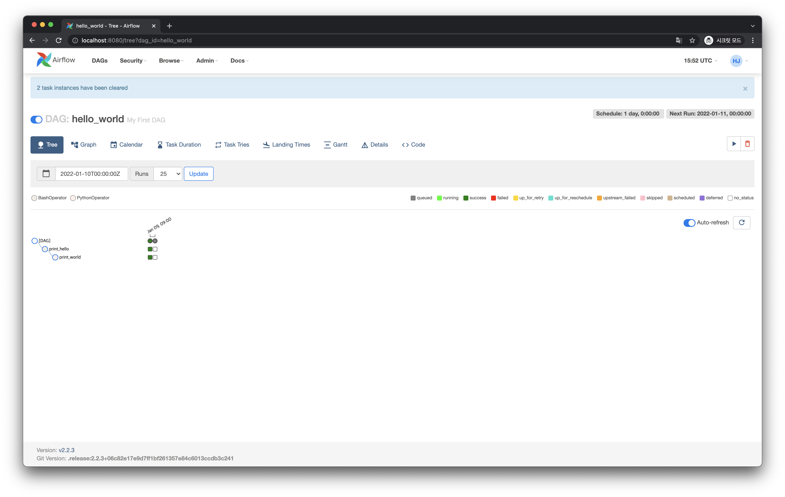

<br>

## DAG Trigger 하기

위에서 DAG을 실행한 방법은 "스케줄링"을 통한 방법이었습니다. 즉 DAG을 `ON` 상태로만 두면 DAG 파일 내에 정의된 대로 스케줄되어 DAG Run이 실행되는 방식이었죠.

그런데 스케줄링된 대로가 아니라, 지금 "즉시" DAG Run을 만들고 실행하는 방법이 있습니다. 이 방법은 Trigger라고 부릅니다.

DAG 페이지 우측 상단에 보시면 `Trigger` 버튼이 있습니다.

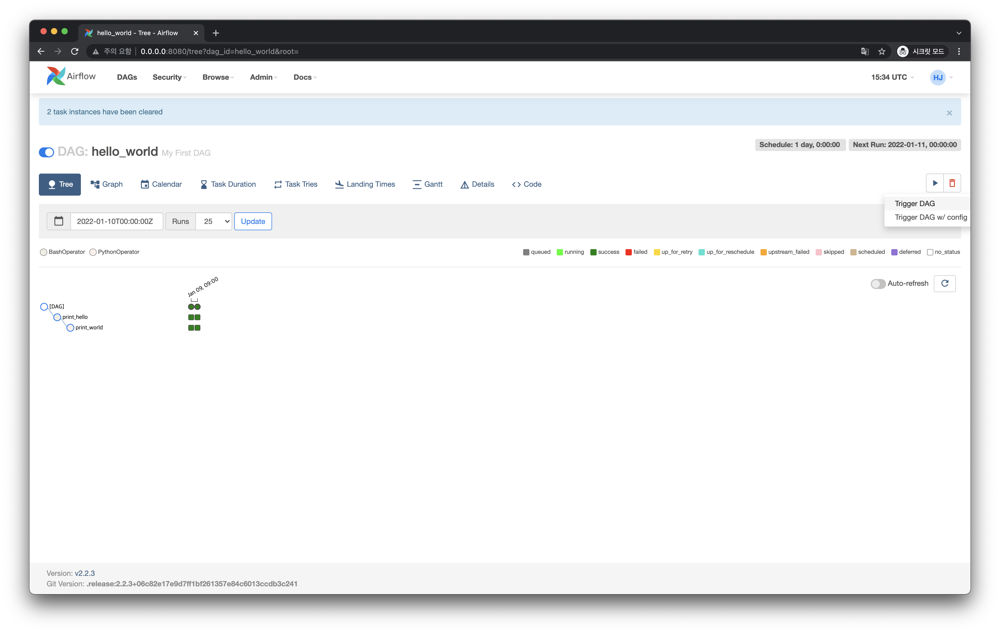

`Trigger DAG` 을 클릭합니다. 그러면 다음과 같이 새로운 DAG Run이 생기고 실행되는 것을 볼 수 있습니다.

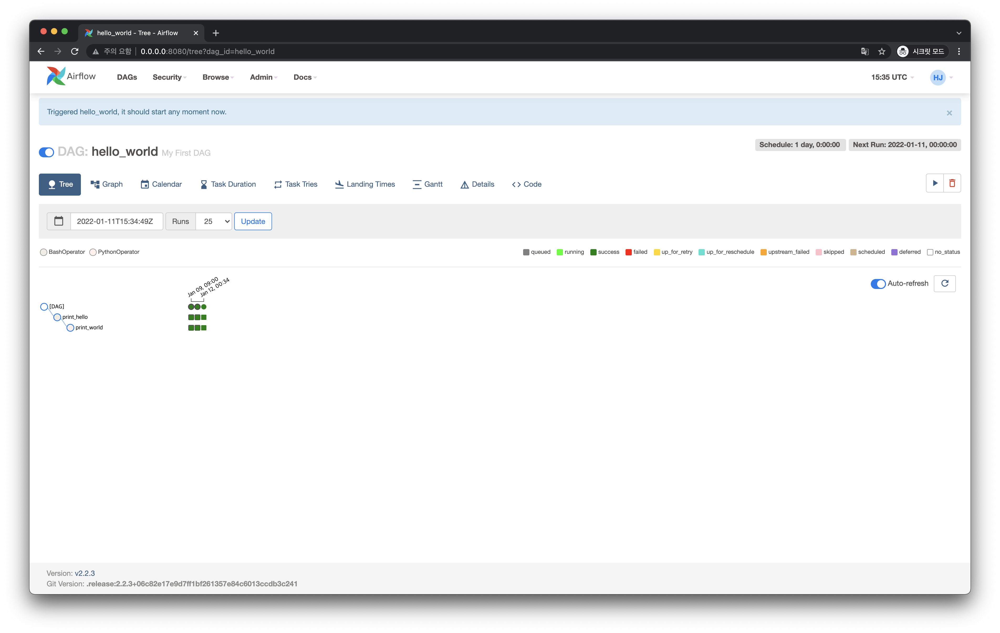

이렇게 Trigger로 실행된 DAG Run은 스케줄링으로 실행된 DAG Run과 다르게 동그라미와 네모 주위에 굵직한 선이 없는 것을 볼 수 있습니다.

<br>

## DAG 삭제하기

`Trigger` 버튼 옆에 `Delete` 버튼 아이콘(쓰레기통 모양)이 있습니다. 이 버튼을 클릭하면 해당 DAG은 삭제됩니다.

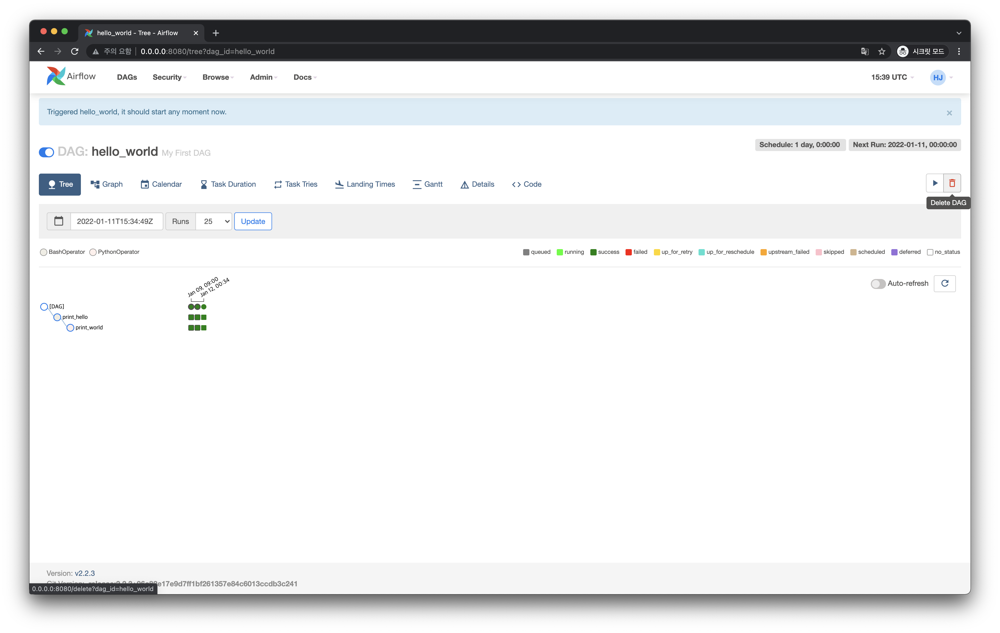

DAG을 삭제하고 메인화면으로 와보면 다음처럼 `hello_world` DAG은 사라진 것 처럼 보입니다.

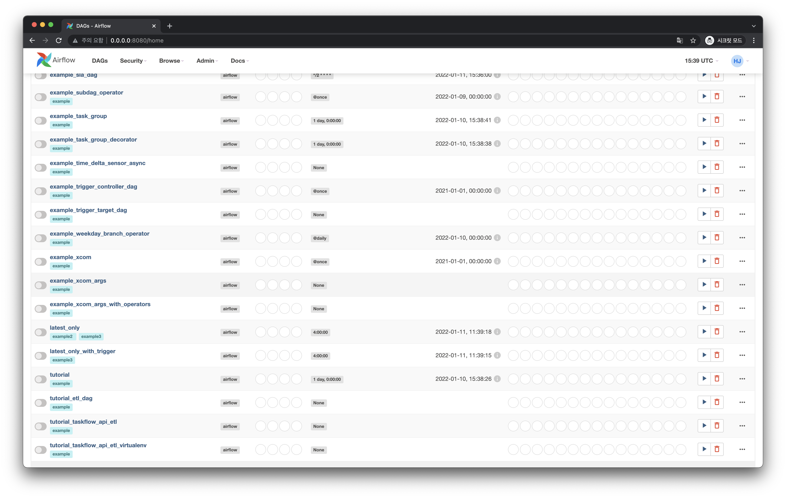

그러나 다시 조금의 시간이 지나면 다음처럼 `hello_world` DAG이 다시 등장한 것을 볼 수 있습니다.

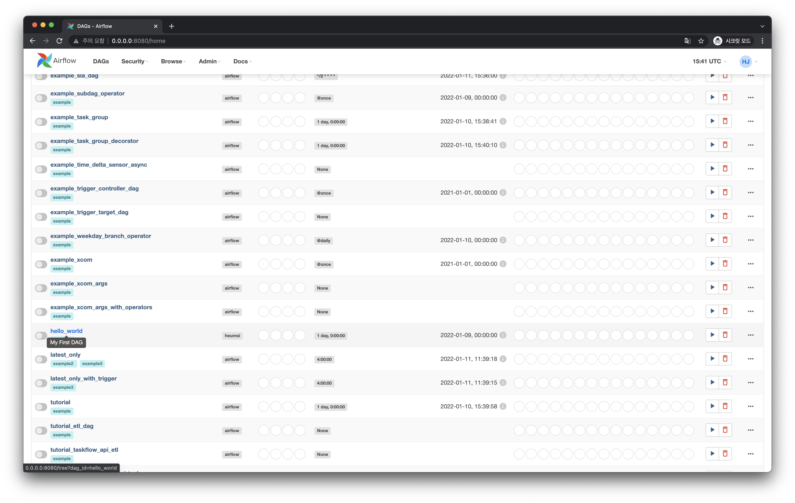

이렇게 다시 등장한 이유는 Airflow Scheduler가 `DAGS_FOLDER` 에서 다시 해당 `hello_world` DAG 파일을 파싱해왔기 때문입니다. 즉 `DAGS_FOLDER` 내에 해당 DAG 파일이 계속 있는 이상, DAG을 삭제해도 웹 UI에는 다시 등장합니다.

여기서 DAG 삭제의 의미는 해당 DAG 파일 자체를 없애버리는 것이 아니라, 해당 DAG의 실행된 DAG Runs 정보 및 메타 정보들을 삭제하는 것임을 알 수 있습니다. (정확히 말하면 DB에서 해당 DAG과 관련된 모든 정보를 삭제합니다.)

만약 웹서버에도 등장하지 않게 완전히 지우고 싶다면, `DAGS_FOLDER` 내에서 해당 DAG 파일까지도 같이 삭제하시면 됩니다.
