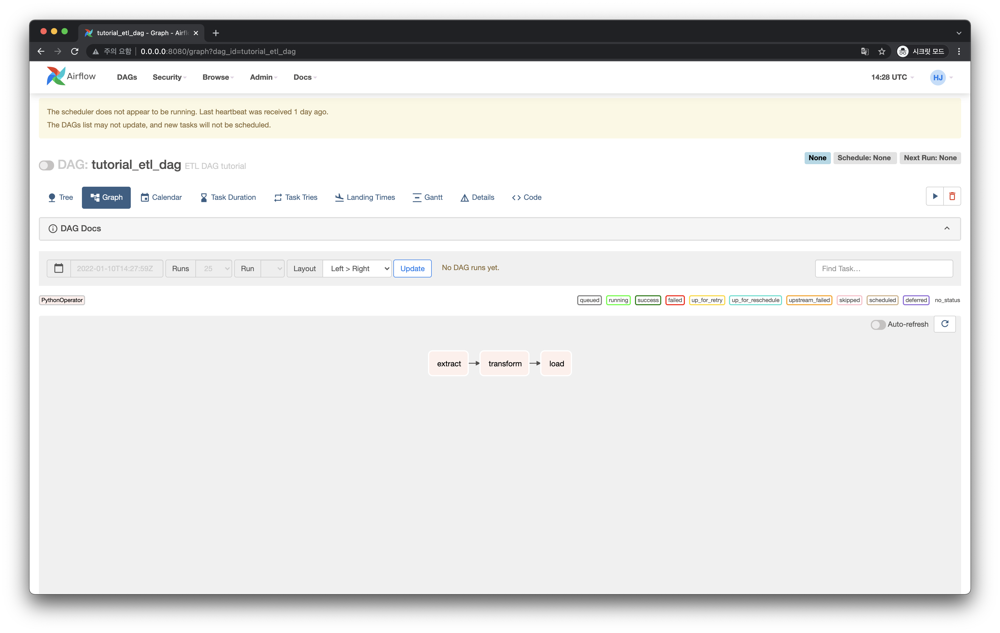

# DAG 작성하기

이번에는 Airflow의 DAG에 대해 알아보고 작성해봅시다.

<br>

## DAG이란?

DAG이란 Directed Acyclic Graph의 약자이며 Airflow에서 파이프라인의 단위의 개념이기도 합니다.  

예를 들어봅시다.  
간단한 ETL (Extract - Transform - Load) 파이프라인은 Airflow에서 다음과 같이 하나의 DAG으로 만들 수 있습니다.



`tutorial_etl_dag` 이라는 DAG 안에는 `extract`, `transform`, `load` 라는 Task가 있습니다. 그리고 이 Task들은 화살표 순서대로 진행하게 됩니다. 이처럼 하나의 DAG을 작성한다는 것은 실행할 Task에 대한 내용과 이 Task들의 순서를 정의하는 것을 말합니다.

Airflow에서는 파이썬 코드로 Airflow DAG을 작성합니다.


<br>

## DAG 폴더

DAG을 작성한 파이썬 파일은 기본적으로 `$AIRFLOW_HOME/dags/` 디렉토리에 저장하면 됩니다. 이 디렉토리를 `DAGS_FOLDER` 라고 부릅니다.

처음에는 `dags/` 라는 디렉토리가 없기 때문에 이를 다음처럼 만들어준 뒤 진입합니다.

```bash
$ mkdir dags
$ cd dags
```

::: tip	 
`DAGS_FOLDER` 에 대한 설정은 `$AIRFLOW_HOME` 디렉토리에 있는 `airflow.cfg` 에서 변경할 수 있습니다. 

다음처럼 `$AIRFLOW_HOME` 디렉토리를 확인해보면 `airflow.cfg` 가 보입니다.

```bash
$ ls -al
total 1392
drwxr-xr-x   8 heumsi  staff     256  7 10 18:25 .
drwxr-xr-x@ 12 heumsi  staff     384  7 10 18:25 ..
drwxr-xr-x   6 heumsi  staff     192  7  7 20:31 .venv
-rw-r--r--   1 heumsi  staff       6  7 10 18:09 airflow-webserver.pid
-rw-r--r--   1 heumsi  staff   42316  7 10 18:09 airflow.cfg  # 여기!
-rw-r--r--   1 heumsi  staff  614400  7 10 18:10 airflow.db
drwxr-xr-x   3 heumsi  staff      96  7 10 18:09 logs
-rw-r--r--   1 heumsi  staff    4700  7 10 18:09 webserver_config.py
```

그리고 `airflow.cfg` 를 확인해보면 다음처럼 `dags_folder` 라는 값을 볼 수 있습니다.

```toml
[core]
dags_folder = ./dags
...
```

`airflow.cfg` 는 이 외에도 Airflow에 관련된 많은 설정들을 담고 있습니다. 자세한건 추후에 알아봅시다.
:::

<br>

## DAG 작성하기

`dags` 디렉토리 내부에 다음과 같이 `hello_world.py` 를 작성합니다.

```python
# hello_world.py

from datetime import timedelta

from airflow import DAG
from airflow.utils.dates import days_ago
from airflow.operators.bash import BashOperator
from airflow.operators.python import PythonOperator


def print_world() -> None:
    print("world")


# with 구문으로 DAG 정의를 시작합니다.
with DAG(
    dag_id="hello_world",  # DAG의 식별자용 아이디입니다.
    description="My First DAG",  # DAG에 대해 설명합니다.
    start_date=days_ago(2),  # DAG 정의 기준 2일 전부터 시작합니다.
    schedule_interval=timedelta(days=1),  # 1일을 주기로 실행합니다.
    tags=["my_dags"],
) as dag:

    # 테스크를 정의합니다.
    # bash 커맨드로 echo hello 를 실행합니다.
    t1 = BashOperator(
        task_id="print_hello",
        bash_command="echo Hello",
        owner="heumsi",  # 이 작업의 오너입니다. 보통 작업을 담당하는 사람 이름을 넣습니다.
        retries=3,  # 이 테스크가 실패한 경우, 3번 재시도 합니다.
        retry_delay=timedelta(minutes=5),  # 재시도하는 시간 간격은 5분입니다.
    )

    # 테스크를 정의합니다.
    # python 함수 print_world를 실행합니다.
    t2 = PythonOperator(
        task_id="print_world",
        python_callable=print_world,
        owner="heumsi",
        retries=3,
        retry_delay=timedelta(minutes=5),
    )

    # 테스크 순서를 정합니다.
    # t1 실행 후 t2를 실행합니다.
    t1 >> t2
```

코드가 어떻게 구성되어있나, 하나씩 살펴봅시다!

<br>

### DAG 인스턴스 정의하기

가장 먼저, DAG 정의를 시작하는 부분을 봅시다.

```python{15-22}
# hello_world.py

from datetime import timedelta

from airflow import DAG
from airflow.utils.dates import days_ago
from airflow.operators.bash import BashOperator
from airflow.operators.python import PythonOperator


def print_world() -> None:
    print("world")


# with 구문으로 DAG 정의를 시작합니다.
with DAG(
    dag_id="hello_world",  # DAG의 식별자용 아이디입니다.
    description="My First DAG",  # DAG에 대해 설명합니다.
    start_date=days_ago(2),  # DAG 정의 기준 2일 전부터 시작합니다.
    schedule_interval=timedelta(days=1),  # 1일을 주기로 실행합니다.
    tags=["my_dags"],
) as dag:

    # 테스크를 정의합니다.
    # bash 커맨드로 echo hello 를 실행합니다.
    t1 = BashOperator(
        task_id="print_hello",
        bash_command="echo Hello",
        owner="heumsi",  # 이 작업의 오너입니다. 보통 작업을 담당하는 사람 이름을 넣습니다.
        retries=3,  # 이 테스크가 실패한 경우, 3번 재시도 합니다.
        retry_delay=timedelta(minutes=5),  # 재시도하는 시간 간격은 5분입니다.
    )

    # 테스크를 정의합니다.
    # python 함수 print_world를 실행합니다.
    t2 = PythonOperator(
        task_id="print_world",
        python_callable=print_world,
        owner="heumsi",
        retries=3,
        retry_delay=timedelta(minutes=5),
    )

    # 테스크 순서를 정합니다.
    # t1 실행 후 t2를 실행합니다.
    t1 >> t2
```

- `dag_id (str)` 
    - DAG의 이름이자, 식별자입니다.
- `description (str)`
    - DAG을 설명하는 문구가 들어갑니다.
-  `start_date (datetime.datetime)`
    - 언제부터 DAG을 실행할지 정합니다. 
    - 여기서는 편의상 Airflow가 제공해주는 `dags_ago` 를 썼지만,  `datetime.datetime` 객체로 정확한 날짜를 지정해주는게 일반적입니다.
- `schedule_interval (datetime.timedelta | str)`
    - DAG이 최초 실행된 이후 어느 시간 간격으로 실행(스케줄링)시킬지 정합니다.
    - 여기서는 편의상 `datetime.timedelta` 를 사용했지만, cron expression (`str`) 을 사용하는게 일반적입니다.
-  `tags (List[str])`
    - DAG에 tag를 달아 일종의 라벨링을 할 수 있습니다.
    - 필수사항은 아니지만, 달아두면 추후에 검색이나 DAG을 파악하는데 용이합니다.

:::tip

`DAG` 인스턴스에 이외의 들어가는 파라미터들이 많이 있지만, 기본적으로 들어가야하는 값들 위주로 적어보았습니다. 이 외에 더 다양한 파라미터들에 대한 정보는 [여기서](https://airflow.apache.org/docs/apache-airflow/stable/_api/airflow/models/dag/index.html#airflow.models.dag.DAG) 확인하실 수 있습니다.

:::

<br>

### 테스크 정의하기

그 다음으로 테스크를 정의하는 부분을 봅시다.

```python{11-12,24-42}
# hello_world.py

from datetime import timedelta

from airflow import DAG
from airflow.utils.dates import days_ago
from airflow.operators.bash import BashOperator
from airflow.operators.python import PythonOperator


def print_world() -> None:
    print("world")


# with 구문으로 DAG 정의를 시작합니다.
with DAG(
    dag_id="hello_world",  # DAG의 식별자용 아이디입니다.
    description="My First DAG",  # DAG에 대해 설명합니다.
    start_date=days_ago(2),  # DAG 정의 기준 2일 전부터 시작합니다.
    schedule_interval=timedelta(days=1),  # 1일을 주기로 실행합니다.
    tags=["my_dags"],
) as dag:

    # 테스크를 정의합니다.
    # bash 커맨드로 echo hello 를 실행합니다.
    t1 = BashOperator(
        task_id="print_hello",
        bash_command="echo Hello",
        owner="heumsi",  # 이 작업의 오너입니다. 보통 작업을 담당하는 사람 이름을 넣습니다.
        retries=3,  # 이 테스크가 실패한 경우, 3번 재시도 합니다.
        retry_delay=timedelta(minutes=5),  # 재시도하는 시간 간격은 5분입니다.
    )

    # 테스크를 정의합니다.
    # python 함수 print_world를 실행합니다.
    t2 = PythonOperator(
        task_id="print_world",
        python_callable=print_world,
        owner="heumsi",
        retries=3,
        retry_delay=timedelta(minutes=5),
    )

    # 테스크 순서를 정합니다.
    # t1 실행 후 t2를 실행합니다.
    t1 >> t2
```

- 테스크는 Airflow에서 제공하는 여러 `Operator` 로 만들 수 있습니다.
    - 여기서는 `BashOperator` 와 `PythonOperator` 를 사용했습니다.
- `BashOperator` 를 통해 `bash` 로 `echo Hello` 작업을 실행시킵니다.
- `PythonOperator` 를 통해 `print_world()` 함수를 실행시킵니다.
- `Operator` 별로 여러 파라미터들이 있지만, 대표적으로 다음 파라미터들은 모든 `Operator`에서 공통적으로 사용합니다.
    - `owner (str)`
        - 실행하는 테스크의 소유자입니다. 보통 담당자 이름을 넣습니다.
    - `retries (int)` 
        - 테스크 실행에 실패한 경우, 재시도할 횟수입니다.
    - `retry_delay (datetime.timedelta)`
        - 재시도 할 때, 재시도하는 시간 간격입니다.
    - 이 외에도 모든 파라미터를 알고 싶다면 [공식 문서](https://airflow.apache.org/docs/apache-airflow/stable/tutorial.html#example-pipeline-definition)에서 확인해보실 수 있습니다.

::: tip

Airflow에서는 수많은 Operator를 제공합니다. 예를 들면 GCP BigQuery를 실행할 수 있는 `BigQueryOperator` 등이 있습니다. 더 자세한 내용이 궁금하신 분들은 아래 링크를 참고하세요.

- [Airflow 기본 오퍼레이터 목록](https://airflow.apache.org/docs/apache-airflow/stable/_api/airflow/operators/)
- [Airflow 프로바이더 오퍼레이터 목록](https://airflow.apache.org/docs/#providers-packages-docs-apache-airflow-providers-index-html)
    - GCP나 AWS 등 외부 프로바이더 관련 오퍼레이터는 Airflow 설치 시에 별도 옵션을 추가해야 합니다.
    - 이 부분은 뒤에서 따로 다뤄봅시다.

:::

<br>

### 테스크 순서 정하기

```python{45-47}
# hello_world.py

from datetime import timedelta

from airflow import DAG
from airflow.utils.dates import days_ago
from airflow.operators.bash import BashOperator
from airflow.operators.python import PythonOperator


def print_world() -> None:
    print("world")


# with 구문으로 DAG 정의를 시작합니다.
with DAG(
    dag_id="hello_world",  # DAG의 식별자용 아이디입니다.
    description="My First DAG",  # DAG에 대해 설명합니다.
    start_date=days_ago(2),  # DAG 정의 기준 2일 전부터 시작합니다.
    schedule_interval=timedelta(days=1),  # 1일을 주기로 실행합니다.
    tags=["my_dags"],
) as dag:

    # 테스크를 정의합니다.
    # bash 커맨드로 echo hello 를 실행합니다.
    t1 = BashOperator(
        task_id="print_hello",
        bash_command="echo Hello",
        owner="heumsi",  # 이 작업의 오너입니다. 보통 작업을 담당하는 사람 이름을 넣습니다.
        retries=3,  # 이 테스크가 실패한 경우, 3번 재시도 합니다.
        retry_delay=timedelta(minutes=5),  # 재시도하는 시간 간격은 5분입니다.
    )

    # 테스크를 정의합니다.
    # python 함수 print_world를 실행합니다.
    t2 = PythonOperator(
        task_id="print_world",
        python_callable=print_world,
        owner="heumsi",
        retries=3,
        retry_delay=timedelta(minutes=5),
    )

    # 테스크 순서를 정합니다.
    # t1 실행 후 t2를 실행합니다.
    t1 >> t2
```

- 정의한 테스크 인스턴스들의 실행 순서를 `>>` 오퍼레이터를 통해 정합니다.
  - 위에서는 `t1` 실행이 완료되면 `t2`를 실행합니다.
  - 이 말인 즉슨, `t1` 이 실행 완료되지 않거나 실패하면 `t2` 가 실행되지 않는다는 의미입니다.

<br>

### `default_args` 활용하기

위 코드에서 `BashOperator` 와 `PythonOperator` 에 다음 내용들이 중복으로 존재합니다.

```python{29-31,39-41}
# hello_world.py

from datetime import timedelta

from airflow import DAG
from airflow.utils.dates import days_ago
from airflow.operators.bash import BashOperator
from airflow.operators.python import PythonOperator


def print_world() -> None:
    print("world")


# with 구문으로 DAG 정의를 시작합니다.
with DAG(
    dag_id="hello_world",  # DAG의 식별자용 아이디입니다.
    description="My First DAG",  # DAG에 대해 설명합니다.
    start_date=days_ago(2),  # DAG 정의 기준 2일 전부터 시작합니다.
    schedule_interval=timedelta(days=1),  # 1일을 주기로 실행합니다.
    tags=["my_dags"],
) as dag:

    # 테스크를 정의합니다.
    # bash 커맨드로 echo hello 를 실행합니다.
    t1 = BashOperator(
        task_id="print_hello",
        bash_command="echo Hello",
        owner="heumsi",  # 이 작업의 오너입니다. 보통 작업을 담당하는 사람 이름을 넣습니다.
        retries=3,  # 이 테스크가 실패한 경우, 3번 재시도 합니다.
        retry_delay=timedelta(minutes=5),  # 재시도하는 시간 간격은 5분입니다.
    )

    # 테스크를 정의합니다.
    # python 함수 print_world를 실행합니다.
    t2 = PythonOperator(
        task_id="print_world",
        python_callable=print_world,
        owner="heumsi",
        retries=3,
        retry_delay=timedelta(minutes=5),
    )

    # 테스크 순서를 정합니다.
    # t1 실행 후 t2를 실행합니다.
    t1 >> t2
```

이렇게 여러 Operator에 공통으로 들어가는 파라미터들은 다음처럼 `DAG` 인스턴스를 정의하는 부분에서 `default_args` 파라미터에 `Dict` 를 넘기는 방식을 통해 중복을 제거할 수 있습니다.

```python{22-26,31-36,40-45}
# hello_world.py

from datetime import timedelta

from airflow import DAG
from airflow.utils.dates import days_ago
from airflow.operators.bash import BashOperator
from airflow.operators.python import PythonOperator


def print_world() -> None:
    print("world")


# with 구문으로 DAG 정의를 시작합니다.
with DAG(
    dag_id="hello_world",  # DAG의 식별자용 아이디입니다.
    description="My First DAG",  # DAG에 대해 설명합니다.
    start_date=days_ago(2),  # DAG 정의 기준 2일 전부터 시작합니다.
    schedule_interval=timedelta(days=1),  # 1일을 주기로 실행합니다.
    tags=["my_dags"],
    default_args={  # 모든 오퍼레이터에 들어갈 공통 파라미터를 정의합니다.
        owner: "heumsi",  # 이 작업의 오너입니다. 보통 작업을 담당하는 사람 이름을 넣습니다.
        retries: 3,  # 이 테스크가 실패한 경우, 3번 재시도 합니다.
        retry_delay: timedelta(minutes=5),  # 재시도하는 시간 간격은 5분입니다.
    }
) as dag:
 
    # 테스크를 정의합니다.
    # bash 커맨드로 echo hello 를 실행합니다.
    # 기존의 공통 파라미터들은 default_args에 들어갔습니다.
    # 즉 default_args는 모든 오퍼레이터에 주입됩니다.
    t1 = BashOperator(
        task_id="print_hello",
        bash_command="echo Hello",
    )

    # 테스크를 정의합니다.
    # python 함수 print_world를 실행합니다.
    # 기존의 공통 파라미터들은 default_args에 들어갔습니다.
    # 즉 default_args는 모든 오퍼레이터에 주입됩니다.
    t2 = PythonOperator(
        task_id="print_world",
        python_callable=print_world,
    )

    # 테스크 순서를 정합니다.
    # t1 실행 후 t2를 실행합니다.
    t1 >> t2
```
